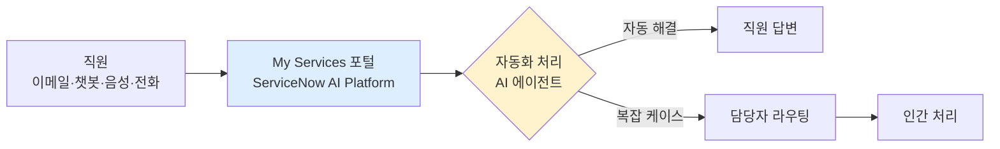

## Summary

Siemens GBS(Global Business Services)는 360,000명 이상의 직원을 지원하는 HR·재무·구매 서비스를 통합 관리하기 위해 ServiceNow AI 플랫폼 기반의 "My Services" 포털을 구축했다. ✅ **Fact** 이 포털은 월 110,000건의 방문을 처리하며, 기존 100개 이상의 이메일 사서함을 단일 진입점으로 통합했다. 사용자 만족도 8.8/10, 직원의 87%가 업무를 즐기고 있다고 응답했다. [[sources/servicenow-siemens-case-study.md]]

## Problem / Why (도입 배경)

Siemens GBS는 HR, 재무, 구매 지원 서비스가 지나치게 복잡하고 고객이 탐색하기 어렵다는 문제를 안고 있었다. 수백 개의 별도 이메일 사서함으로 요청이 분산되어 처리 효율이 낮았고, 레거시 시스템 다수가 병존했다.

## Solution Architecture

> **최우선 원칙**: 이 섹션은 **공개된 사실만** 기록한다.

### A. Process (프로세스)

- **Before (As-is)**: HR·재무·구매 문의가 100개 이상의 개별 이메일 사서함으로 분산. 고객이 어떤 채널에 연락해야 할지 혼란.
- **After (To-be)**:
  1. ✅ **Fact** "My Services" 단일 포털로 모든 HR·재무·구매 요청을 통합 접수. [[sources/servicenow-siemens-case-study.md]]
  2. ✅ **Fact** ServiceNow AI 에이전트가 인테이크·라우팅·해결 자동화. [[sources/servicenow-siemens-case-study.md]]
  3. ✅ **Fact** 이메일·챗봇·음성·전화를 포함하는 현대적 디지털 인터랙션 레이어 구축. [[sources/servicenow-siemens-case-study.md]]
- **Human-in-the-loop (HITL) 지점**: 복잡한 케이스는 담당자에게 라우팅. 자동화 가능 케이스는 AI가 직접 처리.
- **Trigger & Frequency**: 직원 문의 발생 시 수시(on-demand). 월 110,000건 처리.
- **Scope of autonomy**: ✅ **Fact** 자동화 및 ServiceNow AI 에이전트 활용으로 인테이크·라우팅·해결 자동화. [[sources/servicenow-siemens-case-study.md]]

범례: 실선 = [[sources/servicenow-siemens-case-study.md]] 확인.

### B. System & Infrastructure (시스템·인프라)

- **Core HRIS / 기반 시스템**: _미공개 (not disclosed)_
- **AI 시스템 배치**: ✅ **Fact** ServiceNow AI Platform (단일 프로세스·공통 경험 레이어). [[sources/servicenow-siemens-case-study.md]]
- **배포 환경**: _미공개 (not disclosed)_
- **연동·통합**: ✅ **Fact** HR·재무·구매 시스템 통합 (기존 레거시 시스템 다수 퇴역). [[sources/servicenow-siemens-case-study.md]]
- **사용자 접점 (UX layer)**: ✅ **Fact** 이메일, 챗봇, 음성, 전화. [[sources/servicenow-siemens-case-study.md]]
- **인증·권한**: _미공개 (not disclosed)_

### C. Data (데이터)

- **입력 데이터 소스**: HR 정책·지식 문서, 서비스 요청 이력.
- **데이터 규모**: ✅ **Fact** 월 110,000건 방문. 기존 100개+ 이메일 사서함 통합. [[sources/servicenow-siemens-case-study.md]]
- **전처리·정제**: _미공개 (not disclosed)_
- **학습 vs RAG vs In-context**: _미공개 (not disclosed)_
- **데이터 거버넌스**: _미공개 (not disclosed)_

### D. Model (모델)

- **Foundation model**: _미공개 (not disclosed)_ — ServiceNow Now Assist 내장 AI 기능 기반이나 구체 모델 미공개.
- **커스터마이징 기법**: _미공개 (not disclosed)_

### E. Organization & Team (조직·팀 구조)

- **오너십**: ✅ **Fact** Siemens GBS(Global Business Services)가 HR·재무·구매 서비스 운영 주체. [[sources/servicenow-siemens-case-study.md]]
- **전략 방향**: ✅ **Fact** "워크포스 주도 조직에서 기술 주도 조직으로" 전환이 GBS의 공식 방향. [[sources/servicenow-siemens-case-study.md]]
- **팀 규모**: _미공개 (not disclosed)_

## Impact / Metrics (기대효과)

### 기대효과 요약
월 110,000건 포털 방문 처리, 100개 이상 레거시 시스템 폐기(Fact). 사용자 만족도 8.8/10, 직원 만족도 87% (자사 보고).

- ✅ **Fact**: 월 110,000건 포털 방문 처리. [[sources/servicenow-siemens-case-study.md]]
- ✅ **Fact**: 100개 이상의 기존 이메일 사서함 및 레거시 시스템 다수 폐기. [[sources/servicenow-siemens-case-study.md]]
- ⚠️ **자사 보고**: 사용자 만족도 8.8/10. [[sources/servicenow-siemens-case-study.md]]
- ⚠️ **자사 보고**: 직원의 87%가 업무에 만족한다고 응답. [[sources/servicenow-siemens-case-study.md]]

## Governance & Risk

- 독일 노사관계(Betriebsrat) 환경에서의 AI 도입 — 종업원 협의회와의 협의 과정 _미공개 (not disclosed)_.
- GDPR 적용 환경. 세부 데이터 처리 동의 방식 _미공개 (not disclosed)_.

## Contradictions

없음 (현재 기준).

## Consulting Angle

- **유럽 제조업 대기업 레퍼런스**: Siemens GBS 사례는 공유서비스센터(SSC) 모델로 HR·재무·구매를 통합 운영하는 대기업의 AI 전환 패턴. 국내 대기업 GBS/SSC 도입 제안 시 즉시 활용.
- **"100개 이메일 사서함 → 1개 포털" 스토리**: 복잡성 가시화와 통합의 ROI를 설명하는 강력한 설득 프레임.
- **ServiceNow HR 도입 타당성**: ServiceNow Now Assist HRSD와 결합했을 때의 실제 운영 결과 사례로 활용 (→ [[servicenow-now-assist-hr]] 연계).
- **파생 질문**: "독일 Betriebsrat(종업원 협의회) 제도가 있는 환경에서 AI 도입 시 노사 협의 방법론은? 한국의 노사협의회와 비교 가능한가?"
