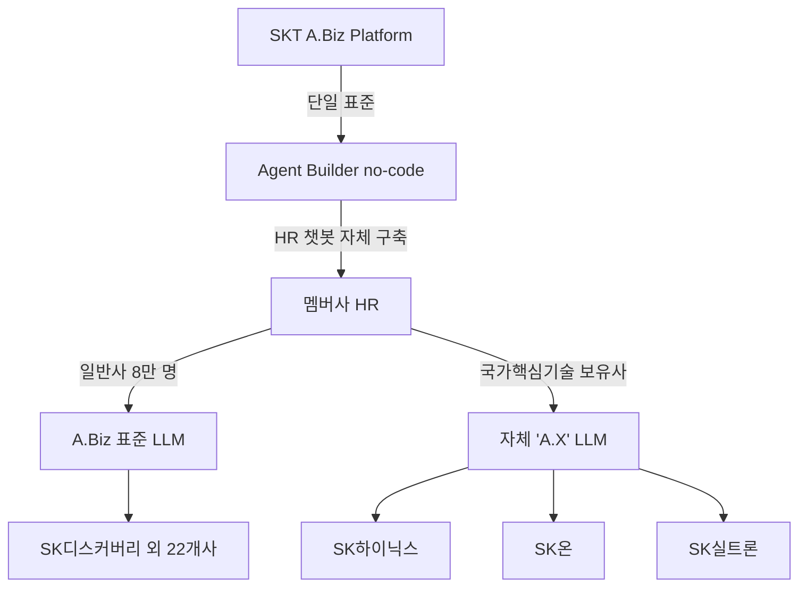

## Summary

SK 그룹이 SKT-SK AX 합작 'A.Biz'를 **그룹 단일 표준**으로 25개 멤버사·**약 8만 명**에 배포 (2025 하반기 rollout). SK디스커버리 등 7개사 시작 → 2025년 말까지 **SK하이닉스·SK이노베이션** 포함 25개 멤버사 확산. HR 정책·절차 문의 응대용 AI 에이전트를 IT 전문 지식 없이 HR 담당자가 **agent builder로 자체 구축** 가능. **국가핵심기술 보유사** (SK하이닉스·SK온·SK실트론)에는 자체 LLM **'A.X'** + SK AX **산업특화 AI** 적용으로 보안 보장.

## Problem / Why

- **Before**: SK 그룹 25개 멤버사가 각각 별도 HR 시스템·챗봇 운영 — 그룹 표준 부재
- **Pain point**: 그룹 차원 AI 거버넌스·비용·표준 보안 통제 어려움 + 멤버사별 중복 투자
- **Trigger**: SKT 'A.Biz' B2B launch 자체 dogfooding + 그룹 차원 AI 가속 명령

## Solution Architecture

### A. Process

- **Before**: 각 멤버사가 별도 HR 시스템·챗봇·AI 도구 도입
- **After**:
  1. SKT-SK AX가 'A.Biz' 단일 platform 제공
  2. 멤버사 HR 담당자가 **agent builder no-code**로 자체 챗봇·자동화 구축
  3. 일반 멤버사: A.Biz 표준 LLM 호출
  4. 국가핵심기술 보유사 (SK하이닉스·SK온·SK실트론): 자체 LLM 'A.X' + SK AX 산업특화 AI 사용으로 격리 보안
  5. HR 정책·절차 Q&A 자동 응답 + 자동화 워크플로
- **HITL**: 각 멤버사 HR 담당자가 agent 설계·운영
- **Frequency**: continuous (직원 daily 사용)

### B. System

- A.Biz platform (SKT 운영) + agent builder (no-code)
- 자체 LLM 'A.X' (SKT 자체 개발)
- SK AX 산업특화 AI (반도체·에너지·화학)
- 국가핵심기술 보유사 격리 환경

### C/D. Data & Model

- **Foundation model**: A.X (SKT 자체) + 외부 partner 혼합
- **데이터**: 멤버사별 격리, 그룹 통합 데이터 거버넌스
- **거버넌스**: 국가핵심기술 보유사는 별도 격리 LLM

### E. Organization

- SKT A.Biz 본부 + SK AX + 25개 멤버사 HR 담당

### F. Diagrams

## Impact / Metrics

### 기대효과 요약
SK 그룹 25개사 8만 명에 단일 AI 표준 배포 — **한국에서 유일하게 그룹 표준화 사례 확인된 conglomerate** (삼성·LG·현대 어느 그룹도 이 정도 그룹 표준화 비공개 확인).

- 25개 멤버사 cover
- 약 8만 명 in scope
- agent builder no-code: HR 담당자 IT 전문 지식 없이 chatbot 자체 구축
- 국가핵심기술 보유사: 자체 LLM 'A.X' 격리 환경

## Governance & Risk

- ✅ 국가핵심기술 보유사 격리 LLM 모델 — KR 산업안보 best practice
- ⚠️ "agent builder no-code"의 quality·보안 통제 governance _세부 미공개_
- ⚠️ 그룹 단일 표준이 멤버사 자율성·실험 제약 가능성
- ⚠️ 한국 AI 기본법 (2026-01-22) 고영향 AI 분류 적용 시 멤버사별 인적감독 의무 일관성

## Consulting Angle

- **KR 대기업 그룹 차원 AI 표준화 reference (1순위, 유일)**:
  - 삼성·LG·현대 그룹은 어떤 정도 그룹 표준화도 공개 확인 안 됨
  - SK가 그룹 표준 확립의 단독 case — 한국 conglomerate 컨설팅의 핵심 reference
  - "8만 명 그룹 단일 표준" headline은 KR 그룹 임원 발표 강력 hook
- **2026 Q3-Q4 KR 그룹 차원 컨설팅 deck**:
  - SK 그룹 단일 표준 + Workday ASOR [[workday-agent-system-of-record-asor]] (글로벌 거버넌스) — KR 그룹 + 글로벌 표준 결합
  - 본 wiki의 한국 3대 SI 비교 [[korean-3-si-hr-ai-comparison]]와 cross-link
- **국가핵심기술 보유사 격리 LLM**: KR 반도체·이차전지·바이오 그룹사 (삼성전자·LG에너지솔루션·삼성바이오로직스 등) 적용 가능 — 산업안보 + AI 활용 trade-off solution
- **agent builder no-code 패턴**: 미래에셋 AI Assistant [[mirae-asset-ai-assistant-platform]] (네이버클라우드 하이퍼클로바X 대시) + SK A.Biz — 한국 자체 플랫폼 + 자체 LLM combo
- **반면교사**:
  - 그룹 표준 단일 vendor lock-in (SKT) — 멤버사 협상력 약화 가능
  - "8만 명 in scope" 중 실제 active user 비율 _미공개_ — 외부 인용 시 caveat 필수
  - Workday HCM 도입 멤버사 (SK 일부) 와 A.Biz 통합 governance _세부 미공개_
