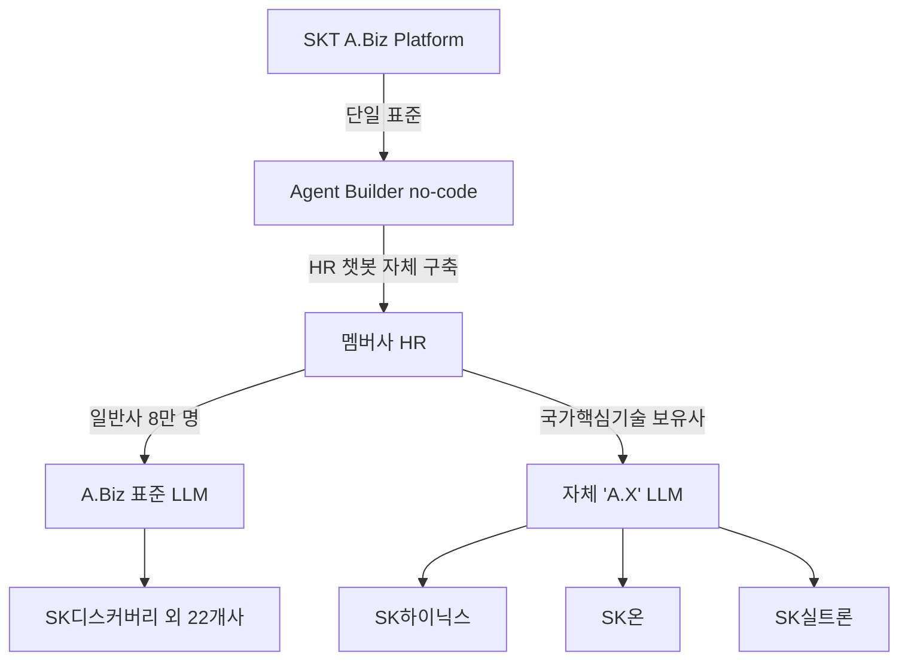

## Summary

SK 그룹이 SKT·SK AX 공동 개발 'A.Biz(에이닷 비즈)'를 그룹 전반에 확대 도입 — 2025-09 SK디스커버리 등 7개사부터 시작, **연말까지 SK하이닉스·SK이노베이션 포함 25개 멤버사·약 8만 명이 사용 예정** (2025-09-29 발표 기준 목표치) ([[sources/heraldcorp-skt-adot-biz-25-companies-2025-09]], [[sources/zdnet-korea-sk-group-adot-biz-25-companies-2025-09]]). 인사 제도 문의 응대 에이전트를 IT 지식 없이 HR 담당자가 **에이전트 빌더로 제작·에이전트 스토어로 배포** ([[sources/skt-newsroom-adot-biz-group-rollout-2025-09]]). ⚠️ 자사 보고: **국가핵심기술 보유사**(SK하이닉스·SK온·SK실트론)에는 SKT 자체 LLM **'에이닷 엑스(A.X)'** + SK AX 산업 특화 AI를 **적용 예정** ([[sources/heraldcorp-skt-adot-biz-25-companies-2025-09]]).

## Problem / Why (도입 배경)

- **Before**: SK 그룹 25개 멤버사가 각각 별도 HR 시스템·챗봇 운영 — 그룹 표준 부재
- **Pain point**: 그룹 차원 AI 거버넌스·비용·표준 보안 통제 어려움 + 멤버사별 중복 투자
- **Trigger**: SKT 'A.Biz' B2B launch 자체 dogfooding + 그룹 차원 AI 가속 명령

## Solution Architecture

### A. Process (프로세스)

- **Before**: 각 멤버사가 별도 HR 시스템·챗봇·AI 도구 도입
- **After**:
  1. SKT·SK AX가 공동 개발한 'A.Biz'를 그룹 멤버사에 확대 도입 ([[sources/skt-newsroom-adot-biz-group-rollout-2025-09]])
  2. 멤버사 HR 담당자가 IT 지식 없이 **에이전트 빌더**로 인사 제도 문의 응대 에이전트 제작 → **에이전트 스토어**로 전 구성원에 배포 ([[sources/skt-newsroom-adot-biz-group-rollout-2025-09]])
  3. 일반 멤버사가 호출하는 LLM: _미공개 (not disclosed)_
  4. ⚠️ 자사 보고: 국가핵심기술 보유사(SK하이닉스·SK온·SK실트론)에는 SKT 자체 LLM '에이닷 엑스' + SK AX 산업 특화 AI 적용 **예정** ([[sources/heraldcorp-skt-adot-biz-25-companies-2025-09]])
  5. 정보 검색·일정·회의록·회의실 예약 등 공통 업무 + 채용 등 전문 업무 지원 ([[sources/zdnet-korea-sk-group-adot-biz-25-companies-2025-09]])
- **HITL**: 각 멤버사 HR 담당자가 에이전트 제작·배포 주체 ([[sources/skt-newsroom-adot-biz-group-rollout-2025-09]]); 응답 검토 절차 _미공개_
- **Frequency**: continuous (직원 daily 사용)

### B. System & Infrastructure (시스템·인프라)

- **Core HRIS / 기반 시스템**: _미공개 (not disclosed)_
- **AI 시스템 배치**: ✅ SKT·SK AX 공동 개발 업무용 AI 에이전트 'A.Biz' + 에이전트 빌더·에이전트 스토어 ([[sources/skt-newsroom-adot-biz-group-rollout-2025-09]])
- **배포 환경**: _미공개 (not disclosed)_
- **연동·통합**: ⚠️ 자사 보고: 자연어 요청으로 회의실 예약·참석자 공지 실행 ([[sources/zdnet-korea-sk-group-adot-biz-25-companies-2025-09]]); HR 시스템 연동 _미공개_
- **사용자 접점 (UX layer)**: _미공개 (not disclosed)_
- **인증·권한**: _미공개 (not disclosed)_

### C. Data (데이터)

- **입력 데이터 소스**: ⚠️ 자사 보고: 인사 제도 등 구성원 문의 (HR 에이전트 예시) ([[sources/heraldcorp-skt-adot-biz-25-companies-2025-09]]); 세부 데이터 항목 _미공개_
- **데이터 규모**: ⚠️ 자사 보고: 연말까지 25개 멤버사 약 8만 명 사용 예정 (목표치) ([[sources/heraldcorp-skt-adot-biz-25-companies-2025-09]])
- **전처리·정제**: _미공개 (not disclosed)_
- **학습 vs RAG vs In-context 구분**: _미공개 (not disclosed)_
- **데이터 거버넌스**: _미공개 (not disclosed)_
- **민감정보 처리**: _미공개 (not disclosed)_

### D. Model (모델)

- **Foundation model**: ⚠️ 자사 보고: 국가핵심기술 보유사(SK하이닉스·SK온·SK실트론)에는 SKT 자체 LLM '에이닷 엑스' 적용 예정 ([[sources/heraldcorp-skt-adot-biz-25-companies-2025-09]], [[sources/skt-newsroom-adot-biz-group-rollout-2025-09]]); 일반 멤버사용 모델 _미공개_
- **Model 유형**: ✅ LLM 기반 업무 에이전트 (정보 검색·일정·회의록·문의 응대) ([[sources/zdnet-korea-sk-group-adot-biz-25-companies-2025-09]])
- **제공 방식**: _미공개 (not disclosed)_
- **커스터마이징 기법**: ✅ 에이전트 빌더(no-code)로 담당자가 에이전트 제작 ([[sources/skt-newsroom-adot-biz-group-rollout-2025-09]]); ⚠️ 자사 보고: SK AX 산업 특화 AI 적용 예정 ([[sources/heraldcorp-skt-adot-biz-25-companies-2025-09]])
- **Orchestration 프레임워크**: _미공개 (not disclosed)_
- **평가·가드레일**: _미공개 (not disclosed)_

### E. Organization & Team (조직·팀 구조)

- **오너십**: ✅ SKT + SK AX (공동 개발·확산 주체) ([[sources/skt-newsroom-adot-biz-group-rollout-2025-09]]); 멤버사 HR 담당자가 에이전트 제작
- **참여 역할·팀 규모·거버넌스·변화관리**: _미공개 (not disclosed)_
- **파트너**: SK AX (그룹 계열 SI) ([[sources/skt-newsroom-adot-biz-group-rollout-2025-09]])

### F. Diagrams (도식)

```mermaid
flowchart TB
    SKT[SKT A.Biz Platform] -->|단일 표준| Agent[Agent Builder no-code]
    Agent -->|HR 챗봇 자체 구축| Member[멤버사 HR]
    Member -->|일반사 8만 명| Standard[A.Biz 표준 LLM]
    Member -->|국가핵심기술 보유사| Secure[자체 'A.X' LLM]
    Secure --> Hynix[SK하이닉스]
    Secure --> SKOn[SK온]
    Secure --> SKSiltron[SK실트론]
    Standard --> Discovery[SK디스커버리 외 22개사]
```

## Impact / Metrics (기대효과)

### 기대효과 요약
SK 그룹 25개사 약 8만 명에 공통 AI 에이전트 확산 예정(2025-09 발표 기준) — 본 wiki 내에서 그룹 차원 확산이 공개 확인된 유일한 한국 conglomerate 사례. HR 특정 효과 수치는 _미공개_.

- ⚠️ 자사 보고: 연말까지 25개 멤버사·약 8만 명 사용 예정 (목표치) ([[sources/heraldcorp-skt-adot-biz-25-companies-2025-09]], [[sources/zdnet-korea-sk-group-adot-biz-25-companies-2025-09]])
- ✅ 에이전트 빌더·스토어: HR 담당자가 IT 지식 없이 에이전트 제작·배포 ([[sources/skt-newsroom-adot-biz-group-rollout-2025-09]])
- ⚠️ 벤더 주장: CBT에서 회의록 작성 시간 60%·보고서 작성 시간 40% 가까이 단축 (SKT 자체 측정, HR 특정 아님) ([[sources/skt-newsroom-adot-biz-group-rollout-2025-09]])
- ⚠️ 자사 보고: 국가핵심기술 보유사에 자체 LLM '에이닷 엑스' 적용 예정 ([[sources/heraldcorp-skt-adot-biz-25-companies-2025-09]])

## Governance & Risk

- ⚠️ 자사 보고: 국가핵심기술 보유사에 자체 LLM '에이닷 엑스' 적용 예정 ([[sources/heraldcorp-skt-adot-biz-25-companies-2025-09]]) — 격리 아키텍처 세부 _미공개_
- ⚠️ "agent builder no-code"의 quality·보안 통제 governance _세부 미공개_
- ⚠️ 그룹 단일 표준이 멤버사 자율성·실험 제약 가능성
- ⚠️ 한국 AI 기본법 (2026-01-22) 고영향 AI 분류 적용 시 멤버사별 인적감독 의무 일관성

## Contradictions

_없음._

> [!note] 2026-09-27 grounding — 소스 3건은 모두 2025-09-29 SKT 발표(연말까지 25개사·약 8만 명 확산 '예정', 국가핵심기술 보유사 A.X '적용 예정')를 전달. 본문의 확정형 서술("배포", "격리 보안 보장", "단일 표준")을 발표 기준 예정형으로 정정. 실제 확산 완료 여부는 후속 소스 필요.

## Consulting Angle

- **KR 대기업 그룹 차원 AI 표준화 reference (1순위, 유일)**:
  - 삼성·LG·현대 그룹은 어떤 정도 그룹 표준화도 공개 확인 안 됨
  - SK가 그룹 표준 확립의 단독 case — 한국 conglomerate 컨설팅의 핵심 reference
  - "8만 명 그룹 단일 표준" headline은 KR 그룹 임원 발표 강력 hook
- **2026 Q3-Q4 KR 그룹 차원 컨설팅 deck**:
  - SK 그룹 단일 표준 + Workday ASOR [[workday-agent-system-of-record-asor]] (글로벌 거버넌스) — KR 그룹 + 글로벌 표준 결합
  - 본 wiki의 한국 3대 SI 비교 [[korean-3-si-hr-ai-comparison]]와 cross-link
- **국가핵심기술 보유사 격리 LLM**: KR 반도체·이차전지·바이오 그룹사 (삼성전자·LG에너지솔루션·삼성바이오로직스 등) 적용 가능 — 산업안보 + AI 활용 trade-off solution
- **agent builder no-code 패턴**: 미래에셋 AI Assistant [[mirae-asset-ai-assistant-platform]] (네이버클라우드 하이퍼클로바X 대시) + SK A.Biz — 한국 자체 플랫폼 + 자체 LLM combo
- **반면교사**:
  - 그룹 표준 단일 vendor lock-in (SKT) — 멤버사 협상력 약화 가능
  - "8만 명 in scope" 중 실제 active user 비율 _미공개_ — 외부 인용 시 caveat 필수
  - Workday HCM 도입 멤버사 (SK 일부) 와 A.Biz 통합 governance _세부 미공개_
