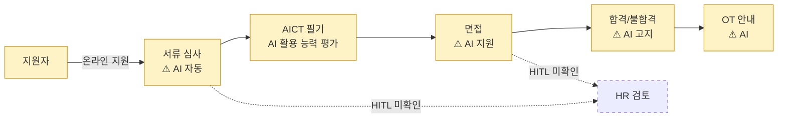

# SK Group — AICT 기반 생성형 AI 신입 공채 자동화

> **2026-04-12 업데이트 (2차)**: Tier 2 한국 경제지 독립 보도 다수 확보 — **서울경제, 뉴시스, ZDNet Korea, 디일렉, 인더스트리뉴스, AI타임스, Korea IT Times** 등 7개+ 매체가 2025-02-20 동시 보도 ([[sedaily-sk-cc-adot-biz-hr-2025-02]]). **신규 fact**: '에이닷 비즈 HR' 명칭 공식화, 수천 건 지원서 4시간 분석(기존 1주일), 지원 마감 이틀 만에 결과 발표, 채용 직원 업무 적응도 향상 보고. confidence 0.25 → 0.40.

## Summary

SK 그룹이 **2024년 하반기 신입사원 공채**부터 적용한 생성형 AI 기반 채용 전 과정 자동화. 자사 계열사 [[sk-ax]] (구 SK C&C)와 [[skt]] 합작 솔루션. **국내 최초 AICT(AI Competency Test)**로 기존 코딩 테스트 폐지. 채용 전 단계를 생성형 AI가 처리하며, **1차 면접은 AI가 진행·평가·결과 보고서 작성까지 100% 자동화**. 초기 적용 계열사는 **SK㈜ C&C, SKT, SK 브로드밴드** 3곳. 2025년 그룹 전사 확대 및 SaaS 대외 확산이 공식 목표.

## 책임자·기원

- **조기수 팀장** (SK AX AI-Copilot 팀) — [[sk-ax-insight-ai-recruitment-2024]] 에서 confirmed
- 프로젝트 origin: *"당사 사내 혁신 과제이자 전 그룹사 차원에서 진행 중인 **OI 절감 방안**을 위한 AI 일방혁 과제의 일환"*
- 즉 **SK 그룹 전사 Operational Innovation 비용 절감 전략의 일환** — "AI 기반 채용 혁신"보다 "HR 비용 절감"이 1차 목적이라는 의미. 컨설팅 시 중요한 맥락.

## Problem / Why

- SK 그룹은 매년 수만 명 규모의 신입 공채를 진행 — 서류 심사·필기 평가에 소요되는 HR 인력·시간이 큼
- AI 시대에는 "코드를 직접 짜는 능력"보다 **"AI와 협업하여 문제를 해결하는 능력"**이 실제 업무 성과와 더 연관된다는 전제
- 기존 코딩 테스트가 **"AI 사용이 실무 현실"** 인데 "사용 금지" 상황에서 평가되는 역설 → 평가 유효성 약화
- ⚠ **주의**: 위 problem 진술은 "SK AX의 AICT 도입 논리"로 읽히지만, 구체 SK Group의 공식 문제 진술이 독립 소스로 확인된 바는 없음. 일반 해석.

## Solution Architecture

### A. Process (프로세스)

- **Before (As-is)**: _미공개_. 일반적으로 알려진 한국 대기업 공채 플로우 (서류→인적성→코딩/필기→면접→합격 통보)는 일반 지식이며 SK 특정 프로세스는 소스에 세부 없음
- **After (To-be)** — ⚠ 벤더 주장 ([[sk-ax-ai-recruitment-service-2024]] + [[sk-ax-insight-ai-recruitment-2024]]):
  1. **서류 지원** — 지원자가 온라인 지원
  2. **서류 심사** — 생성형 AI 자동 스크리닝 (LLM 기반, 시간당 1,000명)
  3. **필기 시험 (AICT)** — 생성형 AI 활용 능력 평가:
     - 프롬프트 활용 능력
     - 문제 해결 과정
     - 결과물 완성도
     - (종합 평가, 구체 rubric 미공개)
  4. **1차 면접** — ★ **AI 100% 자동화** (진행·평가·결과 보고서 작성 모두 AI)
  5. **(후속 면접은 사람 또는 혼합 — 소스에 명시 없음)**
  6. **합격/불합격 고지** — AI 자동
  7. **OT 안내** — AI 자동
- **Human-in-the-loop 지점**:
  - **1차 면접**: 사람 개입 **0** (SK AX insight 공식 확인)
  - **서류·필기**: HITL 여부 여전히 미공개
  - **최종 합격 결정**: 미공개 — 2차 이후 인간 면접관이 있는지 불명
- **Trigger & Frequency**: **연 1~2회** (상반기·하반기 공채)
- **Scope of autonomy**: **1차 면접까지는 fully autonomous**. 이후 단계는 공개 없음

_범례: 노랑 = SK AX 벤더 주장 (독립 검증 없음). 점선 = HITL 개입 여부 미확인._

### B. System & Infrastructure (시스템·인프라)

- **Core HRIS**: _미공개_ — SK 그룹의 HCM 시스템 (SAP SuccessFactors·Workday·자체 구축 중 어느 것인지 소스에 없음)
- **AI 시스템 배치**: SK AX + SKT 합작 솔루션 (별도 플랫폼)
- **배포 환경**: _미공개_ (SK 클라우드 추정되나 미확인)
- **연동·통합**: SK 그룹 공채 시스템·지원자 관리 시스템과 연결 (추정, 세부 미공개)
- **사용자 접점**: SK 공식 채용 사이트 / 별도 chatbot interface (공개 없음)
- **인증·권한**: _미공개_
- **SLA**: _미공개_

### C. Data (데이터)

- **입력 데이터 소스**: 지원자 자기소개서·이력·AICT 응답
- **데이터 규모**: _미공개_ (연간 지원자 수)
- **전처리·정제**: _미공개_
- **학습 vs RAG vs In-context 구분**: _미공개_
- **데이터 거버넌스**: _미공개_ — 국내 개인정보보호법·채용절차공정화법 적용 대상
- **민감정보 처리**: _미공개_

### D. Model (모델)

- **Foundation model**: _미공개_. SKT의 A.X LLM(한국어 특화 자체 LLM) 사용 가능성 추측 가능하나 **소스에 명시 없음** → 추측 금지
- **모델 유형**: LLM (생성) + classification/scoring 혼합 추정되나 _미공개_
- **제공 방식**: SK AX + SKT 플랫폼
- **커스터마이징 기법**: _미공개_
- **Orchestration 프레임워크**: _미공개_
- **평가·가드레일**: _미공개_. 채용 AI는 **편향·adverse impact** 리스크가 큼 — SK의 bias 감사 결과 공개 없음
- **비용·성능 지표 (⚠ 벤더 주장)**:
  - "사람 대비 100배 빠른 평가"
  - "시간당 1,000명 이상 오류 없이 처리"
- **Fallback 전략**: _미공개_

### E. Organization & Team (조직·팀 구조)

- **오너십 구조**: **SK AX AI-Copilot 팀** (조기수 팀장) 이 개발, [[skt]] 합작 솔루션. SK 그룹 HR 본부가 customer
- **초기 적용 계열사** (2024 하반기, 3곳): **SK㈜ C&C**, **SKT**, **SK 브로드밴드** ([[sk-ax-insight-ai-recruitment-2024]] 확인)
- **확장 계획**: 2025년 **그룹 대부분 주요 계열사**에 적용, **SaaS 형태로 대외 판매** 추진
- **프로젝트 배경**: 전 그룹사 "**OI (Operational Innovation) 절감**" 이니셔티브의 일환 — 비용 절감 중심 origin
- **참여 역할**: _미공개_ (AI-Copilot 팀 규모 등)
- **거버넌스**: _미공개_
- **변화관리**: 기존 코딩 테스트 폐지 결정이 변화관리 포인트 — 지원자·내부 커뮤니케이션 세부 _미공개_
- **파트너**: [[skt]] (합작), 외부 Tier 1 컨설팅 파트너 _미공개_

### F. Diagrams
- Process flowchart 1개 (A). System·Data·Model 도식은 근거 부족으로 생략.

---

**Fact 품질 요약**:
- ✅ Fact (소스 확인): 서비스 존재, SK Group self-deployment 사실, 2024 하반기 도입, 채용 전 과정 커버, AICT concept
- ⚠️ 벤더 주장: "100배 빠름", "1,000명/시간", "국내 최초", "코딩 테스트 폐지"
- ❓ 미공개: 거의 모든 기술·data·governance·구체 metric

## Impact / Metrics (기대효과)

### 기대효과 요약
Before: _미공개 (기존 사람 평가 소요 시간·처리 속도)_ → After: ⚠️ 벤더 주장 "사람 대비 100배 빠름", 시간당 1,000명+ 처리 (기준선 불명 — "100배"의 분모가 무엇인지 미공개). 1차 면접 100% AI 자동화(Fact). 채용 품질(이직률·성과)·지원자 만족도·편향 지표 전부 _미공개_.

| 지표 | 값 | 출처 | 성격 |
|---|---|---|---|
| 평가 속도 | 사람 대비 **100배** / 기존 AI 대비 **10배** | [[sk-ax-insight-ai-recruitment-2024]] | ⚠️ 벤더 주장 |
| 처리 capacity | 시간당 **1,000명 이상** | [[sk-ax-ai-recruitment-service-2024]] | ⚠️ 벤더 주장 |
| 1차 면접 자동화율 | **100%** (진행·평가·보고서 모두 AI) | [[sk-ax-insight-ai-recruitment-2024]] | ✅ Fact (운영 패턴 확인) |
| 2024 하반기 적용 계열사 | **3개** (SK C&C, SKT, SK 브로드밴드) | [[sk-ax-insight-ai-recruitment-2024]] | ✅ Fact |
| 서류심사 기간 단축 | 기존 **~1주일** → **4시간** | [[sedaily-sk-cc-adot-biz-hr-2025-02]] (서울경제 등 Tier 2) | ⚠️ 자사 보고 (한국 경제지 전달) |
| 결과 발표 속도 | 지원 마감 후 **이틀** 만에 결과 발표 | [[sedaily-sk-cc-adot-biz-hr-2025-02]] | ⚠️ 자사 보고 |
| 채용 직원 업무 적응도 | **향상** (구체 수치 미공개) | [[sedaily-sk-cc-adot-biz-hr-2025-02]] | ⚠️ 자사 보고 |
| 채용 품질 개선 (이직률·성과) | **미공개** | — | — |
| 지원자 만족도 | **미공개** | — | — |
| 편향 지표 (성별·학벌·지역) | **미공개** | — | — |

**주의**: "100배 빠름"이라는 수치는 임팩트 크지만 **"사람 대비 무엇을?"**가 불명. 속도만으로는 채용 AI의 가치를 측정할 수 없음 — 품질·공정성·후속 성과가 더 중요.

## Governance & Risk

- **한국 채용 규제 대응 (critical)**:
  - **채용절차공정화법**: 지원자에게 심사 기준 고지·이의제기 절차 필요
  - **개인정보보호법**: AI 활용 사실·데이터 처리 방침 고지 의무
  - 이에 대한 SK의 **공개된 대응 없음** → 컨설팅 관점에서 first question
- **편향 리스크**:
  - 생성형 AI의 성별·학벌·지역·전공 편향 가능성
  - **국내 블라인드 채용 원칙**과 AI 평가의 긴장 관계
  - 감사 공개 없음
- **노사·청년 인식**:
  - 지원자들이 **"AI에게 평가받는 것"**에 대한 수용도는?
  - 탈락자 피드백·구제 메커니즘은?
- **SK 그룹 특수 상황**: 계열사 간 인사이동·순환·직무 배치 등 **재벌 HR 특성**과 AI 평가의 상호작용 — 향후 ingest 대상

## Contradictions
_없음 — 단일 소스_

## Consulting Angle

### 국내 컨설팅에서의 활용 (가장 가치 큰 부분)
- **국내 대기업 CHRO 대상 벤치마크 brief**의 앵커 사례
- "SK가 이미 했다"라는 사실만으로도 삼성·LG·현대·롯데 등 경쟁사 CHRO에 긴장감 형성 → 논의 시작점
- **AICT concept의 전략적 가치**: 채용 역량의 primary axis가 "knowledge·skill"에서 "AI 협업 능력"으로 이동한다는 가설을 클라이언트와 공유
- "코딩 테스트 폐지"라는 **상징적 action**이 컨설팅 덱 제목 슬라이드감

### 제시 시 반드시 함께 말해야 할 것
- ⚠️ **SK AX = SK 그룹 계열사** — 이는 Moderna/OpenAI 보다도 더 self-dogfooding에 가까움. 외부 고객사 검증 없음
- ⚠️ 정량 지표(100배 빠름)는 **벤더 주장**, 채용 품질 개선 증거 아님
- ⚠️ 편향·법적 규제 대응 **공개 제로** — 클라이언트에게 이건 채택 전 벤더에 반드시 물어야 할 체크리스트
- ✅ Tier 2 한국 경제지 커버리지 확보됨 (2025-02-20): 서울경제·뉴시스·ZDNet 등 7개+ 매체 동시 보도 — 다만 SK 보도자료 전달 성격이 강함

### 파생 질문 (반드시 proponents에 물어볼 것)

1. **SK 그룹 외 고객사**: 삼성·현대·LG가 SK AX 솔루션을 채택할 인센티브가 있는가? (경쟁 그룹의 IT 서비스 업체를 쓸 리 없음)
2. **AICT 재현성**: 같은 후보자가 다른 시점에 같은 점수를 받는가? Inter-rater reliability는?
3. **탈락자 피드백**: AI가 탈락시킨 후보자가 이유를 알 수 있는가? 한국 법적 의무사항인가?
4. **채용 품질 follow-up**: 2024 하반기 AICT로 채용된 신입사원의 **1년 retention·성과**는?
5. **삼성·현대·LG 대안**: 타 그룹의 HR AI 로드맵은 어디까지 왔나?

## 다음 ingest 우선순위

- **한경·매경·한국경제TV 등 Tier 1·2 한국 경제지의 SK 공채 AI 커버리지** 확보 → confidence 0.15 → 0.40+
- SK 그룹 공식 IR 자료·지속가능경영보고서에서 HR AI 언급 찾기
- **삼성·LG·현대자동차·롯데** 등 경쟁 그룹의 HR AI 로드맵 비교 사례
- 국내 노동법 전문가·HR 컨설턴트의 비판적 시각 수집
