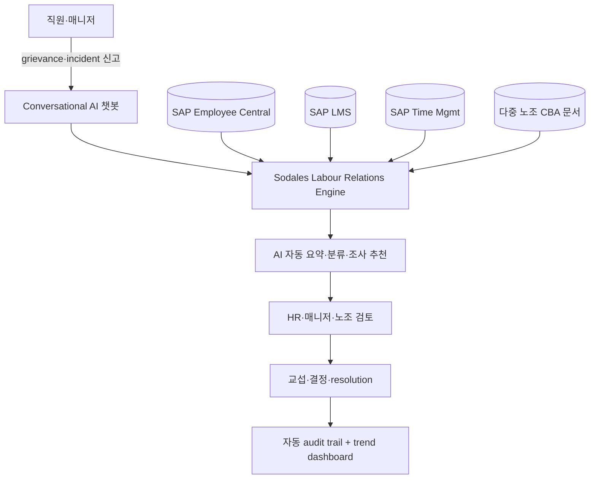

> 📌 **PwC 자료 정정**: PwC Korea ER 컨설팅 자료에서 본 사례를 "spire" (벤더)로 표기했으나, 실제로는 **Spire Energy = 고객사**, **Sodales Solutions = 벤더**. SAP SuccessConnect 2018에서 발표된 customer story.

## Summary

Spire Inc.는 미주리주 St. Louis 기반 미국 5위 천연가스 utility (1.7M 고객, 3개 주, **10+ 노조 운영**) — 미국 최대급 단일 unionized utility. **Sodales Labour Relations Management** (SAP SuccessFactors 통합 endorsed app)을 도입해 incident·grievance·discipline·appeals를 실시간 추적하고 다중 노조별 case 관리·CBA(단체협약) 중앙화·노조 규칙 기반 워크플로우 자동화를 운영. Sodales는 SAP의 **Industry Cloud Solutions Portfolio premium-certified Endorsed App** + SAP Business AI를 활용한 **첫 번째 endorsed app**.

## Problem / Why (도입 배경)

- **Before**: Spire는 10+ 노조와 동시 운영 — 각 노조별 단체협약(CBA)·grievance procedure·timeline·escalation 절차가 모두 상이. 매니저·HR이 spreadsheet·이메일로 1건씩 처리, **노조별 일관성 부재 + audit trail 약함**
- **Pain point**:
  - **다중 노조 복잡성**: 10+ CBA 문서 manual 검색 → grievance 처리 시 잘못된 절차 적용 risk
  - **근태·LMS·comp 데이터 silo**: 각 시스템에서 case 정보 수집 시간 over-burden
  - **컴플라이언스 audit 추적 어려움**: 사건 처리 이력 분산 → 외부 audit·노조 측 조회 시 bottleneck
- **Trigger**: SAP SuccessFactors 도입 + Sodales의 SAP-native 노사관계 SaaS 솔루션 등장 (2018)

## Solution Architecture

### A. Process

- **Before**: 노조 grievance 신고 → HR이 spreadsheet에 기록 → 매니저 이메일 협업 → 별도 시스템에서 근태·LMS·comp 데이터 수집 → audit log 분산
- **After**:
  1. 직원·매니저가 conversational AI 챗봇으로 grievance/incident/disciplinary report 신고
  2. Sodales가 자동으로 SAP Employee Central·LMS·근태에서 관련 데이터 auto-populate
  3. AI가 case 자동 요약 + 조사 추천 (grievance type·노조 식별·timeline 생성)
  4. 다중 노조별 grievance 트래킹 — 노조별 CBA·timeline·escalation 프로토콜 내장
  5. Regulatory-compliant 화상 조사 + 증거 중앙 저장
  6. Resolution 후 자동 audit trail 기록 + 트렌드 dashboard
- **HITL**: 매니저·HR·노조 representative가 모든 결정·교섭·resolution 진행. AI는 데이터 정리·문서화·분류만
- **Frequency**: daily (신고·진행) + 분기별 trend report
- **Scope of autonomy**: assist + execute (자동 데이터 통합·분류는 자율, 결정·교섭은 사람)

### B. System & Infrastructure

- **Core HRIS**: SAP SuccessFactors (Spire는 SAP HCM 베이스)
- **AI 시스템 배치**: SAP Industry Cloud Solutions Portfolio 내 endorsed app (SAP App Center 등재)
- **연동**: SAP Employee Central, LMS, Time Management, Compensation
- **사용자 접점**: Sodales web/mobile portal + conversational AI 챗봇 + SSO (SAP IdP)
- **인증**: RBAC (HR·매니저·직원·노조 representative 권한 분리)
- **AI 안전성**: SAP Business AI guardrails 활용 (벤더 주장)

### C. Data

- **입력 데이터**:
  - Employee Central (역할·근속·노조 소속·과거 disciplinary)
  - LMS (안전 교육·자격 이수 이력)
  - Time Management (근태·잔업)
  - Compensation (급여·페널티)
  - CBA 문서 (다중 노조별)
  - Incident report 자유 입력
- **모델 구조**: AI summarization (case 요약) + classification (grievance type·노조 식별) + RPA (시스템 자동 갱신)
- **Data governance**: SAP enterprise governance, audit trail, _구체 retention 미공개_

### D. Model

- **Foundation model**: SAP Business AI (구체 LLM provider _부분 미공개_)
- **Customization**: domain-specific (US labor relations + 다중 노조 CBA 처리)
- **Orchestration**: Sodales 자체 workflow engine + SAP Joule (가능성)

### E. Organization & Team

- **오너십**: Spire HR + Sodales customer success + SAP partner ecosystem
- **참여 역할**: HR business partner (운영) + 노조 representative (CBA 협의) + IT (SAP 통합)

### F. Diagrams

범례: 모든 연결 ⚠️ Sodales 공식 자료 + SAP App Center 기반.

## Impact / Metrics (기대효과)

### 기대효과 요약
**다중 노조 utility의 grievance 디지털화** — Spire는 10+ 노조 운영 환경에서 case 처리 일관성·audit trail·CBA 활용 자동화. 단 ⚠️ Tier 1·2 독립 검증 0건, Sodales/SAP 자사 자료가 1차 출처.

| 지표 | 값 | 출처 | 성격 |
|---|---|---|---|
| Spire 노조 수 | **10+** | Sodales/SAP customer story | ⚠️ 자사 보고 |
| Spire 직원 규모 | ~3,400명 | Spire 공식 | ✅ Fact (10-K) |
| Spire 고객 규모 | 1.7M (3개 주) | Spire 공식 | ✅ Fact |
| Sodales endorsed app 등급 | SAP **premium-certified** | SAP App Center | ✅ Fact (Tier 3) |
| Sodales SAP Business AI 첫 endorsed app | 1st | Sodales/SAP 공식 | ⚠️ 벤더 주장 |
| Spire grievance 처리 시간 단축·만족도 | _구체 수치 미공개_ | — | ❓ 미공개 |

## Governance & Risk

- ⚠️ **Tier 1·2 독립 검증 0건** — Sodales 벤더 자료 + SAP App Center + SAP customer success page만이 1차 source. Gartner/Forrester ER software report 누락
- ✅ SAP endorsed app + premium certification → 엔터프라이즈 보안·data residency 요건 부합
- ⚠️ 한국 적용 시 **노조법 차이**: 한국 복수노조 + 단체교섭 절차 + 부당노동행위 규제는 미국 NLRA와 상이 — Sodales의 미국 NLRA 기반 워크플로우 customization 필요
- ⚠️ 다중 노조 CBA 자동 매칭 정확도 _미공개_ — 잘못 적용 시 부당노동행위 risk

## Consulting Angle

- **다중 노조 환경 reference**: 한국 SK·LG·현대차·금융지주 등 복수노조 보유 그룹사의 노사 case 처리 디지털화 검토 시 **유일한 글로벌 다중 노조 utility reference** (10+ 노조)
- **SAP HCM 베이스 한국 대기업 fit**: 삼성·LG·SK는 SAP HCM 비중이 큰 그룹 — Sodales는 SAP-native이므로 추가 ETL 부담 적음
- **vs HR Acuity** [[hr-acuity-oliver-er-companion]]:
  - HR Acuity: 미국 ER market leader, AI Companion (olivER), 5,000+ 고객
  - Sodales: SAP-native, 다중 노조 utility 전문
  - 한국 도입 시 vendor selection 핵심: 기존 HRIS (SAP vs other) + 노조 형태 (단일 vs 복수)
- **vs 고용노동부 AI** [[moel-ai-labor-law-consultation]]:
  - 정부 AI: 노동법 상담 (개별 노무자 대상)
  - Sodales: 사내 grievance 운영 (집단노사 대상)
  - 보완 관계 — 정부 사례는 사내 챗봇 reference, Sodales는 case management
- **반면교사**:
  - PwC 자료에서 "Spire" (고객) ↔ Sodales (벤더) 혼동 발생 — **컨설팅 자료 작성 시 customer/vendor 분명히 표기**
  - Sodales의 다중 노조 자동 매칭 정확도 미공개 — POC 시 한국 노조법 fit·정확도 검증 필수
- **2018 SAP SuccessConnect 발표 사례** — 8년 경과 → recency penalty. 2024-2026 신규 customer 사례 발표 시 confidence 재조정
- **Watch list**: Sodales 한국 진출·Forrester ER software wave 발표·Gartner Market Guide for Employee Relations 등재 시 confidence 재조정
