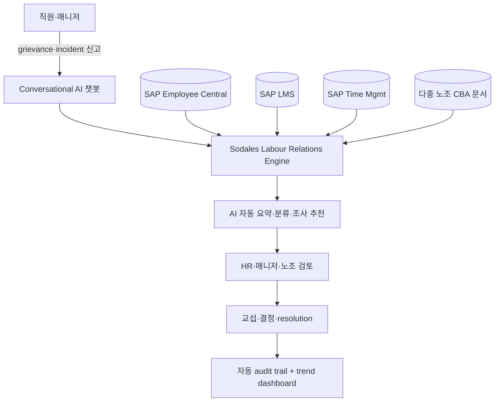

> 📌 **PwC 자료 정정**: PwC Korea ER 컨설팅 자료에서 본 사례를 "spire" (벤더)로 표기했으나, 실제로는 **Spire Energy = 고객사**, **Sodales Solutions = 벤더**. SAP SuccessConnect 2019 인터뷰 기반 customer story ([[sources/sap-store-spire-energy-success-story]] — PwC 자료의 '2018'은 원문상 2019).

## Summary

Spire Energy는 미주리주 St. Louis 기반 미국 5위 상장 천연가스 기업 (약 1.7m 고객, 3개 주, **10+ 노조 운영**) ([[sources/sap-store-spire-energy-success-story]]). SAP SuccessFactors 확장인 **Sodales Labour Relations Software(LRS)**로 징계·job bidding·CBA(단체협약) 관리 등 노조 관련 커뮤니케이션을 표준화 (⚠️ 벤더 사례 — [[sources/sap-store-spire-energy-success-story]]). 플랫폼은 다중 노조 환경의 고충·중재·time claim·CBA 관리와 규칙 기반 워크플로우를 표방 (⚠️ 벤더 주장 — [[sources/sodales-labour-relations-product]]). Sodales는 SAP GenAI Hub·SAP AI Core를 활용하고 Employee Central과 통합되는 **첫 Premium Certified Endorsed App** (⚠️ 벤더 주장, 2024-10-22 보도자료 — [[sources/sodales-sap-app-center]]; 'Industry Cloud Solutions Portfolio' 문구는 인용 소스에 없음).

## Problem / Why (도입 배경)

- **Before**: Spire는 10+ 노조와 동시 운영 — 각 노조별 단체협약(CBA)·grievance procedure·timeline·escalation 절차가 모두 상이. 매니저·HR이 spreadsheet·이메일로 1건씩 처리, **노조별 일관성 부재 + audit trail 약함**
- **Pain point**:
  - **다중 노조 복잡성**: 10+ CBA 문서 manual 검색 → grievance 처리 시 잘못된 절차 적용 risk
  - **근태·LMS·comp 데이터 silo**: 각 시스템에서 case 정보 수집 시간 over-burden
  - **컴플라이언스 audit 추적 어려움**: 사건 처리 이력 분산 → 외부 audit·노조 측 조회 시 bottleneck
- **Trigger**: SAP SuccessFactors 확장 앱으로 Sodales가 갭을 보완 — SAP SuccessConnect 2019 인터뷰 (Talent Program Lead Max Henning) ([[sources/sap-store-spire-energy-success-story]]); 도입 시점 _미공개_

## Solution Architecture

### A. Process (프로세스)

- **Before**: 노조 grievance 신고 → HR이 spreadsheet에 기록 → 매니저 이메일 협업 → 별도 시스템에서 근태·LMS·comp 데이터 수집 → audit log 분산
- **After**:
  1. 직원·매니저가 conversational AI 챗봇으로 grievance/incident/disciplinary report 신고
  2. Sodales가 자동으로 SAP Employee Central·LMS·근태에서 관련 데이터 auto-populate
  3. AI가 case 자동 요약 + 조사 추천 (grievance type·노조 식별·timeline 생성)
  4. 다중 노조별 grievance 트래킹 — 노조별 CBA·timeline·escalation 프로토콜 내장
  5. Regulatory-compliant 화상 조사 + 증거 중앙 저장
  6. Resolution 후 자동 audit trail 기록 + 트렌드 dashboard
- **HITL**: 매니저·HR·노조 representative가 모든 결정·교섭·resolution 진행. AI는 데이터 정리·문서화·분류만
- **Frequency**: daily (신고·진행) + 분기별 trend report
- **Scope of autonomy**: assist + execute (자동 데이터 통합·분류는 자율, 결정·교섭은 사람)

### B. System & Infrastructure (시스템·인프라)

- **Core HRIS**: ✅ SAP SuccessFactors — Sodales LRS는 그 확장(extension) ([[sources/sap-store-spire-energy-success-story]])
- **AI 시스템 배치**: ⚠️ 벤더 주장: SAP Premium Certified Endorsed App — SAP GenAI Hub·SAP AI Core 활용 ([[sources/sodales-sap-app-center]], 2024-10-22 보도자료; Spire 도입 시점의 AI 기능 포함 여부 _미공개_)
- **배포 환경**: _미공개 (not disclosed)_
- **연동·통합**: ⚠️ 벤더 주장: SAP Employee Central 통합 ([[sources/sodales-sap-app-center]]); LMS·Time Management·Compensation 연동은 _미공개_
- **사용자 접점**: _미공개 (not disclosed)_
- **인증·권한**: _미공개 (not disclosed)_
- **AI 안전성**: ⚠️ 벤더 주장: SAP Business AI 기반 안전·노동 규제 준수 지원 ([[sources/sodales-sap-app-center]]); guardrail 세부 _미공개_

### C. Data (데이터)

- **입력 데이터 소스**: ⚠️ 벤더 주장: 징계·job bidding·CBA 관리 데이터 ([[sources/sap-store-spire-energy-success-story]]); 고충·중재·time claim·seniority 등 ([[sources/sodales-labour-relations-product]]); Employee Central 연동 데이터 ([[sources/sodales-sap-app-center]]). LMS·근태·보상 항목은 _미공개_
- **데이터 규모**: _미공개 (not disclosed)_
- **전처리·정제**: _미공개 (not disclosed)_
- **학습 vs RAG vs In-context 구분**: _미공개 (not disclosed)_
- **데이터 거버넌스**: _미공개 (not disclosed)_
- **민감정보 처리**: _미공개 (not disclosed)_

### D. Model (모델)

- **Foundation model**: ⚠️ 벤더 주장: SAP GenAI Hub·SAP AI Core 활용 ([[sources/sodales-sap-app-center]]); 구체 LLM _미공개_
- **Model 유형**: _미공개 (not disclosed)_
- **제공 방식**: ⚠️ 벤더 주장: SAP Endorsed App (SAP Store 판매) ([[sources/sodales-sap-app-center]])
- **커스터마이징 기법**: ⚠️ 벤더 주장: 다중 노조 규칙 기반 워크플로우·CBA 관리·정책 해석 일관성 ([[sources/sodales-labour-relations-product]])
- **Orchestration 프레임워크**: _미공개 (not disclosed)_
- **평가·가드레일**: _미공개 (not disclosed)_

### E. Organization & Team (조직·팀 구조)

- **오너십**: ⚠️ 벤더 사례: Spire Talent Program Lead Max Henning이 SAP SuccessConnect 2019에서 소개 ([[sources/sap-store-spire-energy-success-story]]); 운영 조직 _미공개_
- **참여 역할**: HR·management 팀의 노조 관리 부담이 배경 ([[sources/sap-store-spire-energy-success-story]]); 역할 구성 _미공개_
- **팀 규모·기간·거버넌스·변화관리**: _미공개 (not disclosed)_
- **파트너**: Sodales Solutions (벤더), SAP (플랫폼) ([[sources/sodales-sap-app-center]])

### F. Diagrams (도식)

```mermaid
flowchart TB
    Emp[직원·매니저] -->|grievance·incident 신고| Chat[Conversational AI 챗봇]
    Chat --> Sodales[Sodales Labour Relations Engine]
    EC[(SAP Employee Central)] --> Sodales
    LMS[(SAP LMS)] --> Sodales
    Time[(SAP Time Mgmt)] --> Sodales
    CBA[(다중 노조 CBA 문서)] --> Sodales
    Sodales --> AI[AI 자동 요약·분류·조사 추천]
    AI --> HR[HR·매니저·노조 검토]
    HR --> Resolution[교섭·결정·resolution]
    Resolution --> Audit[자동 audit trail + trend dashboard]
```

범례: 모든 연결 ⚠️ Sodales 공식 자료([[sources/sap-store-spire-energy-success-story]], [[sources/sodales-labour-relations-product]], [[sources/sodales-sap-app-center]]) 기반 — 챗봇·LMS/Time 연동·화상 조사·trend dashboard 노드는 인용 소스 미확인(점선 취급).

## Impact / Metrics (기대효과)

### 기대효과 요약
**다중 노조 utility의 grievance 디지털화** — Spire는 10+ 노조 운영 환경에서 case 처리 일관성·audit trail·CBA 활용 자동화. 단 ⚠️ Tier 1·2 독립 검증 0건, Sodales/SAP 자사 자료가 1차 출처.

| 지표 | 값 | 출처 | 성격 |
|---|---|---|---|
| Spire 노조 수 | **10+** | [[sources/sap-store-spire-energy-success-story]] | ⚠️ 벤더 사례 전달 |
| Spire 직원 규모 | _미공개_ | 인용 소스에 없음 (2026-09-27 grounding 점검) | ❓ |
| Spire 고객 규모 | 약 1.7m (3개 주) | [[sources/sap-store-spire-energy-success-story]] | ⚠️ 벤더 사례 전달 |
| Sodales endorsed app 등급 | SAP Premium Certified Endorsed App | [[sources/sodales-sap-app-center]] (보도자료) | ⚠️ 벤더 주장 |
| Sodales SAP GenAI Hub 활용 첫 Premium Certified Endorsed App | 1st (2024-10-22) | [[sources/sodales-sap-app-center]] | ⚠️ 벤더 주장 |
| Spire grievance 처리 시간 단축·만족도 | _구체 수치 미공개_ | — | ❓ 미공개 |

## Governance & Risk

- ⚠️ **Tier 1·2 독립 검증 0건** — Sodales 벤더 자료 + SAP App Center + SAP customer success page만이 1차 source. Gartner/Forrester ER software report 누락
- ✅ SAP endorsed app + premium certification → 엔터프라이즈 보안·data residency 요건 부합
- ⚠️ 한국 적용 시 **노조법 차이**: 한국 복수노조 + 단체교섭 절차 + 부당노동행위 규제는 미국 NLRA와 상이 — Sodales의 미국 NLRA 기반 워크플로우 customization 필요
- ⚠️ 다중 노조 CBA 자동 매칭 정확도 _미공개_ — 잘못 적용 시 부당노동행위 risk

## Contradictions

> [!note] 2026-09-27 grounding — (1) 'SAP SuccessConnect 2018'은 원문상 **2019** ([[sources/sap-store-spire-energy-success-story]]). (2) 'Industry Cloud Solutions Portfolio' 문구는 인용 소스에 없음 — 2024-10-22 보도자료의 'SAP GenAI Hub 활용 첫 Premium Certified Endorsed App'으로 교체 ([[sources/sodales-sap-app-center]]). (3) Spire 직원 수, LMS/Time/Compensation 연동, RBAC·SSO, SAP Joule, HR Acuity 고객 수는 인용 소스에 없어 `_미공개_`/삭제. (4) [[sources/pwc-er-ai-deck-2026-05]]는 스냅샷 unavailable — 인용 불가.

## Consulting Angle

- **다중 노조 환경 reference**: 한국 SK·LG·현대차·금융지주 등 복수노조 보유 그룹사의 노사 case 처리 디지털화 검토 시 **유일한 글로벌 다중 노조 utility reference** (10+ 노조)
- **SAP HCM 베이스 한국 대기업 fit**: 삼성·LG·SK는 SAP HCM 비중이 큰 그룹 — Sodales는 SAP-native이므로 추가 ETL 부담 적음
- **vs HR Acuity** [[hr-acuity-oliver-ai-er-companion]]:
  - HR Acuity: 미국 ER 벤더, AI Companion (olivER) — 고객 규모는 해당 페이지 참조
  - Sodales: SAP-native, 다중 노조 utility 전문
  - 한국 도입 시 vendor selection 핵심: 기존 HRIS (SAP vs other) + 노조 형태 (단일 vs 복수)
- **vs 고용노동부 AI** [[moel-ai-labor-law-consultation]]:
  - 정부 AI: 노동법 상담 (개별 노무자 대상)
  - Sodales: 사내 grievance 운영 (집단노사 대상)
  - 보완 관계 — 정부 사례는 사내 챗봇 reference, Sodales는 case management
- **반면교사**:
  - PwC 자료에서 "Spire" (고객) ↔ Sodales (벤더) 혼동 발생 — **컨설팅 자료 작성 시 customer/vendor 분명히 표기**
  - Sodales의 다중 노조 자동 매칭 정확도 미공개 — POC 시 한국 노조법 fit·정확도 검증 필수
- **2019 SAP SuccessConnect 인터뷰 사례** ([[sources/sap-store-spire-energy-success-story]]) — 7년 경과 → recency penalty. 2024-2026 신규 customer 사례 발표 시 confidence 재조정
- **Watch list**: Sodales 한국 진출·Forrester ER software wave 발표·Gartner Market Guide for Employee Relations 등재 시 confidence 재조정
