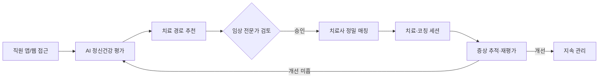

## Summary

**General Mills**가 전통 EAP(Employee Assistance Program)의 **1% 이용률** 문제를 해결하기 위해 **Spring Health**의 AI 기반 정밀 정신건강 플랫폼을 도입. 14개월 내 **28% 직원 등록, 이용률 26%** (기존 대비 26배), **우울증 58% 증상 개선**(평균 2.46 세션), **불안 49% 개선**(1.4 세션), 전체 **67% 개선**을 보고. Spring Health는 AI를 활용해 직원-치료사 매칭·초기 평가·치료 경로 최적화를 수행하며, 2026년 기준 50M+ lives 지원. [[sources/spring-health-general-mills-case.md]]

## Problem / Why

- 전통 EAP 이용률이 **산업 평균 2~5%**, General Mills는 **1%**에 불과 → 직원 정신건강 지원이 형식적
- 정신건강 문제 → 생산성 저하·결근·이직 — 그러나 기존 EAP는 **접근성·품질이 낮아** 실질 효과 미미
- General Mills는 **정신건강에 대한 사내 문화 자체를 바꾸고 싶었음** — 단순 서비스 교체가 아닌 **문화 변화** 목적 [[sources/spring-health-general-mills-case.md]]

## Solution Architecture (요약)

### A. Process (프로세스)

- **Before**: 전통 EAP → 직원이 전화로 접수 → 치료사 무작위 배정 → 이용률 1%
- **After**: Spring Health 앱/웹에서 **AI 기반 정신건강 평가(wellness assessment)** 완료 → AI가 최적 치료 경로(therapy/coaching/자가관리) 추천 → 정밀 매칭으로 치료사 배정 → 이용률 26% [[sources/spring-health-general-mills-case.md]]
- **HITL 지점**: AI가 치료 경로를 추천하나 **임상 전문가가 최종 승인·감독** (precision mental healthcare 모델)
- **Trigger & Frequency**: 직원 자발적 접근 (수시) + 조직 차원 홍보·넛지
- **Scope of autonomy**: Recommend (치료 경로 추천) → 임상 전문가가 approve

### B. System & Infrastructure

- **Core 플랫폼**: Spring Health (정밀 정신건강 SaaS)
- **AI 시스템**: 직원-치료사 매칭 AI, 정신건강 평가 AI, 치료 경로 최적화 [[sources/spring-health-general-mills-case.md]]
- **사용자 접점**: 모바일 앱 + 웹 포털
- 배포 환경·연동 상세: _미공개 (not disclosed)_

### C. Data

- **입력**: 직원 자기보고 평가(wellness assessment), 치료사 프로필, 임상 결과 데이터 [[sources/spring-health-general-mills-case.md]]
- **데이터 규모**: ⚠️ 벤더 주장: 별도 연구에서 53,000 환자·500+ 고용주 데이터 분석 [[sources/spring-health-general-mills-case.md]]
- **민감정보**: 정신건강 데이터는 HIPAA 대상 — Spring Health의 구체 준수 방식은 _미공개_

### D. Model

- **AI 유형**: 정밀 매칭 알고리즘 (치료사-직원), 임상 결과 예측 모델
- **Foundation model**: _미공개 (not disclosed)_
- **평가**: ⚠️ 벤더 주장: 2025년 연구에서 95% 만족, 70% "기분 나아짐", zero major safety concerns [[sources/spring-health-general-mills-case.md]]
- **Peer-reviewed**: 53,000 환자 연구 — 92.3% reliable improvement/recovery, 61.7% remission (DOI _미공개_) [[sources/spring-health-general-mills-case.md]]

### E. Organization & Team

- _미공개 (not disclosed)_

## Impact / Metrics

### 기대효과 요약

전통 EAP 1% → 26% 이용률(26x), 우울증 58%·불안 49% 증상 개선. 비용 효과 $1,070/참여자 절감.

| 지표 | Before | After | 출처 | 성격 |
|---|---|---|---|---|
| EAP 이용률 | 1% | **26%** | Spring Health/General Mills | ⚠️ 벤더 주장 + 자사 보고 |
| 직원 등록률 (14개월) | — | **28%** | Spring Health/General Mills | ⚠️ 벤더 주장 |
| 평가 완료율 | — | **88%** | Spring Health/General Mills | ⚠️ 벤더 주장 |
| 우울증 증상 개선 | — | **58%** (평균 2.46 세션) | Spring Health/General Mills | ⚠️ 벤더 주장 |
| 불안 증상 개선 | — | **49%** (평균 1.4 세션) | Spring Health/General Mills | ⚠️ 벤더 주장 |
| 전체 개선 | — | **67%** | Spring Health/General Mills | ⚠️ 벤더 주장 |
| 참여자당 절감 | — | **$1,070/1년차** | Spring Health 공식 | ⚠️ 벤더 주장 |
| 플랫폼 규모 | — | **50M+ lives** (2026) | Spring Health 공식 | ⚠️ 벤더 주장 |

**⚠️ 모든 수치가 벤더·자사 보고. Peer-reviewed 연구(53K 환자)가 별도 존재하나 General Mills 특정은 아님.**

## Governance & Risk

- 정신건강 데이터의 **극도의 민감성** — HIPAA 필수, GDPR/PIPA 확장 대응 필요
- AI 매칭의 **문화적 편향** — 한국 적용 시 한국 치료사·문화적 맥락 반영 필요
- **Responsible AI**: 2025년 4월 Spring Health이 mental health AI 업계 최초로 "principled approach" 프레임워크 발표 — 구체 내용 _미공개_ [[sources/spring-health-general-mills-case.md]]

## Consulting Angle

### 활용 포인트
- **EAP 혁신의 가장 강력한 정량 사례**: 1%→26% 이용률은 CHRO에게 가장 직관적인 "so what" 데이터
- **"Precision mental healthcare" 개념**: 기존 EAP의 "one-size-fits-all" 대비 AI 기반 정밀 매칭의 가치를 설명하는 프레임워크
- **비용 효과 $1,070/참여자**: Total Rewards 예산 논의에서 ROI 근거로 활용

### 한국 적용
- 한국 EAP 시장(한국EAP협회 등)은 이용률 1~3%로 유사한 문제 → General Mills 사례가 직접 참고 가능
- 국내: 마인드풀리·트로스트 등 정신건강 앱이 기업 B2B 확대 중 — Spring Health 모델과 비교
- 한국 개인정보보호법 하에서 정신건강 데이터 수집·AI 분석의 **적법성·동의** 이슈가 핵심 장벽
