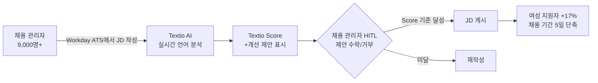

## Summary

T-Mobile은 Textio의 AI 기반 포용적 언어 플랫폼을 ~125명 리크루터 + 9,000명+ 채용 관리자에게 배포해, 성 중립적 어조 편집 시 여성 지원자 +17%, Textio Score 90+ 달성 시 채용 소요 기간 5일 단축을 확인했다. Workday ATS에 Textio를 직접 통합해 JD 작성 시 실시간 AI 제안을 받는 구조다. 기업 합병 통합 과정 중에 도입했으며, 2025년 3월 HR Brew가 Textio의 스킬 기반 면접 도구 출시를 별도 보도.

## Problem / Why

- T-Mobile 합병(T-Mobile + Sprint) 이후 채용 브랜딩·JD 언어 비일관성
- 다양성 채용 목표 달성을 위한 JD·이메일 언어의 시스템적 개선 필요
- 9,000명+ 채용 관리자의 JD 작성 품질을 일관되게 관리하는 수단 부재

## Solution Architecture

### A. Process (프로세스)

- **Before (As-is)**: 리크루터·채용 관리자가 개별적으로 JD 작성 → 편향 언어 미감지 → 다양성 지원자 풀 제한
- **After (To-be)**:
  1. JD를 Workday ATS에서 직접 작성 (Textio 인라인 통합)
  2. Textio AI가 실시간 언어 점수(Textio Score) + 개선 제안 표시
  3. Textio Score 기준 이상(T-Mobile 기준 미공개)이어야 게시 허용
  4. 리크루팅 이메일·고용 브랜드 콘텐츠에도 동일 도구 적용
- **Human-in-the-loop**: 채용 관리자·리크루터가 AI 제안 수용 여부 결정; 최종 게시 전 Score 기준 충족 필수
- **Trigger & Frequency**: JD 작성·편집 시 실시간(daily)
- **Scope of autonomy**: recommend (AI가 언어 개선 제안); 인간이 accept/reject

범례: 실선 = Textio 케이스 스터디에서 확인

### B. System & Infrastructure (시스템·인프라)

- **Core HRIS / ATS**: ✅ Fact — Workday ATS (Textio 직접 통합)
- **AI 시스템 배치**: Textio SaaS (Workday 내 플러그인/통합)
- **배포 환경**: Textio 클라우드 + Workday 클라우드
- **연동·통합**: Workday ATS 인라인 통합; 이메일 클라이언트 통합 (구체 시스템 미공개)
- **사용자 접점**: Workday ATS UI 내 인라인, 리크루팅 이메일 도구

### C. Data (데이터)

- **입력**: JD 텍스트, 리크루팅 이메일, 고용 브랜드 콘텐츠
- **출력**: Textio Score (0~100), 언어 개선 제안, 성별 tone 지표
- **학습**: Textio 자체 언어 모델 (기업별 데이터 사용 방식 미공개)
- **데이터 규모**: 9,000+ 채용 관리자 사용 데이터 누적

### D. Model (모델)

- **Foundation model**: _미공개 (not disclosed)_ — Textio 자체 언어 모델 (외부 LLM 사용 여부 미공개)
- **Model 유형**: NLP (텍스트 품질·포용성 분류), scoring 모델
- **커스터마이징**: _미공개 (not disclosed)_
- **평가·가드레일**: Textio Score 기반 게시 기준 정책 (기업별 설정 가능)

### E. Organization & Team (조직·팀 구조)

- **오너십**: HR / 인재확보 + DEI 부서 공동
- **배포 범위**: ~125 리크루터 + Employer Brand Marketing + DEI 직원 + 9,000+ 채용 관리자
- **변화관리**: 전체 채용 관리자 대상 Textio 훈련 + 합병 통합 프로세스와 동시 진행

## Impact / Metrics (기대효과)

### 기대효과 요약
성 중립 어조 적용 시 여성 지원자 17% 증가, Textio Score 90+ 달성 시 채용 소요 기간 5일 단축 (자사 ���고 기반).

| 지표 | 결과 | 신뢰도 |
|---|---|---|
| 여성 지원자 증가 (성 중립 어조 편집 시) | **+17%** | ⚠️ 자사 보고 (Textio 케이스 스터디) |
| 채용 소요 기간 (Score 90+ 달성 시) | **5일 단축** | ⚠️ 자사 보고 |
| Textio 사용 인원 | 125 리크루터 + 9,000+ 채용 관리자 | ✅ Fact (케이스 스터디 직접 기재) |

## Governance & Risk

- 여성 지원자 증가 외 기타 소외 그룹(인종·장애 등)에 대한 개선 효과: 미공개
- Textio Score 컷오프 정책이 현업 채용 속도를 늦출 수 있는 리스크 → 미공개
- 언어 개선이 실제 채용 결정(면접·최종 합격)의 다양성에 미치는 영향: 미공개

## Contradictions

없음.

## Consulting Angle

- **DEI 채용 ROI 논거**: "포용적 언어 → 여성 지원자 +17% → 채용 기간 -5일"은 DEI 투자 비용 편익 분석에 수치로 제시 가능
- **ATS 통합 패턴**: Workday 통합 사례는 ATS 중심 HR tech 스택을 가진 클라이언트에게 즉시 참조 가능한 아키텍처
- **한국 대기업 적용**: 공채 JD의 성별 편향 언어(예: 남성 지원자 선호 표현) 문제에 직접 적용 가능 — 공채 시즌 JD 품질 개선 POC로 활용
- **주의**: 언어 개선만으로는 체계적 DEI 목표 달성 어려움 — 면접 평가·합격 결정 단계의 bias audit과 병행 필요를 클라이언트에 경고
