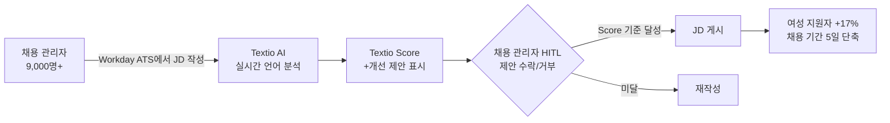

## Summary

T-Mobile은 Textio의 AI 기반 포용적 언어 플랫폼을 ~125명 리크루터 + 9,000명+ 채용 관리자에게 배포해, 성 중립적 어조 편집 시 여성 지원자 +17%, Textio Score 90+ 달성 시 채용 소요 기간 5일 단축을 확인했다. Workday ATS에 Textio를 직접 통합해 JD 작성 시 실시간 AI 제안을 받는 구조다. 기업 합병 통합 과정 중에 도입했으며, 2025년 3월 HR Brew가 Textio의 스킬 기반 면접 도구 출시를 별도 보도. Textio 플랫폼 차원에서는 J&J(여성 지원자 +90,000명)·Nvidia(충원 속도 2배) 사례가 Harvard Business School Digital Initiative를 통해 전달됐다 (⚠️ 벤더 주장 (Harvard DI 전달)). 2026-09-27 `textio-tmobile-inclusive-jd` 페이지를 이 페이지로 병합.

## Problem / Why (도입 배경)

- T-Mobile 합병(T-Mobile + Sprint) 이후 채용 브랜딩·JD 언어 비일관성
- 다양성 채용 목표 달성을 위한 JD·이메일 언어의 시스템적 개선 필요
- 9,000명+ 채용 관리자의 JD 작성 품질을 일관되게 관리하는 수단 부재

## Solution Architecture

### A. Process (프로세스)

- **Before (As-is)**: 리크루터·채용 관리자가 개별적으로 JD 작성 → 편향 언어 미감지 → 다양성 지원자 풀 제한
- **After (To-be)**:
  1. JD를 Workday ATS에서 직접 작성 (Textio 인라인 통합)
  2. Textio AI가 실시간 언어 점수(Textio Score) + 개선 제안 표시
  3. Textio Score 기준 이상이어야 게시 허용 — ⚠️ 벤더 주장 (T-Mobile case study PDF): 작성자가 제안 수용/거절하며 **점수 ≥90** 목표, 90+ 도달 시 ATS 게시
  4. 리크루팅 이메일·고용 브랜드 콘텐츠에도 동일 도구 적용
  5. 응답률·다양성 지표로 ROI 추적 (⚠️ 벤더 주장 — T-Mobile case study PDF)
- **Human-in-the-loop**: 채용 관리자·리크루터가 AI 제안 수용 여부 결정; 최종 게시 전 Score 기준 충족 필수
- **Trigger & Frequency**: JD 작성·편집 시 실시간(daily)
- **Scope of autonomy**: recommend (AI가 언어 개선 제안); 인간이 accept/reject

```mermaid
flowchart LR
    HM[채용 관리자\n9,000명+] -->|Workday ATS에서 JD 작성| Textio[Textio AI\n실시간 언어 분석]
    Textio --> Score[Textio Score\n+개선 제안 표시]
    Score --> HITL{채용 관리자 HITL\n제안 수락/거부}
    HITL -->|Score 기준 달성| Post[JD 게시]
    HITL -->|미달| Revise[재작성]
    Post --> Outcome[여성 지원자 +17%\n채용 기간 5일 단축]
```
범례: 실선 = Textio 케이스 스터디에서 확인

### B. System & Infrastructure (시스템·인프라)

- **Core HRIS / ATS**: ✅ Workday ATS — Textio 직접 embedded ([[sources/textio-tmobile-duolingo-dei-2025]])
- **AI 시스템 배치**: ✅ Textio (SaaS) — Workday ATS 내 통합 ([[sources/textio-tmobile-duolingo-dei-2025]])
- **배포 환경**: _미공개 (not disclosed)_
- **연동·통합**: ✅ Workday ATS 통합; 적용 범위는 job posts·리크루팅 이메일·고용 브랜드 콘텐츠 ([[sources/textio-tmobile-duolingo-dei-2025]]); 이메일 시스템 연동 방식 _미공개_
- **사용자 접점**: ✅ Workday ATS 내 (JD 작성) ([[sources/textio-tmobile-duolingo-dei-2025]]); 이메일 도구 접점 세부 _미공개_

### C. Data (데이터)

- **입력**: ✅ job posts, 리크루팅 이메일, 고용 브랜드 콘텐츠 ([[sources/textio-tmobile-duolingo-dei-2025]])
- **출력**: ✅ Textio Score, 성 중립 어조(gender-neutral tone) 제안 ([[sources/textio-tmobile-duolingo-dei-2025]]); 점수 범위 _미공개_
- **학습**: _미공개 (not disclosed)_ — case study PDF(sources 미등록)의 '수백만 건 hiring docs 학습' 주장은 인용 불가
- **데이터 규모**: ✅ ~125 리크루터 + 9,000+ 채용 관리자 사용 ([[sources/textio-tmobile-duolingo-dei-2025]])

### D. Model (모델)

- **Foundation model**: _미공개 (not disclosed)_ — Textio 자체 언어 모델 (외부 LLM 사용 여부 미공개)
- **Model 유형**: ✅ 언어 분석·Textio Score 산출 ([[sources/textio-tmobile-duolingo-dei-2025]]); 모델 유형 세부 _미공개_
- **커스터마이징**: _미공개 (not disclosed)_
- **평가·가드레일**: ✅ Textio Score ≥90 게시물 기준으로 채용 기간 단축을 측정 ([[sources/textio-tmobile-duolingo-dei-2025]]); T-Mobile 게시 차단 정책 세부 _미공개_ (Duolingo는 ≥85 정책 — 동일 소스)

### E. Organization & Team (조직·팀 구조)

- **오너십**: HR / 인재확보 + DEI 부서 공동
- **배포 범위**: ✅ ~125 리크루터 + Employer Brand Marketing + DEI 직원 + 9,000+ 채용 관리자 ([[sources/textio-tmobile-duolingo-dei-2025]])
- **변화관리**: 전체 채용 관리자 대상 Textio 훈련 + 합병 통합 프로세스와 동시 진행

## Impact / Metrics (기대효과)

### 기대효과 요약
성 중립 어조 적용 시 여성 지원자 17% 증가, Textio Score 90+ 달성 시 채용 소요 기간 5일 단축 (자사 ���고 기반).

| 지표 | 결과 | 신뢰도 |
|---|---|---|
| 여성 지원자 증가 (성 중립 어조 편집 시) | **+17%** | ⚠️ 자사 보고 (Textio 케이스 스터디) |
| 채용 소요 기간 (Score 90+ 달성 시) | **5일 단축** | ⚠️ 자사 보고 |
| Textio 사용 인원 | 125 리크루터 + 9,000+ 채용 관리자 | ✅ Fact (케이스 스터디 직접 기재) |
| J&J — 추가 여성 지원자 (Textio 플랫폼 타 고객) | **+90,000명** (pipeline 9%↑) | ⚠️ 벤더 주장 (Harvard DI 전달) |
| Nvidia — 충원 속도 (Textio 플랫폼 타 고객) | **2배 빠름** | ⚠️ 벤더 주장 (Harvard DI 전달) |
| Textio 플랫폼 — Fortune 500 채택 | **25%+** | ⚠️ 벤더 주장 (Textio 공식) |
| 학술 관심 — Harvard Business School Digital Initiative 연구 커버 | 해당 | ✅ Fact (Tier 1) |

> J&J·Nvidia·Fortune 500 수치는 2026-09-27 병합된 `textio-tmobile-inclusive-jd` 페이지에서 이관 (출처: Harvard Business School Digital Initiative 게시물 및 Textio 자료 — sources 참조). T-Mobile 외 고객 수치이므로 이 페이지의 confidence 산정에는 반영하지 않음.

## Governance & Risk

- 여성 지원자 증가 외 기타 소외 그룹(인종·장애 등)에 대한 개선 효과: 미공개
- Textio Score 컷오프 정책이 현업 채용 속도를 늦출 수 있는 리스크 → 미공개
- 언어 개선이 실제 채용 결정(면접·최종 합격)의 다양성에 미치는 영향: 미공개

## Contradictions

> [!note] 2026-09-27 중복 페이지 병합
> - `textio-tmobile-inclusive-jd` (Talent Acquisition / Sourcing & Attraction, first_seen 2023, confidence 0.35) 페이지를 이 페이지로 병합. 카테고리는 Strategic Workforce & Governance / DEI, first_seen 2022-12-01 유지.
> - **표기 차이**: T-Mobile 여성 지원자 +17%·5일 단축·125+9,000 배포 수치를 병합 전 페이지는 ⚠️ 벤더 주장(Textio case study)으로, 이 페이지는 ⚠️ 자사 보고로 표기. 원 출처는 Textio가 발행한 T-Mobile 케이스 스터디(벤더 발행·고객 인용)이므로 두 표기 모두 독립 검증 없음 — 외부 인용 시 "벤더 케이스 스터디 수치"로 명시할 것.
> - **게시 기준 점수**: 이 페이지는 "T-Mobile 기준 미공개"로 기술했으나, 병합 전 페이지가 인용한 T-Mobile case study PDF는 Score ≥90 목표·90+ 시 게시로 기술 → Process 3단계에 반영 (⚠️ 벤더 주장).

> [!note] 2026-09-27 grounding — 유일한 인용 소스 [[sources/textio-tmobile-duolingo-dei-2025]]의 raw 스냅샷은 Textio 사례 목록 페이지로 T-Mobile 수치(+17%·5 days)가 없음(소스 페이지 요약에만 존재). B/C/D의 배포 환경·학습 데이터·점수 범위 등 미확인 서술은 `_미공개_`로 교체. Harvard DI·case study PDF는 `sources_unresolved` — 인용 불가.

## Consulting Angle

- **DEI 채용 ROI 논거**: "포용적 언어 → 여성 지원자 +17% → 채용 기간 -5일"은 DEI 투자 비용 편익 분석에 수치로 제시 가능
- **ATS 통합 패턴**: Workday 통합 사례는 ATS 중심 HR tech 스택을 가진 클라이언트에게 즉시 참조 가능한 아키텍처
- **한국 대기업 적용**: 공채 JD의 성별 편향 언어(예: 남성 지원자 선호 표현) 문제에 직접 적용 가능 — 공채 시즌 JD 품질 개선 POC로 활용
- **주의**: 언어 개선만으로는 체계적 DEI 목표 달성 어려움 — 면접 평가·합격 결정 단계의 bias audit과 병행 필요를 클라이언트에 경고
- **"AI가 편향을 만든다"의 반대 사례** (병합 이관): Amazon 2017 ML 채용 도구 폐기 사례와 대비 — 같은 AI를 편향 **제거**에 쓴 사례로 제시 가능 (T-Mobile +17%, J&J +90k는 ⚠️ 벤더 주장임을 병기)
- **편향 감소의 두 접근법 병치** (병합 이관): (1) 사후 감사 — HireVue bias audit [[hirevue-ai-assessment-bias-audit]] vs (2) 사전 예방 — Textio inclusive JD. 클라이언트 제안 시 두 축을 나란히 제시
