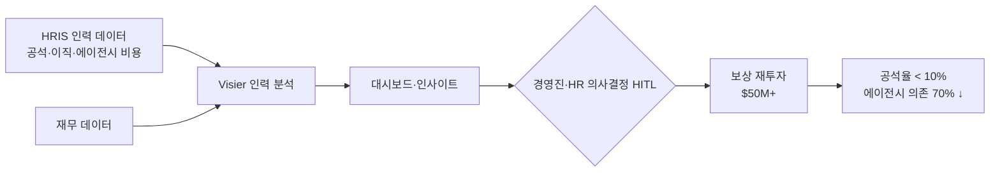

## Summary

Tampa General Hospital (12,000 FTE, 대형 미국 의료시스템)이 Visier 인력 분석 플랫폼을 활용해 공석율·이직 원인을 데이터로 분석하고 에이전시 노동(파견 간호사) 의존도를 70% 줄였다. 절감 재원 $50M+를 직원 보상에 재투자해 공석율 10% 미만을 달성했다. Visier Outsmart 2025 컨퍼런스에서 Business Performance Impact Vizzie Award 수상. Visier 고객 컨퍼런스 발표 기반으로 자사 보고 성격이 있으나, 독립 HIMSS Stage 7 인증(2025-06)이 병원의 분석 성숙도를 간접 검증.

## Problem / Why

- 입원 환자 파견 간호사(travel nurse) 과의존 → 고비용 구조
- 인력 공석 원인 파악 데이터 부재 → 임시방편적 충원 반복
- HR과 재무 간 인력 데이터 단절 → 투자 의사결정 지연

## Solution Architecture

### A. Process (프로세스)

- **Before (As-is)**: 에이전시 노동에 의존, 공석 원인 분석 없이 임시 충원 반복
- **After (To-be)**: Visier로 공석율·이직 패턴·에이전시 비용 연동 분석 → 인력 투자 우선순위 결정 → 보상 재투자로 내부 충원율 제고
- **Human-in-the-loop (HITL) 지점**: 분석 결과 기반 보상 전략 결정 → 경영진·HR CHRO 승인
- **Trigger & Frequency**: 상시 대시보드 (daily) + 정기 경영진 보고
- **Scope of autonomy**: 분석·인사이트 제시(recommend); 투자 결정은 경영진(approve-then-act)

범례: 실선 = Visier Outsmart 2025 발표에서 확인

### B. System & Infrastructure (시스템·인프라)

- **Core HRIS**: _미공개 (not disclosed)_
- **AI 시스템 배치**: Visier SaaS 플랫폼 (클라우드)
- **배포 환경**: _미공개 (not disclosed)_
- **연동·통합**: HR 데이터 + 재무 데이터 연동 (구체 시스템 미공개)
- **사용자 접점**: 경영진 대시보드, HR 분석가 인터페이스
- **Visier MCP**: 2026-04 Visier MCP 출시 — 외부 AI 에이전트가 Visier 인력 데이터에 거버넌스 기반 접근 가능 (향후 확장 가능성)

### C. Data (데이터)

- **입력**: 직원 마스터(12,000 FTE), 이직·공석 데이터, 에이전시 비용, 보상 데이터, 재무 지표
- **규모**: 12,000 FTE 기반 분석
- **연동**: HR ↔ Finance 헤드카운트 조정 (별도 J&J 사례에서도 동일 패턴 확인)
- **학습 vs RAG**: _미공개 (not disclosed)_
- **거버넌스**: _미공개 (not disclosed)_

### D. Model (모델)

- **Foundation model**: _미공개 (not disclosed)_ — Visier Vee (NL Q&A); 분석 엔진 모델 아키텍처 미공개
- **Model 유형**: 기술통계·예측 분석 (attrition, 공석 패턴); Vee = LLM 기반 NL Q&A
- **커스터마이징**: _미공개 (not disclosed)_

### E. Organization & Team (조직·팀 구조)

- **오너십**: HR + Finance 공동 (헤드카운트 조정 프로젝트)
- **참여 역할**: HR analytics 팀, 재무팀, 경영진
- **거버넌스**: HIMSS Stage 7 Analytics 인증 (2025-06) — 플로리다 최초 (분석 성숙도 독립 검증)
- **AI 도입 규모**: 61개 AI 애플리케이션 병원 전체에 배포

## Impact / Metrics (기대효과)

### 기대효과 요약
에이전시 노동 비용 70% 절감, $50M+ 직원 보상 재투자, 공석율 10% 미만 달성 (자사 보고 기반).

| 지표 | 결과 | 신뢰도 |
|---|---|---|
| 에이전시 노동 비용 절감 | -70% (입원 파견 간호사 제거) | ⚠️ 자사 보고 (Visier 컨퍼런스 발표) |
| 재투자 규모 | $50M+ → 직원 보상 | ⚠️ 자사 보고 |
| 공석율 | < 10% | ⚠️ 자사 보고 |
| 분석 성숙도 인증 | HIMSS Stage 7 (2025-06) | ✅ Fact (HIMSS 독립 인증기관) |

## Governance & Risk

- 의료 인력 데이터(환자 치료 결과 연동 가능) → HIPAA 준수 고려
- 분석 기반 보상 결정 → 공정 보상 감사 병행 필요 여부 미공개
- 에이전시 노동 70% 축소 → 내부 간호사 공급망 관리 역량이 전제 조건 (상세 미공개)

## Contradictions

없음.

## Consulting Angle

- **헬스케어 클라이언트**: 에이전시 노동 과의존 → People Analytics 기반 내부 충원 ROI 제안의 핵심 벤치마크. "$50M 재투자 → 공석율 10% 이하"는 설득력 있는 투자 논거
- **제조·유통 클라이언트**: 교대근무 인력 과의존 구조에 동일 로직 적용 가능
- **한국 적용**: 병원 간호사 이직율 문제, 파견 간호사 의존도가 국내 의료계에서도 유사하게 나타남 — 서울대병원·삼성서울병원 등에 참고 사례로 제시 가능
- **데이터 포인트**: 61개 AI 앱 도입 병원 → "AI 포트폴리오 관리" 거버넌스 필요성 강조 가능
