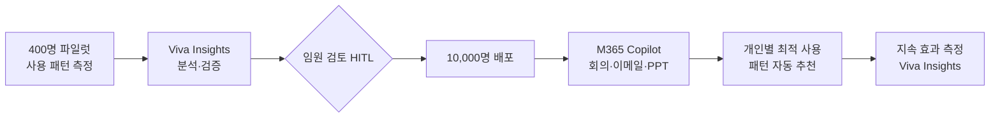

## Summary

Toshiba는 "도시바 리바이탈리제이션 플랜" (FY2024–FY2026)의 일환으로 Microsoft 365 Copilot을 10,000명에게 배포했다. 400명 파일럿에서 5.6시간/월의 시간 절감이 확인되었으며, 전사 배포 시 연간 200,000시간 이상 절감이 예상된다. Viva Insights와 결합해 개인별 최적 Copilot 사용 패턴을 자동 추천하는 시스템을 구축했다.

## Problem / Why

- 일본 기업 특유의 회의·문서 작업 과부하 → 전략·혁신 시간 부족
- 사업 재편(도시바 리바이탈리제이션 플랜) 과정에서 생산성 확보가 전략적 요건
- 10,000명 규모의 AI 도입 효과를 데이터로 측정·최적화할 체계 필요

## Solution Architecture

### A. Process (프로세스)

- **Before (As-is)**: 회의 기록 수작업, 이메일·회의 정보 수동 파악, PPT 초안 수작업
- **After (To-be)**:
  1. 400명 파일럿 → 사용 패턴 분석 (Viva Insights 연동)
  2. 파일럿 결과 검증 후 10,000명 배포
  3. Microsoft 기술 지원으로 개인 활동 패턴 기반 Copilot 사용 자동 추천 시스템 구축
  4. 상시 사용 현황 모니터링 (Viva Insights)
- **Human-in-the-loop**: 파일럿 결과 검토 → 임원 승인 후 전사 배포; 개별 직원은 Copilot 기능 자율 선택
- **Trigger & Frequency**: 상시(daily) — 회의·이메일·문서 작성 시 자동 활성화
- **Scope of autonomy**: recommend (Copilot이 요약·초안·답변 제안); 직원이 최종 결정

범례: 실선 = Microsoft 고객 스토리에서 확인

### B. System & Infrastructure (시스템·인프라)

- **Core HRIS**: _미공개 (not disclosed)_
- **AI 시스템 배치**: Microsoft 365 Copilot (클라우드, Azure 기반)
- **배포 환경**: Microsoft Cloud (Azure)
- **연동·통합**: Microsoft 365 앱 전체 (Teams, Outlook, PowerPoint, Word 등), Viva Insights (사용 분석)
- **사용자 접점**: Microsoft 365 앱 내 인라인 Copilot
- **지역**: 일본 (주요 배포)

### C. Data (데이터)

- **입력**: 회의 트랜스크립트, 이메일, 문서, 개인 작업 패턴 (Viva Insights)
- **데이터 규모**: 10,000명 사용 로그; 파일럿 400명의 상세 분석
- **거버넌스**: Microsoft 기업 데이터 처리 정책; 일본 개인정보보호법 적용 (구체 내용 미공개)
- **데이터 잔존**: _미공개 (not disclosed)_

### D. Model (모델)

- **Foundation model**: ⚠️ 벤더 주장: GPT-4 계열 (Microsoft/OpenAI) — Microsoft 공식 사양이나 버전 미명시
- **Model 유형**: LLM (생성, 요약, 번역), 사용 패턴 분석(classifier/embedding — Viva Insights)
- **제공 방식**: Microsoft Azure OpenAI Service (상용 API)
- **커스터마이징**: 개인 활동 패턴 기반 추천 자동화 (자체 구현 — Microsoft 기술 지원)

### E. Organization & Team (조직·팀 구조)

- **오너십**: IT/DX 부서 주도 (HR 협업)
- **파트너**: Microsoft (기술 지원·구현 파트너)
- **변화관리**: 파일럿 단계에서 "어떻게 최대한 활용할지" 토론 → 내부 Copilot 활용법 가이드 수립
- **팀 규모**: 파일럿 400명 → 10,000명 (규모 및 기간 미공개)

## Impact / Metrics (기대효과)

### 기대효과 요약
파일럿 활용율 95%, 직원당 월 5.6시간 절감, 10,000명 확대 시 연간 200,000시간+ 절감 (자사 보고 기반).

| 지표 | 결과 | 신뢰도 |
|---|---|---|
| 파일럿 활용율 | 95% 실제 사용 | ⚠️ 자사 보고 (Microsoft 케이스 스터디) |
| 월 시간 절감 / 직원 | **5.6시간** | ⚠️ 자사 보고 |
| 연간 시간 절감 (10,000명) | **200,000시간+** | 계산값 (5.6h × 12 × 10,000) |
| 주요 사용 사례 | Teams 회의 기록, PPT 생성, 이메일·회의 따라잡기 | ✅ Fact (Microsoft 케이스 스터디) |

## Governance & Risk

- 일본 개인정보보호법(APPI) 준수: 직원 생산성 데이터 수집·분석 관련 동의·투명성 요건
- 95% 사용율이 자발적 참여인지 업무 지시 기반인지 불명확 → 실제 체감 가치 측정의 어려움
- AI 활용 격차 (tech-savvy vs. 미숙련 직원) → 미공개

## Contradictions

없음.

## Consulting Angle

- **일본·아시아 기업 대상**: "일본 기업도 Copilot 전사 배포"는 보수적 아시아 기업에 대한 레퍼런스로 유효. 도시바 리바이탈리제이션 플랜 맥락 — AI가 기업 재건의 핵심 수단
- **ROI 계산 템플릿**: 5.6h/월 × 평균 인건비 × 직원수로 투자 회수 기간 계산 가능 — 제안서 비용편익 분석에 즉시 활용
- **한국 대기업 적용**: 삼성·현대·LG 등 MS365 대규모 사용 기업에서 Copilot 도입 ROI 벤치마크로 활용
- **파생 질문**: "5.6시간 절감 중 얼마가 실제 고부가가치 업무로 전환되었는가?" — 생산성 역설(Jevons paradox) 고려 필요
