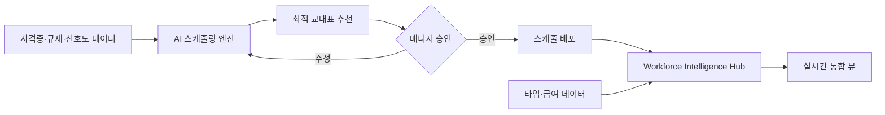

## Summary

UKG가 AI 기반 워크포스 스케줄링·인텔리전스 솔루션을 확대하며, 미국 최대 헬스케어 시스템의 **90% 가까이**가 UKG를 사용한다고 발표(2026-02). 대표 고객 사례로 **KC CARE Health Center**가 리텐션 **92% 개선**·효율성 **60% 향상**, **Jetro Restaurant Depot**이 UKG Rapid Hire로 연간 소싱·온보딩 비용 **$1.8M 절감**(2025), 연 **$2.2M 절감** 전망. 2025년 11월 **Workforce Intelligence Hub** 출시 — AI 기반 스케줄·타임·채용·성과·급여 데이터를 실시간 통합 뷰로 제공. [[sources/ukg-healthcare-scheduling-2026-02.md]]

## Problem / Why

- 프론트라인(의료·소매·외식) 인력의 **교대 스케줄링 복잡성** — 자격증·컴플라이언스·선호도·공정근무법 등 다중 제약
- 높은 이직률 → **채용·온보딩 비용 반복 발생**
- 스케줄·타임·급여 데이터가 **사일로화** → 실시간 의사결정 불가
- 프론트라인 직원의 **번아웃** — 비효율 스케줄링이 주 원인 중 하나

## Solution Architecture (요약)

### A. Process (프로세스)

- **Before**: 매니저가 수동으로 교대표 작성 → 자격증·컴플라이언스·선호도 수동 확인 → 채용도 개별 프로세스
- **After**: AI가 자격증·규제·선호도·노동법 제약을 반영한 최적 스케줄 자동 생성 → Workforce Intelligence Hub에서 스케줄·타임·채용·급여 데이터 실시간 통합 뷰 → UKG Rapid Hire로 AI-first 채용 [[sources/ukg-healthcare-scheduling-2026-02.md]]
- **HITL 지점**: AI 스케줄 추천 → 매니저 승인/수정
- **Trigger & Frequency**: 일간 (교대 스케줄링), 주간/월간 (인력 계획)
- **Scope of autonomy**: Recommend → Approve-then-act

### B. System & Infrastructure

- **Core 플랫폼**: UKG Pro / UKG Ready (HCM + Workforce Management)
- **AI 시스템**: Bryte AI (UKG 내장 AI 에이전트) — 급여 인사이트·복리후생 모델링·셀프서비스·Great Place To Work Hub 연동 [[sources/ukg-healthcare-scheduling-2026-02.md]]
- **Workforce Intelligence Hub**: 2025-11 출시 — 스케줄·타임·채용·성과·급여·산업 트렌드 실시간 통합 [[sources/ukg-healthcare-scheduling-2026-02.md]]
- **데이터 규모**: ⚠️ 벤더 주장: 12B+ 스케줄 생성, 10B 출퇴근 기록, 750M+ 지원자 처리 [[sources/ukg-healthcare-scheduling-2026-02.md]]

### C. Data

- **입력**: 근태·스케줄·채용·급여·성과 데이터 + 자격증·규제·직원 선호도 + Great Place To Work 설문 [[sources/ukg-healthcare-scheduling-2026-02.md]]
- **One View**: 150+ 국가, $14.6B 급여 처리, >99% 정확도, 84% touchless payroll [[sources/ukg-healthcare-scheduling-2026-02.md]]
- 학습/RAG 방식: _미공개 (not disclosed)_

### D. Model

- _미공개 (not disclosed)_

### E. Organization & Team

- _미공개 (not disclosed)_

## Impact / Metrics

### 기대효과 요약

프론트라인 인력 스케줄링 최적화 + 채용 비용 절감 + payroll 자동화.

| 지표 | 값 | 기업 | 출처 | 성격 |
|---|---|---|---|---|
| 리텐션 개선 | **92%** | KC CARE | UKG 공식 | ⚠️ 자사 보고 |
| 효율성 향상 | **60%** | KC CARE | UKG 공식 | ⚠️ 자사 보고 |
| 연간 비용 절감 | **$1.8M** (2025), **$2.2M** 전망 | Jetro Restaurant Depot | UKG 공식 | ⚠️ 자사 보고 |
| 헬스케어 시장 점유 | **~90%** 미국 최대 시스템 | 산업 전체 | UKG 공식 | ⚠️ 벤더 주장 |
| Touchless payroll | **84%** | UKG One View | UKG 공식 | ⚠️ 벤더 주장 |
| Payroll 정확도 | **>99%** | UKG One View | UKG 공식 | ⚠️ 벤더 주장 |
| 직원 AI 스케줄 신뢰 | **75%** (프론트라인) | 설문 | UKG 공식 | ⚠️ 벤더 주장 |

## Governance & Risk

- AI 스케줄링의 **공정성** — 특정 직원에게 불리한 교대 패턴 반복 위험
- 프론트라인 직원의 **AI에 대한 신뢰 부족** — UKG 자체 조사에서 53%만 고용주가 AI 준비시킨다고 인식 [[sources/ukg-healthcare-scheduling-2026-02.md]]
- 52시간제(한국) 등 지역 노동법 컴플라이언스 자동 반영 필요

## Consulting Angle

### 활용 포인트
- **프론트라인 워크포스 AI의 대표 사례**: 헬스케어·소매·외식 클라이언트에게 직접 참고
- **"Workforce Intelligence Hub" 개념**: 스케줄·타임·급여·채용 데이터 통합은 국내 대기업 HR 데이터 사일로 문제 해결의 벤치마크
- **Touchless payroll 84%**: 급여 자동화 목표치 설정의 근거

### 한국 적용
- 한국 제조·유통·병원의 교대제 스케줄링 + 52시간 컴플라이언스 → UKG 모델 참조
- 국내: 시프티(Shiftee)가 유사 포지션이나 AI 기능은 계획 단계 → UKG와 격차 비교 가능
- UKG는 글로벌 150+ 국가 운영이나 한국 시장 직접 진출 여부 _미공개_
