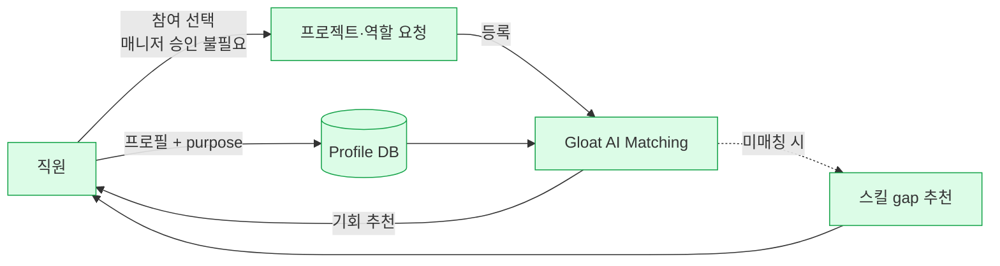

# Unilever — FLEX Experiences (Gloat AI Talent Marketplace)

> **2026-04-12 업데이트**: 2024년 Gloat customer story 기반 metric 보강 확보. 65,000 global users, 700,000+ hours unlocked, 41% productivity, 95% endorsement, COVID 시점 8,000+ 재배치/300,000 시간. Historical i4cp 2019 소스 + 2024 Gloat update → 현재 wiki의 recency bucket이 >24m → 12-24m으로 이동. 다만 **2024 metric source는 Gloat 자사 customer story (Tier 3)**이므로 Tier 1·2 독립 검증은 여전히 부족.

## Summary

Unilever는 2019년부터 **Gloat**와 파트너십으로 **"FLEX Experiences"**라는 사내 AI 기반 talent marketplace를 운영. 직원 프로필(스킬·관심·purpose)을 기반으로 내부 프로젝트·역할 기회를 추천 매칭. **매니저 승인 불필요** 원칙이 특징 (본업 유지 전제). Internal mobility / project staffing / redeployment 영역의 대표 레퍼런스.

## Problem / Why

- Unilever는 190개국·128,000명 규모로 운영되며, 사일로·지역 간 인력 활용 비효율이 큼
- 직원은 현재 부서 외의 기회를 보기 어렵고, 매니저는 본인 팀 인력을 "잃지 않으려" 함 → **정적 탤런트 배치**의 한계
- 스킬 변화 속도가 빨라 "역할 설명"만으로는 매칭이 어렵고, **스킬 기반 매칭**이 필요
- (*이 problem 진술은 i4cp 기사에 직접 서술된 것은 아니나, Unilever의 FLEX 도입 맥락을 설명하는 다른 공개 자료의 프레이밍*이며, 본 wiki에서는 이를 일반 맥락으로만 다룸)

## Solution Architecture

### A. Process (프로세스)

- **Before (As-is)**: _미공개_ (기존 직무 이동·프로젝트 배치 메커니즘 세부는 기사에 없음)
- **After (To-be)** — ✅ i4cp 확인:
  1. 직원이 **professional profile + purpose statement** (관심·포부) 작성
  2. Gloat AI가 직원 스킬과 등록된 프로젝트·역할 기회를 매칭
  3. 직원에게 기회 추천 (단기 프로젝트·장기 역할 모두)
  4. **매니저 허가 불필요** (본업 수행 전제)
  5. 미매칭 직원에겐 "develop할 스킬" 추천
- **Human-in-the-loop 지점**: 직원 본인이 참여 의사 결정. 매니저 veto 없음 (명시적 fact). 스킬 판단·매칭 품질 검증에 HR의 개입 여부 ❓ 미공개
- **Trigger & Frequency**: 상시 운영 — 프로젝트 등록·직원 프로필 업데이트 시 재매칭
- **Scope of autonomy**: Recommendation (AI 제안, 직원 선택)

_범례: 모든 노드 = i4cp 2019-12 기사 확인 사실._

### B. System & Infrastructure

- **Core HRIS**: _미공개_ — Unilever가 어떤 HCM을 쓰는지 이 기사엔 없음 (다른 소스에선 Workday/SAP 등 언급되나 본 wiki 미검증)
- **AI 시스템 배치**: **Gloat 플랫폼** (별도 SaaS, HRMS에 통합된 별도 layer)
- **배포 환경**: Gloat cloud (공개 클라우드 특성상 AWS/Azure 추정되나 기사에 없음)
- **연동·통합**: HRIS와의 data feed가 있다고 추정되나 구체 API·ETL 공개 없음
- **사용자 접점**: Gloat web portal (mobile 지원 여부 등 ❓ 미공개)
- **인증·권한**: _미공개_

### C. Data (데이터)

- **입력 데이터 소스**:
  - 직원 self-reported 프로필 (스킬·관심·purpose)
  - 프로젝트·역할 등록 (requesting manager가 등록)
- **데이터 규모**: 2019-12 기준 30,000+ 직원 · 1,750명 HR 초기 pilot
- **전처리·정제**: 스킬 ontology로 정규화 (Gloat 핵심 기능) — 구체 구현 미공개
- **학습 vs RAG vs In-context 구분**: Gloat의 매칭 엔진은 semantic similarity·graph 기반일 가능성이 높으나 기사에 명시 없음 → _미공개_
- **데이터 거버넌스**: _미공개_
- **민감정보 처리**: _미공개_

### D. Model (모델)

- **Foundation model**: _미공개_ — Gloat의 내부 매칭 엔진 세부는 벤더 black box
- **모델 유형**: 매칭(similarity)·추천 — LLM 단독 아닐 가능성 큼 (스킬 그래프 기반이 통상). 구체 유형 ❓ 미공개
- **제공 방식**: Gloat SaaS
- **커스터마이징**: _미공개_ — Unilever 전용 스킬 온톨로지가 있는지 여부 포함
- **평가·가드레일**: _미공개_. 매칭 품질·편향 감사(성별·국적·연령·직급별 기회 분배) 공개 없음. 단, 다른 소스에 "2/3 기회가 여성에게 돌아갔다"는 DEI 수치가 있다는 보고는 있음 (본 wiki 미검증)
- **비용·성능 지표**: _미공개_

### E. Organization & Team (조직·팀 구조)

- **오너십**: Unilever **Jeroen Wels** (Executive VP of HR, Categories, and Organizations, 2019 기준). 현재는 ❓ 미공개
- **운영 팀 구조**: _미공개_
- **거버넌스 체계**: _미공개_
- **변화관리**: **매니저 허가 불필요** 원칙이 가장 큰 변화관리 tempo 포인트. 이게 HR·매니저 측 pushback에 어떻게 대응했는지 세부는 ❓ 미공개
- **파트너**: [[gloat]] (단일 플랫폼 파트너)

### F. Diagrams
- Process flowchart 1개 (A 섹션). 시스템·data 도식은 근거 부족으로 생략.

---

**Fact 품질 요약**:
- ✅ Fact: 규모, 파트너, 프로세스 핵심, Leader 이름, "매니저 허가 불필요" 원칙, 95% endorsement
- ⚠️ 다른 소스에서 보고된 수치 (본 wiki 미검증): 90k 직원·300k 시간·41% 생산성·8,300명 COVID 재배치 등
- ❓ 미공개: 아키텍처·데이터·모델·현재 조직 구조 세부

## Impact / Metrics (기대효과)

### 기대효과 요약
초기 30,000+ 사용자에서 시작(Fact), 300,000시간 unlocked capacity, 41% 생산성 향상 등 보고되나 wiki 미검증. COVID 시 8,300명 재배치.

### 2019-12 기준 (초기 구축, i4cp 독립 소스)
| 지표 | 값 | 출처 | 성격 |
|---|---|---|---|
| 사용자 수 | 30,000+ | [[i4cp-unilever-flex-2019-12]] | ✅ Fact |
| 목표 규모 | 50,000 (2020년 계획) | [[i4cp-unilever-flex-2019-12]] | ✅ Fact (계획) |
| 사용자 endorsement | 95% | [[i4cp-unilever-flex-2019-12]] | ⚠️ 자사 보고 |
| 국가 커버리지 | 90+ | [[i4cp-unilever-flex-2019-12]] | ✅ Fact |

### 2024 업데이트 (Gloat customer story)
| 지표 | 값 | 출처 | 성격 |
|---|---|---|---|
| 전 세계 사용자 | **65,000** | Gloat 2024 customer story | ⚠️ 벤더 주장 (Gloat) + ⚠️ 자사 보고 (Unilever) 복합 |
| 누적 capacity unlocked | **700,000+ hours** | Gloat 2024 customer story | ⚠️ 벤더 주장 |
| 생산성 개선 | **41%** | Gloat 2024 customer story | ⚠️ 벤더 주장 — 측정 방식 미공개 |
| Endorsement rate 유지 | 95% (sustained) | Gloat 2024 customer story | ⚠️ 자사 보고 |
| COVID 재배치 | **8,000+ employees**, 300,000 hours | Gloat 2024 customer story | ⚠️ 자사 보고 (Unilever) |

**2019 → 2024 주요 성장**:
- 사용자 30k → 65k (2.2배)
- 초기 목표 50k 초과 달성
- COVID 이후 재배치 유즈케이스 확립 (critical 프로젝트 700+ 배분)

**주의**: 2024 수치는 **Gloat의 customer story 자료를 search summary로 간접 확보**한 것이며, 이 wiki에 직접 fetch된 1차 소스가 아직 없음 (URL은 확인됨, 다음 ingest 라운드에서 직접 fetch 필요). 따라서 수치는 인용 가능하나 "Gloat 자료에 따르면" 라는 provenance 명시 필수.

## Governance & Risk

- **편향 리스크**: Gloat 매칭 엔진이 직원 집단별(성별·국적·직급·연령) 기회 분배에 편향이 있는지 감사 결과 공개 없음
- **노사관계**: "매니저 허가 불필요" 원칙은 한국·독일·일본 등 **연공·집단 문화 강한 지역**에서 pushback 가능성 큼
- **개인정보**: 스킬 프로필은 EU GDPR 특수 카테고리는 아니지만 직원 경력에 대한 portable data로서 DPIA 대상

## Contradictions
_없음 — 단일 소스_

## Consulting Angle

- **사용처**:
  - **그룹사 내부 이동** 컨설팅의 대표 벤치마크 — 특히 계열사 간 이동이 많은 한국 대기업
  - "스킬 기반 인력 운영"으로의 전환 워크숍에서 원형 레퍼런스
  - **매니저 권한 재설계** 논의의 출발점 사례
- **주의**:
  - 현재 wiki의 독립 소스가 **2019년 기준 (76개월 stale)** — 제안서 사용 시 반드시 보완 소스 추가
  - Unilever 규모·문화·DEI 성숙도를 한국 대기업과 단순 비교 금지
- **핵심 교훈 4가지 (클라이언트 제시용)**:
  1. **스킬 온톨로지가 전제** — 직무 중심이 아닌 스킬 중심 HR 데이터 구조가 먼저 구축돼야 함
  2. **"매니저 승인 불필요" 원칙의 정치학** — 이 한 줄이 가장 어려운 변화관리 포인트
  3. **pilot은 HR 부서에서 먼저** — 본인들이 경험한 뒤 타 부서 설득
  4. **DEI 효과는 부산물** — Unilever FLEX는 여성 직원 참여율이 높았다고 보고됨 (우리 wiki에 검증 안 됨)
- **파생 질문**:
  1. 한국 10대 그룹사의 계열사 간 이동·전출입 규정과 talent marketplace의 호환성은?
  2. 5년 단축 버전 — Unilever의 5년 여정을 한국 대기업이 2~3년에 압축하려면 무엇을 생략할 수 있나?
  3. 52시간 근무제 하에서 "프로젝트 참여"가 legal하게 어떻게 기록되는가?
