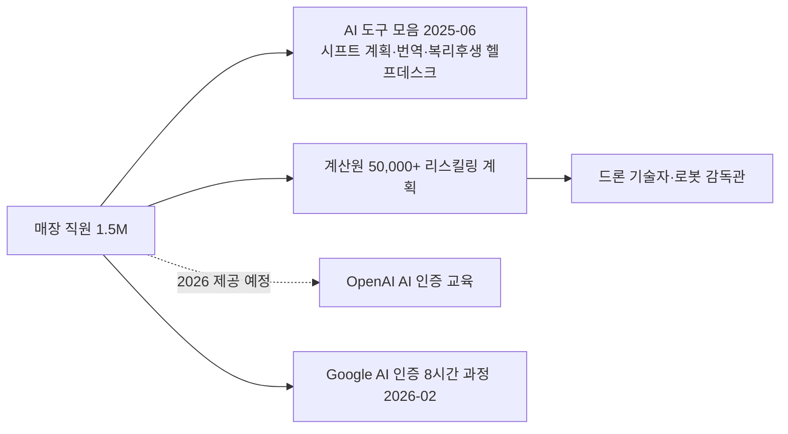

## Summary

Walmart은 2025년 6월 1.5M 매장 직원 대상의 AI 도구 모음(야간 진열 AI 작업 관리·44개 언어 실시간 번역·AI 복리후생 헬프데스크)을 공개하고 [[sources/walmart-corporate-ai-tools-2025-06.md]], 2025년 9월 OpenAI와 AI 인증 교육 프로그램 파트너십(2026년 제공 예정)을 발표했다 [[sources/hrdive-walmart-openai-certification-2025-09.md]]. 2026년 2월에는 Google AI Professional Certification 파트너십으로 1.6 million 직원에게 무료 AI 기초 과정 제공을 발표 (OpenAI 인증과 별개 프로그램) [[sources/fortune-walmart-ai-training-2026-02.md]]. ✅ **Fact** "People-led, Tech-powered" 원칙 하에 AI를 인력 대체가 아닌 보완으로 포지셔닝 [[sources/walmart-corporate-ai-tools-2025-06.md]] [[sources/fortune-walmart-ai-training-2026-02.md]]; 계산원 50,000+ → 드론 기술자·로봇 감독관 리스킬링 계획 [[sources/jobspikr-walmart-reskilling-2025.md]] (1차 출처 미표기). Workday HCM·Paradox ATS 운영 서술은 인용 소스에 없어 삭제 (2026-09-27 grounding 점검).

## Problem / Why (도입 배경)

Walmart는 약 2.1 million 명의 직원을 보유하며(2025-06 기업 개요 [[sources/walmart-corporate-ai-tools-2025-06.md]]; 매장 수 _미공개_), 프론트라인 인력 관리·AI 시대 직원 역량 전환이 과제다. 팀 리드의 시프트 계획 시간 부담 [[sources/walmart-corporate-ai-tools-2025-06.md]], 자동화로 인한 역할 재설계 [[sources/jobspikr-walmart-reskilling-2025.md]]가 배경. 채용 소요시간 등 baseline은 ❓ 미공개.

## Solution Architecture

> **최우선 원칙**: 이 섹션은 **공개된 사실만** 기록한다.

### A. Process (프로세스)

- **Before (As-is)**: ❓ baseline 미공개 — 팀 리드 시프트 계획 90분 소요(초기 결과 기준) [[sources/walmart-corporate-ai-tools-2025-06.md]]; 채용 소요시간 등은 인용 소스에 없음
- **After (To-be)**:
  1. ⚠️ **자사 보고** 2025년 6월, 1.5M 매장 직원 대상 AI 도구 모음 공개 — 야간 진열 AI 작업 관리 도구(시프트 계획 90분 → 30분, 초기 결과), 44개 언어 실시간 번역, AI 복리후생 헬프데스크; 자체 ML 플랫폼 Element 기반. [[sources/walmart-corporate-ai-tools-2025-06.md]]
  2. ✅ **Fact** 2025년 9월, OpenAI와 AI 인증 교육 프로그램 파트너십 발표 (2026년 제공 예정). [[sources/hrdive-walmart-openai-certification-2025-09.md]]
  3. ✅ **Fact** 2026년 2월, Google AI Professional Certification 파트너십 — 미국·캐나다 1.6 million 직원에게 8시간 AI 기초 과정 무료 제공 (OpenAI 인증과 별개). [[sources/fortune-walmart-ai-training-2026-02.md]]
  4. ⚠️ 계산원 50,000+명을 드론 기술자·로봇 감독관으로 전환하는 리스킬링 계획 (1차 출처 미표기 블로그). [[sources/jobspikr-walmart-reskilling-2025.md]]
  5. Workday HCM 통합·Paradox ATS 채용 자동화·Manager Academy 의무화: _미공개_ (인용 소스에 없어 삭제 — 2026-09-27 grounding 점검)
- **Human-in-the-loop (HITL)**: _미공개 (not disclosed)_ — 시프트 계획 도구는 팀 리드가 사용 [[sources/walmart-corporate-ai-tools-2025-06.md]]
- **Trigger & Frequency**: 교육(온디맨드), 시프트 계획(일별) — 세부 _미공개_
- **Scope of autonomy**: _미공개 (not disclosed)_

범례: 실선 = [[sources/walmart-corporate-ai-tools-2025-06.md]] [[sources/jobspikr-walmart-reskilling-2025.md]] [[sources/fortune-walmart-ai-training-2026-02.md]] 확인. 점선 = 2026년 제공 예정 [[sources/hrdive-walmart-openai-certification-2025-09.md]].

### B. System & Infrastructure (시스템·인프라)

- **Core HRIS**: _미공개 (not disclosed)_ (기존 Workday HCM 서술은 인용 소스에 없어 삭제 — 2026-09-27 grounding 점검)
- **ATS**: _미공개 (not disclosed)_ (기존 Paradox 서술은 인용 소스에 없어 삭제)
- **AI 시스템 배치**: ⚠️ 자사 보고: 자체 ML 플랫폼 Element 기반 AI 도구. [[sources/walmart-corporate-ai-tools-2025-06.md]]
- **AI 교육 파트너**: ✅ **Fact** OpenAI (2026년 AI 인증 프로그램) [[sources/hrdive-walmart-openai-certification-2025-09.md]]; Google (AI Professional Certification, 2026-02) [[sources/fortune-walmart-ai-training-2026-02.md]]
- **배포 환경**: _미공개 (not disclosed)_
- **연동·통합**: _미공개 (not disclosed)_ (기존 Data Café 서술은 인용 소스에 없어 삭제)
- **사용자 접점**: ⚠️ 자사 보고: 매장 직원용 AI 도구 — 실시간 번역(텍스트·음성, 44개 언어), AI 복리후생 헬프데스크 [[sources/walmart-corporate-ai-tools-2025-06.md]]; 앱·디바이스 세부 _미공개_

### C. Data (데이터)

- **입력 데이터 소스**: ⚠️ 자사 보고: 야간 진열 작업·시프트 계획 데이터, 다국어 대화 [[sources/walmart-corporate-ai-tools-2025-06.md]]; 세부 _미공개_
- **데이터 규모**: ⚠️ 자사 보고: AI 도구 대상 1.5M 매장 직원; 전체 직원 약 2.1 million 명 (기업 개요). [[sources/walmart-corporate-ai-tools-2025-06.md]] 매장 수 _미공개_
- **데이터 거버넌스**: _미공개 (not disclosed)_

### D. Model (모델)

- **Foundation model**: _미공개 (not disclosed)_ — OpenAI는 교육 파트너이지 도구의 모델 제공자로 확인되지 않음 [[sources/hrdive-walmart-openai-certification-2025-09.md]]
- **Model 유형**: ⚠️ 자사 보고: 작업 관리 AI, 실시간 번역(텍스트·음성), 복리후생 Q&A — 자체 ML 플랫폼 Element 기반 [[sources/walmart-corporate-ai-tools-2025-06.md]]
- **커스터마이징**: _미공개 (not disclosed)_

### E. Organization & Team (조직·팀 구조)

- **문화·철학**: ✅ **Fact** "People-led, Tech-powered" — AI를 인력 대체가 아닌 보완으로 공식 천명. CPO Donna Morris (Fortune 2026-02) [[sources/fortune-walmart-ai-training-2026-02.md]], SVP Greg Cathey (2025-06) [[sources/walmart-corporate-ai-tools-2025-06.md]] 인용.
- **거버넌스**: _미공개 (not disclosed)_

## Impact / Metrics (기대효과)

### 기대효과 요약
Before: 팀 리드 시프트 계획 90분 (⚠️ 자사 보고, 초기 결과) → After: 30분 (⚠️ 자사 보고, 초기 결과 기준 팀 리드·매장 매니저 체감치) [[sources/walmart-corporate-ai-tools-2025-06.md]]. 채용 소요시간·Workday 절감액·업계 노동 효율성 수치는 인용 소스에 없어 _미공개_ (2026-09-27 grounding 점검).

- ⚠️ **자사 보고**: 시프트 계획 시간 90분 → 30분 (팀 리드·매장 매니저의 초기 결과 체감치). [[sources/walmart-corporate-ai-tools-2025-06.md]]
- ⚠️ **자사 보고**: 1.6 million 직원 무료 AI 교육 제공 (Google 인증, 2026-02). [[sources/fortune-walmart-ai-training-2026-02.md]]
- 채용 소요시간 단축·Workday 절감액·RILA 노동 효율성: _미공개_ (인용 소스에 없음)

## Governance & Risk

- ✅ **Fact**: "불행히도 AI를 이유로 인력을 줄이는 기업들이 있지만, Walmart는 오히려 1.6M 직원을 교육하고 있다"고 CPO Donna Morris가 공개 발언 (Fortune 2026-02). [[sources/fortune-walmart-ai-training-2026-02.md]]
- EEOC(미국 고용기회균등위원회) 등 채용 AI 공정성 규제 적용 대상. 구체 bias audit 내용 _미공개 (not disclosed)_.

## Contradictions

_없음._

> [!note] 2026-09-27 grounding — Workday HCM(직원 수·도입 연도·절감액·Data Café), Paradox Olivia(채용 기간 단축), 매장 수, RILA 노동 효율성, Manager Academy 의무화는 인용 소스 4건 어디에도 없음([[sources/jobspikr-walmart-reskilling-2025.md]] raw는 50,000명 리스킬링만 다룸) → `_미공개_`/삭제. "unfortunate" 발언은 CEO가 아닌 CPO Donna Morris ([[sources/fortune-walmart-ai-training-2026-02.md]]). Fortune 기사는 Google 인증(2026-02) 건으로 OpenAI 인증(2025-09)과 별개. [[sources/hrdive-walmart-openai-certification-2025-09.md]]는 walmart-openai-certification의 hrdive 소스와 동일 URL(중복 페이지).

## Consulting Angle

- **"인력 대체 vs 역할 전환" 내러티브**: "People-led, Tech-powered" 메시지는 AI 도입 시 노조·직원의 저항을 관리하는 커뮤니케이션 전략의 강력한 사례. 노사 관계가 민감한 클라이언트 제안에 활용.
- **프론트라인 AI 도구 패키지**: 시프트 계획·다국어 번역·복리후생 헬프데스크를 한 번에 배포한 패턴은 편의점·F&B·물류 등 국내 프론트라인 클라이언트에 참고 가능 (수치는 초기 결과 기준 체감치, ⚠️ 자사 보고).
- Paradox 채용 자동화·Workday 단일화 서술은 인용 소스에 없어 삭제 — 재조사(/hr-research) 후 복원 검토.
- **파생 질문**: "OpenAI와 Walmart의 AI 인증 프로그램은 국내 유통업(이마트·롯데마트)에 어떻게 이식 가능한가? 국내 규제(근로기준법, 중소기업 지원사업) 맥락에서의 차이는?"
