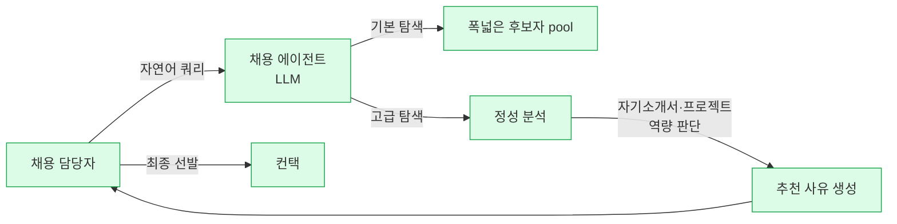

# 원티드랩 — AI 채용 에이전트 (LLM 기반 자연어 인재 검색)

> ⚠ **2025-10 런칭 신제품, 외부 customer 확인 0건**: 제품 자체는 Tier 2 한국 매체가 커버했지만, 실제 기업 도입·deployment 사례는 공개된 바 없음. Paradox·Eightfold 등 글로벌 벤더와의 한국 시장 경쟁 reference로서의 가치.

## Summary

원티드랩(국내 최대급 HR tech 벤더, 상장)이 2025년 10월 21일 출시한 **LLM 기반 AI 채용 에이전트**. 기업 채용 담당자가 **자연어로 인재를 검색**할 수 있게 하는 B2B 제품. 복잡한 필터 설정 없이 "**역량과 경험을 AI가 판단하여 추천 사유까지 제시**"하는 것이 핵심 차별점.

## Problem / Why

- 기존 ATS·채용 플랫폼은 **키워드·필터 기반 검색**이어서 후보자의 "잠재 역량"이나 "정성적 경험"을 놓치기 쉬움
- 자기소개서·프로젝트 경험 같은 **비정형 텍스트 데이터**가 검색에 제대로 반영되지 않음
- 채용 담당자는 검색 결과를 일일이 읽고 판단해야 하므로 **단순 검색에도 많은 시간 소요**

(원티드랩의 공식 problem statement를 전달하는 매체 요약 기반. 직접 인용 아님.)

## Solution Architecture

### A. Process (프로세스)

- **Before (As-is)**: 채용 담당자가 키워드·필터로 후보자를 검색, 검색 결과를 수동으로 검토
- **After (To-be)** — ✅ [[aitimes-wantedlab-recruiting-agent-2025-10]] 확인:
  1. 채용 담당자가 **자연어로 원하는 후보자 프로필 입력** (예: "AI 스타트업 경험 있는 백엔드 5년차 이상")
  2. **기본 탐색**: 조건에 맞는 후보자를 빠르고 넓게 추출
  3. **고급 탐색**: AI 에이전트가 각 후보의 **자기소개서·프로젝트 경험** 등 정성 데이터 분석
  4. AI가 **역량·경험 판단** + **추천 사유** 제시
  5. 담당자가 최종 판단 및 컨택
- **Human-in-the-loop 지점**: 최종 선발은 채용 담당자 (AI는 검색·추천·판단 근거 제시까지)
- **Trigger & Frequency**: 채용 담당자가 필요할 때 수시 사용 (on-demand)
- **Scope of autonomy**: Recommend + reasoning (decide는 사람)

_범례: 녹색 = AI타임스 기사 확인 사실._

### B. System & Infrastructure (시스템·인프라)

- **Core HRIS**: N/A (독립 플랫폼, 채용 담당자 B2B 제품)
- **AI 시스템 배치**: 원티드 플랫폼 내부 (기존 원티드 서비스에 에이전트 기능으로 추가)
- **배포 환경**: 원티드 클라우드 (공개 클라우드 추정, 세부 미공개)
- **연동·통합**: 원티드 채용 플랫폼의 기존 후보자 풀 (360만 인재·3.5만 기업) 활용. 기업 ATS와의 API 연동 여부 ❓ 미공개
- **사용자 접점**: 원티드 웹 interface (별도 애플리케이션 여부 _미공개_)
- **인증·권한**: _미공개_

### C. Data (데이터)

- **입력 데이터 소스** (기존 원티드 플랫폼):
  - 360만+ 후보자 프로필 (이력·스킬·자기소개서·프로젝트 경험)
  - 3.5만+ 기업의 채용 공고·채용 이력
  - 1,000만+ 매칭 데이터 (과거 매칭 결과)
- **데이터 규모**: 국내 최대급 HR data pool (상장사 IR 기준)
- **전처리·정제**: _미공개_ — 자기소개서 등 정성 data를 어떻게 구조화하는지 공개 없음
- **학습 vs RAG vs In-context 구분**: _미공개_
- **데이터 거버넌스**:
  - 원티드랩은 국내 개인정보보호법 대상 — 후보자 동의 기반 data 활용
  - 구체 처리 방침 세부는 플랫폼 약관에 있으나 이 기사에 요약 없음
- **민감정보 처리**: _미공개_

### D. Model (모델)

- **Foundation model**: **LLM 기반**이라고만 명시. 구체 모델(자체 학습? OpenAI·Anthropic API 래핑?) _미공개_
- **모델 유형**: LLM 추론 + semantic search (추정되나 소스에 명시 없음)
- **제공 방식**: 원티드랩 자체 플랫폼
- **커스터마이징 기법**: _미공개_
- **Orchestration 프레임워크**: _미공개_
- **평가·가드레일**: _미공개_. 국내 채용 AI의 **편향·공정성 감사** 자체가 드문 영역 — 공개된 감사 없음
- **비용·성능 지표**: _미공개_

### E. Organization & Team (조직·팀 구조)

- **제품 오너십**: **황리건** 플랫폼 총괄이사 (AI타임스 2025-10 인터뷰에서 확인)
- **개발 팀 구조**: _미공개_
- **거버넌스**: _미공개_
- **외부 파트너**: _미공개_

### F. Diagrams
- Process flowchart 1개 (A). 실증 customer 부재로 시스템·org 도식 생략.

---

**Fact 품질 요약**:
- ✅ Fact: 제품 존재·출시일·핵심 기능·LLM 기반·기존 원티드 플랫폼 스케일
- ⚠️ 벤더 주장 (AI타임스가 전달): "잠재 역량 평가", "인사담당자 생산성 향상"
- ❓ 미공개: 기술 스택·모델 벤더·실제 성능·customer deployment

## Impact / Metrics (기대효과)

### 기대효과 요약
⚠️ 기대효과 수치 미공개. 아래 표 참조.

**현재 공개된 정량 지표 0건** (2025-10 런칭 직후, 2026-04 기준 ~6개월).

관련 플랫폼 규모 (참고):
- 360만 후보자 프로필, 3.5만 기업, 1,000만+ 매칭 이력

**원티드랩 기업 metric** (2025):
- 매출: 367억원
- 목표: 2026년 AX 매출 전체의 50%

## Governance & Risk

- **개인정보보호법**: 후보자 data의 AI 활용 동의 범위 — 원티드 약관 기준 추정되나 이 기사에 없음
- **채용절차공정화법**: AI가 후보자 판단에 개입하는 경우 기업 측(customer)의 고지·이의제기 절차 의무 — 원티드랩 제품 자체가 아니라 도입 기업 책임 영역
- **편향 리스크**: 기존 매칭 data(1,000만)에 편향이 있다면 학습·추론 결과에 반영될 수 있음. 감사 공개 없음
- **실증 부재**: 2025-10 런칭 직후 → 실제 품질·안정성 검증 부족

## Contradictions
_없음 — 단일 소스_

## Consulting Angle

### 국내 컨설팅에서의 활용
- **한국 HR tech 벤더의 AI 전략** 설명 시 대표 사례 — 글로벌 벤더만 논의하는 덱에 균형 제공
- **vs Paradox Olivia 비교**: 유사 concept(자연어 대화형 채용 AI)이지만 한국어·국내 규제 대응 면에서 우위 주장 가능
- **한국어 처리 품질**이 컨설팅 프로젝트의 핵심 필터 — 원티드랩은 한국어 후보자 풀에 특화됐지만 실제 품질은 파일럿으로만 검증 가능

### 제시 시 주의점
- ⚠️ **2025-10 런칭 직후** — 실증 customer 없음, "가능성 중심"으로만 제시
- ⚠️ Foundation model 미공개 → 기술 실력 평가 불가. 클라이언트가 "어떤 LLM 쓰는지?" 물으면 답할 수 없음
- ⚠️ Paradox/Eightfold 대비 **고객 레퍼런스 수**는 현저히 적음 — 이 차이를 덮지 말 것

### 한국 맥락의 차별 가치
- 원티드랩은 국내 매칭 data 1,000만 건 축적 — 글로벌 벤더가 복제하기 어려운 자산
- 한국어 자기소개서·프로젝트 경험의 **정성적 맥락 이해**에서 글로벌 대비 우위 가능성
- 단, 이 가정은 **실증 없음** — 파일럿 필수

### 파생 질문

1. 원티드랩의 채용 에이전트는 **어떤 LLM을 사용**하는가? (자체 학습 LLM인지, OpenAI/Anthropic/Solar·HyperCLOVA 등 래핑인지)
2. **한국어 자기소개서 이해도**가 글로벌 벤더(Paradox·Eightfold)보다 실제로 우위인가?
3. **편향 감사 결과**가 있는가? 성별·학벌·지역별 추천 균형은?
4. Paradox가 한국 시장 진입 시 원티드랩의 경쟁력은?
5. 기업 ATS(마이다스아이티 JODBA, 사람인 등)와의 **통합 경로**는?

## 다음 ingest 우선순위

- 원티드랩의 **실제 customer 도입 사례** 확보 (런칭 이후 6개월 경과)
- Paradox·Eightfold의 한국 진출 현황과 비교
- 사람인·잡코리아·리멤버·라이너 등 경쟁 국내 벤더 AI 전략
- **마이다스아이티 inAIR** (기존 국내 AI 채용 솔루션) ingest 필요
