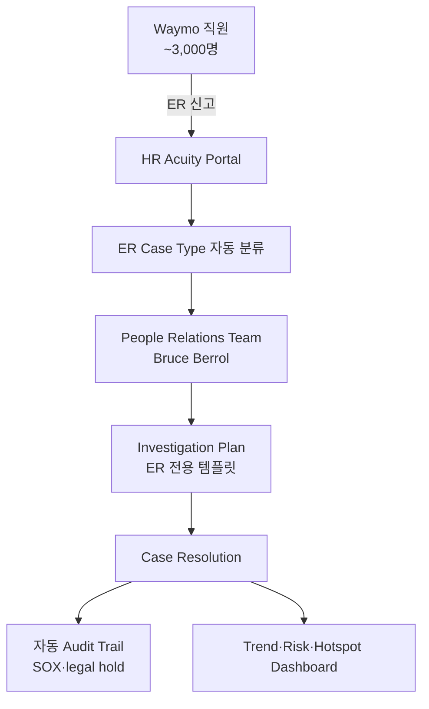

## Summary

Waymo (Alphabet 자율주행 자회사, ~3,000명)는 HR Acuity로 ER case management를 운영. ⚠️ 자사 보고: ServiceNow 같은 범용 도구 → HR Acuity 전용 도구 전환으로 **reporting time 92% 감소**. Bruce Berrol (Head of People Relations) 인용: 일반 ticketing 도구는 ER 도메인 (grievance·discipline·investigation)을 제대로 모름 → 전용 도구 선택. Role-based access·security 강화 동기.

> 📌 **HR Acuity case study 단일 출처** — Tier 1·2 독립 정량 검증 0건. 92% 수치는 ⚠️ 자사 보고로 인용 시 명시 필수.

## Problem / Why (도입 배경)

- **Before**: Waymo는 ServiceNow 같은 범용 ITSM/HR ticketing 도구로 ER case 처리 — grievance·discipline·investigation도 일반 ticket으로 처리
- **Pain point**:
  - **ER 도메인 부재**: ServiceNow는 ER (grievance·investigation·legal hold·noncompete) 도메인 모름 — case 분류·workflow가 일반 IT ticket과 동일
  - **Role-based access 한계**: ER case는 매니저·HR·legal 권한 분리 필요. 일반 ticket은 해당 분리 약함
  - **Audit trail 부족**: ER case는 SOX·legal hold·investigation 이력 필요 → 일반 ticket의 audit trail 부족
  - **Reporting 수작업**: trend·risk·hotspot 보고서 수작업 작성
- **Trigger**: 자율주행 사업 확장 + 조직 성장 → ER case volume 증가 → 전용 도구 필요성. HR Acuity가 G2/Brandon Hall 등 ER 전용 leader로 등장

## Solution Architecture

### A. Process (프로세스)

- **Before**: 직원이 ServiceNow ticket으로 ER 신고 → HR이 일반 ticket workflow로 처리 → audit·reporting 수작업
- **After**:
  1. 직원이 HR Acuity portal로 ER case 신고 — case type 자동 분류
  2. HR/People Relations team이 ER 전용 workflow로 처리 — investigation plan·인터뷰 질문 등 ER 템플릿
  3. Role-based access — 매니저·HR·legal 권한 분리
  4. 자동 audit trail (SOX·legal hold 대응)
  5. Trend·risk·hotspot dashboard 자동 생성
- **HITL**: Bruce Berrol People Relations team이 모든 case 결정·resolution 진행. HR Acuity는 분류·문서화·audit·reporting 자동화
- **Frequency**: daily case 처리 + 분기 trend
- **Scope of autonomy**: assist + automate (분류·audit·reporting 자율, 결정·인터뷰는 사람)

### B. System & Infrastructure (시스템·인프라)

- **Core platform**: HR Acuity SaaS (Waymo 도입)
- **AI 시스템 배치**: HR Acuity 전체 (olivER AI 사용 여부는 case study에 명시 없음)
- **연동**: HRIS·SSO (구체 미공개)
- **Migration**: ServiceNow → HR Acuity (ER case 전용 분리)

### C. Data (데이터)

- **입력 데이터**: 직원 신고·인사 정보·과거 case (Migration된 ServiceNow case 일부 가능성)
- **Data governance**: role-based access·security 강화

### D. Model (모델)

- **Foundation model**: HR Acuity stack (구체 모델 미공개)

### E. Organization & Team (조직·팀 구조)

- **오너십**: Waymo People Relations team (Bruce Berrol Head of People Relations)
- **거버넌스**: ER 전용 도구 도입 → audit trail·legal hold 컴플라이언스 강화

### F. Diagrams (도식)

범례: 모든 연결 ⚠️ HR Acuity Waymo case study (자사 보고) 기반.

## Impact / Metrics (기대효과)

### 기대효과 요약
ServiceNow 같은 범용 도구 → HR Acuity 전용 도구 전환으로 reporting time 대폭 단축. ⚠️ HR Acuity case study 단일 출처 (자사 보고).

| 지표 | 값 | 출처 | 성격 |
|---|---|---|---|
| **Reporting time 감소** | **92%** | HR Acuity Waymo case study | ⚠️ 자사 보고 |
| Migration source | ServiceNow → HR Acuity | HR Acuity case study | ⚠️ 자사 보고 |
| Waymo 규모 | ~3,000명 (자율주행 사업부) | 외부 추정 | ✅ Fact (10-K 추정) |
| Waymo 모회사 | Alphabet | 공시 | ✅ Fact |
| 핵심 인용 | Bruce Berrol Head of People Relations | HR Acuity case study | ✅ Fact |

## Governance & Risk

- ⚠️ **HR Acuity 단일 출처** — Tier 1·2 독립 검증 0건. 92% 수치는 ⚠️ 자사 보고
- ⚠️ olivER AI 사용 여부 case study에 명시 안 됨 — case management 위주 도입으로 추정
- ⚠️ Waymo 특수성:
  - 자율주행 회사 — 일반 제조·금융과 노동 환경 상이
  - SF Bay Area — 미국 노동시장 특수
  - ~3,000명 규모 — 한국 대기업 (10K+ 규모)과 적용 차이
- ⚠️ 한국 적용 시 customization 필요 (한국어·노조법·PIPA)

## Consulting Angle

- **HR Acuity 정량 reference 사례**: 한국 대기업 ER AI 도입 검토 시 "92% reporting time 감소" 인용 가능 (단 ⚠️ 자사 보고 명시)
- **ServiceNow → 전용 도구 migration pattern**:
  - 한국 대기업도 ServiceNow·자체 ticket 시스템으로 ER 처리 중인 곳 다수
  - Waymo 사례 = "범용 도구의 한계 + 전용 ER 도구 전환의 가치" 명확한 reference
- **Role-based access·audit trail 강화**:
  - 한국 SOX·내부통제·개인정보 audit trail 요건 강함
  - Waymo는 자율주행 안전 컴플라이언스 요건 — 한국 대기업의 ESG·감사 요건과 유사
- **한계**:
  - Waymo 규모 (~3K) ≠ 한국 대기업 (10K+) — scale 차이
  - 자율주행 산업 특수성 — 한국 제조·금융과 적용 차이
  - Tier 1·2 독립 검증 0건 — 자사 보고 한계
- **vs Yelp** [[yelp-hr-acuity-er-documentation]]:
  - Yelp: 정성 사례 (single source of truth in documentation)
  - Waymo: 정량 사례 (92% reporting time)
  - 양자 보완 — Waymo는 ROI 정량, Yelp는 도입 동기·고려사항
- **Watch list**: HR Acuity Waymo 갱신·외부 분석가 (Forrester·Gartner)의 Waymo 사례 인용 시 confidence 재조정
