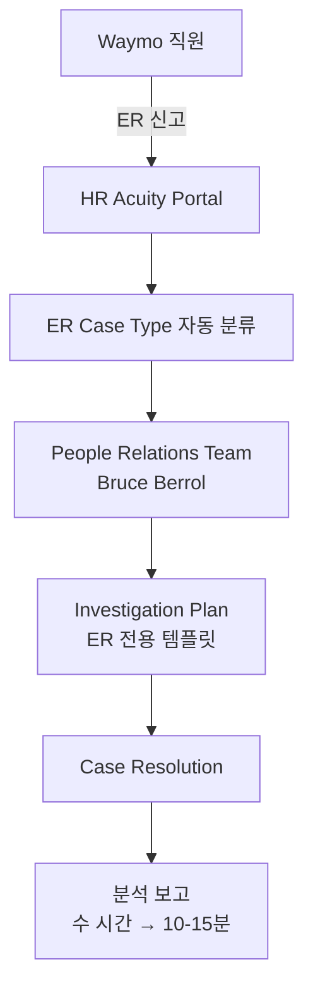

## Summary

Waymo (Alphabet 자율주행 자회사; 직원 수 _미공개_ — 인용 소스에 없음)는 HR Acuity로 ER case management를 운영. ⚠️ 자사 보고: 보고서 작성이 수 시간 → 10-15분으로 줄어 **reporting time 약 92% 절감** ([[sources/hr-acuity-waymo-case-study]]). Bruce Berrol (Head of People Relations): 데이터 기반 인사이트·리스크 감소가 도입 동기; 팀원 Desiree: ServiceNow 같은 전사 시스템의 보안·권한 우려 → ER 팀 소유의 전용 도구 선택 (동일 소스; 기존 'Berrol 인용'은 오귀속 — 2026-09-27 정정). Role-based access 강조.

> 📌 **HR Acuity case study 단일 출처** — Tier 1·2 독립 정량 검증 0건. 92% 수치는 ⚠️ 자사 보고로 인용 시 명시 필수.

## Problem / Why (도입 배경)

- **Before**: Waymo는 ServiceNow 같은 범용 ITSM/HR ticketing 도구로 ER case 처리 — grievance·discipline·investigation도 일반 ticket으로 처리
- **Pain point**:
  - **ER 도메인 부재**: ServiceNow는 ER (grievance·investigation·legal hold·noncompete) 도메인 모름 — case 분류·workflow가 일반 IT ticket과 동일
  - **Role-based access 한계**: ER case는 매니저·HR·legal 권한 분리 필요. 일반 ticket은 해당 분리 약함
  - **Audit trail 부족**: ER case는 SOX·legal hold·investigation 이력 필요 → 일반 ticket의 audit trail 부족
  - **Reporting 수작업**: trend·risk·hotspot 보고서 수작업 작성
- **Trigger**: 자율주행 사업 확장 + 조직 성장 → ER case volume 증가 → 전용 도구 필요성. HR Acuity가 G2/Brandon Hall 등 ER 전용 leader로 등장

## Solution Architecture

### A. Process (프로세스)

- **Before**: 직원이 ServiceNow ticket으로 ER 신고 → HR이 일반 ticket workflow로 처리 → audit·reporting 수작업
- **After**:
  1. 직원이 HR Acuity portal로 ER case 신고 — case type 자동 분류
  2. HR/People Relations team이 ER 전용 workflow로 처리 — investigation plan·인터뷰 질문 등 ER 템플릿
  3. Role-based access — 매니저·HR·legal 권한 분리
  4. 자동 audit trail (SOX·legal hold 대응)
  5. Trend·risk·hotspot dashboard 자동 생성
- **HITL**: Bruce Berrol People Relations team이 모든 case 결정·resolution 진행. HR Acuity는 분류·문서화·audit·reporting 자동화
- **Frequency**: daily case 처리 + 분기 trend
- **Scope of autonomy**: assist + automate (분류·audit·reporting 자율, 결정·인터뷰는 사람)

### B. System & Infrastructure (시스템·인프라)

- **Core platform**: ✅ HR Acuity ER 전용 케이스 관리 플랫폼 (Waymo 도입) ([[sources/hr-acuity-waymo-case-study]]); Core HRIS _미공개_
- **AI 시스템 배치**: _미공개 (not disclosed)_ — olivER AI 사용 여부는 case study에 명시 없음
- **연동**: _미공개 (not disclosed)_
- **Migration**: ⚠️ 자사 보고: ServiceNow 같은 전사 시스템 대신 ER 팀 소유의 전용 시스템 선택 ([[sources/hr-acuity-waymo-case-study]]); 기존 ServiceNow 사용·이관 여부 _미공개_

### C. Data (데이터)

- **입력 데이터**: ✅ ER 케이스·분석 보고 데이터 ([[sources/hr-acuity-waymo-case-study]]); 세부 _미공개_
- **Data governance**: ✅ 역할 기반 접근 제어(role-based access)·보안·권한 관리 ([[sources/hr-acuity-waymo-case-study]])

### D. Model (모델)

- **Foundation model**: _미공개 (not disclosed)_

### E. Organization & Team (조직·팀 구조)

- **오너십**: ✅ Waymo People Relations team — Bruce Berrol, Head of People Relations ([[sources/hr-acuity-waymo-case-study]])
- **거버넌스**: ✅ ER 팀 소유 시스템 + 역할 기반 접근 제어 ([[sources/hr-acuity-waymo-case-study]]); audit trail·legal hold 서술은 소스에 없어 _미공개_

### F. Diagrams (도식)

```mermaid
flowchart TB
    Emp[Waymo 직원] -->|ER 신고| HRA[HR Acuity Portal]
    HRA --> Class[ER Case Type 자동 분류]
    Class --> ER[People Relations Team<br/>Bruce Berrol]
    ER --> Plan[Investigation Plan<br/>ER 전용 템플릿]
    Plan --> Resolution[Case Resolution]
    Resolution --> Report[분석 보고<br/>수 시간 → 10-15분]
```

범례: 모든 연결 ⚠️ HR Acuity Waymo case study (자사 보고) 기반.

## Impact / Metrics (기대효과)

### 기대효과 요약
ServiceNow 같은 범용 도구 → HR Acuity 전용 도구 전환으로 reporting time 대폭 단축. ⚠️ HR Acuity case study 단일 출처 (자사 보고).

| 지표 | 값 | 출처 | 성격 |
|---|---|---|---|
| **Reporting time 감소** | **92%** (산출 근거 미공개) | [[sources/hr-acuity-waymo-case-study]] | ⚠️ 자사 보고 |
| 보고서 작성 시간 | 수 시간 → **10-15분** | [[sources/hr-acuity-waymo-case-study]] | ⚠️ 자사 보고 |
| 대안 대비 선택 | ServiceNow 같은 전사 시스템 대신 ER 전용 도구 | [[sources/hr-acuity-waymo-case-study]] (Desiree 인용) | ⚠️ 자사 보고 |
| Waymo 규모 | _미공개_ | 인용 소스에 없음 (2026-09-27 grounding 점검) | ❓ |
| Waymo 모회사 | Alphabet | 공시 | ✅ Fact |
| 핵심 인용 | Bruce Berrol Head of People Relations | [[sources/hr-acuity-waymo-case-study]] | ✅ Fact |

## Governance & Risk

- ⚠️ **HR Acuity 단일 출처** — Tier 1·2 독립 검증 0건. 92% 수치는 ⚠️ 자사 보고
- ⚠️ olivER AI 사용 여부 case study에 명시 안 됨 — _미공개_
- ⚠️ Waymo 특수성:
  - 자율주행 회사 — 일반 제조·금융과 노동 환경 상이
  - SF Bay Area — 미국 노동시장 특수
  - 직원 규모 _미공개_ — 한국 대기업과 적용 차이 검토 필요
- ⚠️ 한국 적용 시 customization 필요 (한국어·노조법·PIPA)

## Contradictions

_없음._

> [!note] 2026-09-27 grounding — ServiceNow 관련 인용은 Berrol이 아닌 팀원 'Desiree'(직함 미상)의 발언으로 정정 ([[sources/hr-acuity-waymo-case-study]]). Waymo 직원 수, SOX·legal hold·audit trail·hotspot dashboard·HRIS/SSO 연동 서술은 소스에 없어 `_미공개_`/삭제. 92%는 산출 근거 미공개 자사 보고.

## Consulting Angle

- **HR Acuity 정량 reference 사례**: 한국 대기업 ER AI 도입 검토 시 "92% reporting time 감소" 인용 가능 (단 ⚠️ 자사 보고 명시)
- **ServiceNow → 전용 도구 migration pattern**:
  - 한국 대기업도 ServiceNow·자체 ticket 시스템으로 ER 처리 중인 곳 다수
  - Waymo 사례 = "범용 도구의 한계 + 전용 ER 도구 전환의 가치" 명확한 reference
- **Role-based access·audit trail 강화**:
  - 한국 SOX·내부통제·개인정보 audit trail 요건 강함
  - Waymo는 자율주행 안전 컴플라이언스 요건 — 한국 대기업의 ESG·감사 요건과 유사
- **한계**:
  - Waymo 직원 규모 미공개 — scale 비교 불가
  - 자율주행 산업 특수성 — 한국 제조·금융과 적용 차이
  - Tier 1·2 독립 검증 0건 — 자사 보고 한계
- **vs Yelp** [[yelp-hr-acuity-er-documentation]]:
  - Yelp: 정성 사례 (single source of truth in documentation)
  - Waymo: 정량 사례 (92% reporting time)
  - 양자 보완 — Waymo는 ROI 정량, Yelp는 도입 동기·고려사항
- **Watch list**: HR Acuity Waymo 갱신·외부 분석가 (Forrester·Gartner)의 Waymo 사례 인용 시 confidence 재조정
