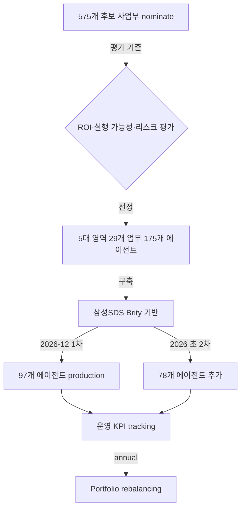

## Summary

우리은행이 **금융권 최초 전사 AI 에이전트 도입** 발표 (2026-03-05). **575개 후보** → **5대 영역(고객관계관리·자산관리·내부통제·고객상담·업무자동화) 29개 업무 175개 에이전트** 선정. 2026-04-07 **삼성SDS 우선협상대상자** 선정. 12월 1차 97개, 2026 초 78개 추가 출시. ⚠️ 자사 보고: 업무처리 속도 30% 향상 기대. **AI 에이전트 portfolio management** 컨설팅의 표준 reference architecture.

## Problem / Why (도입 배경)

- **Before**: 우리은행 ~13K 직원이 다수 산발 시스템 (코어뱅킹·CRM·콜센터·내부통제) 사용. AI 도입은 부서별 산발 PoC
- **Pain point**: KB국민은행 [[kb-bank-ai-hr-deep-change]] (인사이동 AI), 신한 AI ONE [[shinhan-bank-ai-one-platform]] 등 경쟁 은행 AI 가속 → 우리은행 차별화 시급
- **Trigger**: 2026 신년 신경 그룹장 발표 — 금융권 최초 전사 AI 에이전트 도입 결단

## Solution Architecture

### A. Process

- **Before**: 부서별 AI PoC 산발 → ROI 검증 어려움 + 거버넌스 부재
- **After (portfolio management 패턴)**:
  1. **575개 사업부 nominate**된 AI 에이전트 후보 수집
  2. **평가 기준 적용** — 업무 적합성·ROI·실행 가능성·리스크 (구체 framework _미공개_)
  3. **5대 영역 29개 업무 → 175개 에이전트 선정** (체계적 portfolio prune)
  4. 삼성SDS 우선협상대상자 (2026-04-07) → 구축 계약
  5. 2026-12 1차 97개 production, 2026 초 78개 추가
  6. 운영 후 KPI tracking → portfolio rebalancing (annual cycle)
- **HITL**: 우리은행 디지털혁신 + 사업부장 cross-functional. 매 단계 사람 검토
- **Frequency**: portfolio review = annual; 개별 에이전트 = daily 운영
- **Scope**: portfolio governance — 어떤 업무에 AI 에이전트를 배치할지 의사결정 framework

### B. System & Infrastructure

- **Core HRIS**: 우리은행 자체 HR 시스템 (Workday 또는 자체 — _미공개_)
- **AI 시스템 배치**: 삼성SDS 구축 (Brity Copilot 또는 별도 platform — _미공개_)
- **배포 환경**: 우리은행 cloud + 삼성SDS partnership
- **연동·통합**: 코어뱅킹·CRM·콜센터·내부통제 시스템 (5대 영역 cover)
- **사용자 접점**: 직원 portal + 업무 시스템 임베드
- **인증·권한**: 우리은행 SSO + 금융정보보호 강화

### C. Data

- **입력 데이터 소스**: 5대 영역 (고객관계관리·자산관리·내부통제·고객상담·업무자동화) 데이터
- **데이터 규모**: 13K 직원·175개 에이전트 운영 — 정확 transaction 수 _미공개_
- **전처리·정제**: 금융정보보호 강화 (PIPA + 금융권 규제)
- **학습 vs RAG vs In-context**: 구체 architecture _미공개_
- **데이터 거버넌스**: 우리은행 + 삼성SDS 공동 governance
- **민감정보 처리**: 금융정보보호법 + PIPA dual compliance

### D. Model

- **Foundation model**: 삼성SDS Brity 또는 외부 LLM 혼합 추정 — _미공개_
- **모델 유형**: agentic LLM + classifier + automation
- **제공 방식**: 우리은행-삼성SDS 공동 운영
- **커스터마이징 기법**: 금융 도메인 fine-tuning + RAG (사내 정책)
- **Orchestration 프레임워크**: 삼성SDS 자체 (Brity 추정)
- **평가·가드레일**: 5대 영역 portfolio 평가 framework

### E. Organization

- 우리은행 디지털혁신 + 5대 영역 사업부장 + 삼성SDS 파트너 팀
- 2026-04-07 우선협상대상자 선정 후 본격 구축

### F. Diagrams

## Impact / Metrics (기대효과)

### 기대효과 요약
금융권 최초 전사 AI 에이전트 portfolio + 575→175 정량 평가 framework — 모든 KR 금융·대기업 AI 거버넌스 reference.

- ✅ 575개 후보 → 175개 선정 (30% pass rate, 정량 evaluation)
- ✅ 5대 영역 29개 업무 cover
- ✅ 삼성SDS 우선협상대상자 (2026-04-07)
- ⚠️ 자사 보고: 업무처리 속도 30%↑ 기대 (production 후 측정 예정)
- 2026-12 1차 (97개) → 2026 초 2차 (78개)

## Governance & Risk

- ✅ portfolio framework — 단일 PoC 아닌 575→175 정량 평가는 reference 가치 큼
- ⚠️ 175개 에이전트의 quality·일관성 governance 복잡도 — 운영 risk
- ⚠️ 한국 AI 기본법 (2026-01-22) — 5대 영역 중 인사·내부통제는 고영향 AI 분류 가능
- ⚠️ 금융정보보호법 + PIPA dual compliance — 175개 에이전트 모두 검증 필요

## Consulting Angle

- **★최우선 KR 금융·대기업 reference**:
  - **AI 에이전트 portfolio management 컨설팅 메서드론** 그 자체 — 575개 후보 → 평가 → 175개 선정 프로세스
  - 모든 KR 금융 RFP에 의무 인용 (KB·신한·하나·NH·IBK·KB증권·미래에셋 등)
- **금융권 비교 deck**:
  - KB AI HR Deep Change [[kb-bank-ai-hr-deep-change]] (인사이동 단일 알고리즘)
  - 신한 AI ONE [[shinhan-bank-ai-one-platform]] (40+ AI 통합 platform)
  - 우리 175개 에이전트 (portfolio framework)
  - 미래에셋 [[mirae-asset-ai-assistant-platform]] (No-code 빌더)
  - 양상 비교: vendor 종속 vs 자체 platform vs portfolio approach
- **삼성SDS Brity 활용 reference**: 삼성SDS Brity Copilot HCM 통합 (별건) 사례와 cross-link — 삼성SDS의 enterprise AI 시장 점유 입증
- **2026 Q3-Q4 KR consulting deck**:
  - "AI 에이전트 portfolio management" 표지 슬라이드
  - 175개 에이전트 = 글로벌 최대 portfolio (업계 비교 시 IBM AskHR 80+ 태스크 대비 2배)
- **반면교사**:
  - 175개 동시 운영 governance 복잡도 — 단일 platform 또는 명확한 priority tier 필수
  - 30% 속도 향상 = announce 단계 추정치 — 실측 baseline 명시 필요
  - 금융권 최초 = first mover 위험 (technology + regulatory) — POC 4주 + 단계적 확산 권장
- **Watch list**: 2026-12 1차 production 후 actual KPI publication 시 본 page confidence 재조정
