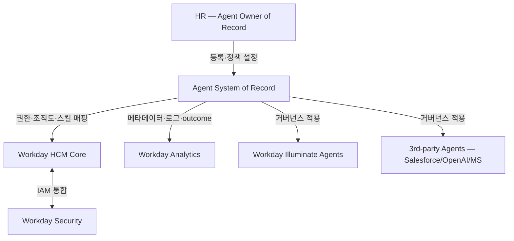

## Summary

Workday가 2026-02-18에 GA 발표한 **Agent System of Record (ASOR)**는 AI 에이전트를 사람 직원과 동일한 방식으로 관리하는 거버넌스 레이어다. 1st-party Workday 에이전트(Illuminate 시리즈)와 3rd-party 에이전트(Salesforce·OpenAI·Microsoft 등)를 한 콘솔에서 권한·조직도·스킬·분석·보안으로 통합 관리. HR이 에이전트의 "owner of record"가 되어 회사 인적자본의 일부로 책임을 가져간다는 패러다임.

## Problem / Why (도입 배경)

- **Before (baseline)**: 엔터프라이즈가 AI 에이전트를 부서별·도구별로 산발 도입. 누가 만들었는지, 어떤 권한을 갖는지, 누가 책임지는지가 불투명. shadow AI 리스크 누적.
- **Pain point**: AI 에이전트가 빠르게 늘어나는데 거버넌스·감사·권한 통제가 부재. Deloitte 2026 HC Trends에 따르면 임원 60%가 AI를 의사결정에 사용하지만 5%만 잘 관리 중.
- **Trigger**: 2026-Q1 EU AI Act high-risk 의무 발효 임박 + 한국 AI 기본법(2026-01-22 시행) 등 글로벌 규제 압력. 엔터프라이즈가 "AI 거버넌스" 카테고리 솔루션 시급히 요구.

## Solution Architecture

### A. Process (프로세스)

- **Before (As-is)**: 1) AI 에이전트가 부서별·벤더별 별도 도구에서 생성·관리 / 2) HR/IT가 에이전트 존재·권한·활동 가시성 부재 / 3) 직원-에이전트 간 책임 경계 불명확 / 4) 감사·컴플라이언스 사후 대응
- **After (To-be)**:
  1. 신규 AI 에이전트 등록 시 ASOR에 owner·purpose·scope 명시
  2. ASOR이 권한·조직도·스킬 매핑 자동 적용 (Workday IAM 연계)
  3. 에이전트 활동 로그·outcome 분석 (사람 직원 분석과 동일 dashboard)
  4. 권한 변경·비활성화·감사 추적 (Workday change history)
- **HITL**: HR이 에이전트의 owner of record로 등록·승인. 권한 변경 시 HR 워크플로 (사람 직원 권한과 동일 거버넌스)
- **Trigger & Frequency**: 신규 에이전트 등록(adhoc) + daily 활동 모니터링
- **Scope of autonomy**: 거버넌스 자체는 사람 정책 결정. 에이전트는 정책 범위 내 autonomous 실행

### B. System & Infrastructure

- **Core HRIS**: Workday HCM
- **AI 시스템 배치**: ASOR은 Workday 코어에 내장된 거버넌스 레이어 (별도 SaaS 아님)
- **배포 환경**: Workday cloud (multi-tenant)
- **연동·통합**: 1st-party Workday Illuminate agents + 3rd-party (Salesforce Agentforce, OpenAI, Microsoft, Anthropic 등) — 표준 프로토콜(MCP·a2a) 기반
- **사용자 접점**: Workday admin console + 권한 변경은 기존 Workday self-service 워크플로
- **인증·권한**: Workday IAM (사람 직원과 동일 모델)

### C. Data (데이터)

- **입력 데이터 소스**: 에이전트 메타데이터(이름·purpose·owner·scope), 활동 로그, outcome metric
- **데이터 규모**: _미공개 (not disclosed)_
- **전처리·정제**: _미공개_
- **학습 vs RAG vs In-context 구분**: ASOR은 거버넌스 레이어이므로 학습 모델은 아님. 활동 분석은 Workday Prism Analytics 활용 추정
- **데이터 거버넌스**: Workday tenant 격리 + 에이전트 활동 audit trail 보존
- **민감정보 처리**: 에이전트가 접근하는 HR 데이터는 기존 Workday RBAC 따름

### D. Model (모델)

- ASOR 자체는 거버넌스 플랫폼 (모델 X). 관리 대상 에이전트가 다양한 foundation model 활용:
  - Workday Illuminate: Workday 자체 학습 모델 (vendor-claimed)
  - 3rd-party: GPT-4/5, Claude, Gemini 등 호출 가능
- _Workday Illuminate base 모델 상세 미공개_

### E. Organization & Team

- **오너십**: HR이 "agent owner of record" — Deloitte 2026 HC Trends가 신규 부상 역할로 명시
- **참여 역할**: HRBP·HR Tech PM·legal·보안·IT/AI plat팀 협업
- **거버넌스 체계**: ASOR 자체가 거버넌스 인프라 — 정책 위원회·AI ethics board는 기업별 별도 구성
- **변화관리**: HR 직무 재설계 — "사람 매니징"에서 "사람+에이전트 매니징"으로

### F. Diagrams

## Impact / Metrics (기대효과)

### 기대효과 요약
AI 에이전트의 "shadow proliferation"을 막고, 사람과 에이전트를 동일 거버넌스 framework로 통합 관리해 EU AI Act·한국 AI 기본법 dual compliance 기반 마련.

- **Before → After**: ⚠️ 도입 사례 수치 미공개 (GA 직후, 실제 customer adoption 데이터 부재)
- **Forrester TEI / 분석가 평가**: 별도 미발표
- **Deloitte 2026 HC Trends 부합**: "60% AI 사용, 5%만 거버넌스" 격차 해소 솔루션 카테고리

## Governance & Risk

- ✅ Workday IAM·audit log 등 기존 Workday 거버넌스 기반 활용 — 신뢰성 ↑
- ⚠️ 3rd-party agent 통합의 깊이는 read-only 메타데이터 vs deep policy enforcement 불명확
- ⚠️ 한국 AI 기본법 "고영향 AI" 의무(영향평가·고지·인적감독) 자동 충족 여부 미검증
- ⚠️ 벤더 lock-in 리스크 — Workday를 쓰지 않는 부서 에이전트는 거버넌스 사각

## Contradictions

(없음 — GA 직후로 충돌 보도 미발견)

## Consulting Angle

- **KR 적용 1순위**: 이미 Workday 도입한 한국 대기업(LG·SK·CJ 등 일부) — AI 거버넌스 솔루션 도입 즉시 reference로 사용 가능
- **확장 어젠다**: Workday 미사용 KR 대기업에는 "Workday ASOR이 만든 카테고리"로 자체 구축 또는 다른 거버넌스 솔루션 도입 논의 진입점
- **2026 Q3-Q4 제안서 핵심 슬라이드**: "사람-에이전트 통합 거버넌스" 트렌드 + Workday ASOR + Deloitte 60/5 갭 데이터 조합
- **Dual compliance 가치**: EU AI Act + 한국 AI 기본법 동시 대응 솔루션이 부재한 시장에서, ASOR이 첫 상용 reference architecture
- **반면교사 포인트**: Workday HCM 미사용 시 ASOR 단독 도입 불가 — HCM 마이그레이션 동반 필요 (KR 대기업 SAP HCM 점유율 큰 곳에는 fit 안 맞음)
