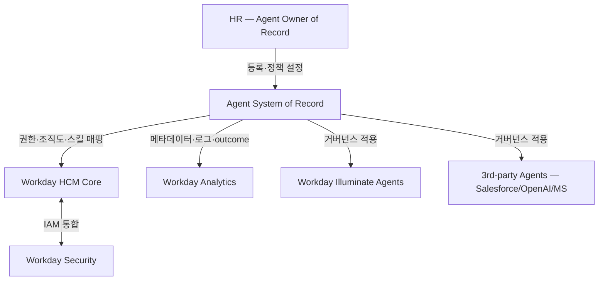

## Summary

Workday가 2026-02-18에 GA 발표한 **Agent System of Record (ASOR)**는 AI 에이전트를 사람 직원과 동일한 방식으로 관리하는 거버넌스 레이어다. 1st-party Workday 에이전트(Illuminate 시리즈)와 3rd-party 에이전트(Salesforce·OpenAI·Microsoft 등)를 한 콘솔에서 권한·조직도·스킬·분석·보안으로 통합 관리. HR이 에이전트의 "owner of record"가 되어 회사 인적자본의 일부로 책임을 가져간다는 패러다임.

## Problem / Why (도입 배경)

- **Before (baseline)**: 엔터프라이즈가 AI 에이전트를 부서별·도구별로 산발 도입. 누가 만들었는지, 어떤 권한을 갖는지, 누가 책임지는지가 불투명. shadow AI 리스크 누적.
- **Pain point**: AI 에이전트가 빠르게 늘어나는데 거버넌스·감사·권한 통제가 부재. Deloitte 2026 HC Trends에 따르면 임원 60%가 AI를 의사결정에 사용하지만 5%만 잘 관리 중 ([[sources/deloitte-2026-human-capital-trends]]).
- **Trigger**: 2026-Q1 EU AI Act high-risk 의무 발효 임박 + 한국 AI 기본법(2026-01-22 시행) 등 글로벌 규제 압력. 엔터프라이즈가 "AI 거버넌스" 카테고리 솔루션 시급히 요구.

## Solution Architecture

### A. Process (프로세스)

- **Before (As-is)**: 1) AI 에이전트가 부서별·벤더별 별도 도구에서 생성·관리 / 2) HR/IT가 에이전트 존재·권한·활동 가시성 부재 / 3) 직원-에이전트 간 책임 경계 불명확 / 4) 감사·컴플라이언스 사후 대응
- **After (To-be)**:
  1. 신규 AI 에이전트 등록 시 ASOR에 owner·purpose·scope 명시
  2. ASOR이 권한·조직도·스킬 매핑 자동 적용 (Workday IAM 연계)
  3. 에이전트 활동 로그·outcome 분석 (사람 직원 분석과 동일 dashboard)
  4. 권한 변경·비활성화·감사 추적 (Workday change history)
- **HITL**: HR이 에이전트의 owner of record로 등록·승인. 권한 변경 시 HR 워크플로 (사람 직원 권한과 동일 거버넌스)
- **Trigger & Frequency**: 신규 에이전트 등록(adhoc) + daily 활동 모니터링
- **Scope of autonomy**: 거버넌스 자체는 사람 정책 결정. 에이전트는 정책 범위 내 autonomous 실행

### B. System & Infrastructure (시스템·인프라)

- **Core HRIS**: ✅ Workday (ASOR은 Workday 플랫폼의 에이전트 거버넌스 레이어) ([[sources/workday-asor-ga-2026-02]])
- **AI 시스템 배치**: ✅ ASOR — 전사 AI 에이전트의 single source of truth (Workday·고객·파트너 제작 에이전트 포함) ([[sources/workday-asor-ga-2026-02]]); 별도 SaaS 여부 _미공개_
- **배포 환경**: _미공개 (not disclosed)_
- **연동·통합**: ✅ Agent Gateway를 통해 MCP·A2A 표준 지원, OpenTelemetry 정렬; Agent Partner Network 65+ 파트너 연결 ([[sources/workday-asor-ga-2026-02]]); 3rd-party 예시(Salesforce·OpenAI·Microsoft)는 소스 페이지 요약 기준 — raw 미확인, Anthropic은 소스에 없어 삭제
- **사용자 접점**: _미공개 (not disclosed)_
- **인증·권한**: ✅ 에이전트를 직원처럼 거버넌스 — 권한·역할·스킬·분석 적용 ([[sources/workday-asor-ga-2026-02]]); IAM 모델 세부 _미공개_

### C. Data (데이터)

- **입력 데이터 소스**: ⚠️ 벤더 주장: 에이전트의 권한·역할·스킬·분석 정보 ([[sources/workday-asor-ga-2026-02]]); 필드 세부 _미공개_
- **데이터 규모**: _미공개 (not disclosed)_
- **전처리·정제**: _미공개 (not disclosed)_
- **학습 vs RAG vs In-context 구분**: ASOR은 거버넌스 레이어 — 학습 모델 아님 ([[sources/workday-asor-ga-2026-02]]); 분석 엔진 _미공개_
- **데이터 거버넌스**: _미공개 (not disclosed)_
- **민감정보 처리**: _미공개 (not disclosed)_

### D. Model (모델)

- **Foundation model**: 해당 없음 — ASOR 자체는 거버넌스 플랫폼 ([[sources/workday-asor-ga-2026-02]]); 관리 대상 에이전트의 모델은 _미공개 (not disclosed)_ (기존 GPT/Claude/Gemini 나열은 소스에 없어 삭제)
- **Model 유형·제공 방식·커스터마이징·Orchestration**: _미공개 (not disclosed)_
- **평가·가드레일**: ⚠️ 벤더 주장: 에이전트를 투자처럼 측정·직원처럼 거버넌스·학습으로 개선 ([[sources/workday-asor-ga-2026-02]]); 세부 _미공개_

### E. Organization & Team (조직·팀 구조)

- **오너십**: HR이 "agent owner of record" ([[sources/workday-asor-ga-2026-02]]) — Deloitte 2026 HC Trends가 agent governance 역할 부상을 명시 ([[sources/deloitte-2026-human-capital-trends]])
- **참여 역할**: HRBP·HR Tech PM·legal·보안·IT/AI plat팀 협업
- **거버넌스 체계**: ASOR 자체가 거버넌스 인프라 — 정책 위원회·AI ethics board는 기업별 별도 구성
- **변화관리**: HR 직무 재설계 — "사람 매니징"에서 "사람+에이전트 매니징"으로

### F. Diagrams (도식)

```mermaid
flowchart TB
    Owner[HR — Agent Owner of Record] -->|등록·정책 설정| ASOR[Agent System of Record]
    ASOR -->|권한·조직도·스킬 매핑| Workday[Workday HCM Core]
    ASOR -->|메타데이터·로그·outcome| Analytics[Workday Analytics]
    ASOR -->|거버넌스 적용| Agent1[Workday Illuminate Agents]
    ASOR -->|거버넌스 적용| Agent2[3rd-party Agents — Salesforce/OpenAI/MS]
    Workday <-->|IAM 통합| IAM[Workday Security]
```

## Impact / Metrics (기대효과)

### 기대효과 요약
AI 에이전트의 "shadow proliferation"을 막고, 사람과 에이전트를 동일 거버넌스 framework로 통합 관리해 EU AI Act·한국 AI 기본법 dual compliance 기반 마련.

- **Before → After**: ⚠️ 도입 사례 수치 미공개 (GA 직후, 실제 customer adoption 데이터 부재)
- **Forrester TEI / 분석가 평가**: 별도 미발표
- **Deloitte 2026 HC Trends 부합**: "60% AI 사용, 5%만 거버넌스" 격차 해소 솔루션 카테고리

## Governance & Risk

- ✅ Workday IAM·audit log 등 기존 Workday 거버넌스 기반 활용 — 신뢰성 ↑
- ⚠️ 3rd-party agent 통합의 깊이는 read-only 메타데이터 vs deep policy enforcement 불명확
- ⚠️ 한국 AI 기본법 "고영향 AI" 의무(영향평가·고지·인적감독) 자동 충족 여부 미검증
- ⚠️ 벤더 lock-in 리스크 — Workday를 쓰지 않는 부서 에이전트는 거버넌스 사각

## Contradictions

_없음._

> [!note] 2026-09-27 grounding — B/C/D의 multi-tenant·admin console·Workday IAM·Prism Analytics·tenant 격리·RBAC·3rd-party 모델(GPT/Claude/Gemini)·Anthropic 서술은 인용 소스에 없어 `_미공개_`/삭제. raw 스냅샷에서 확인되는 것은 65+ 파트너, MCP·A2A·OpenTelemetry, single source of truth, "governed like employees" 표현.

## Consulting Angle

- **KR 적용 1순위**: 이미 Workday 도입한 한국 대기업(LG·SK·CJ 등 일부) — AI 거버넌스 솔루션 도입 즉시 reference로 사용 가능
- **확장 어젠다**: Workday 미사용 KR 대기업에는 "Workday ASOR이 만든 카테고리"로 자체 구축 또는 다른 거버넌스 솔루션 도입 논의 진입점
- **2026 Q3-Q4 제안서 핵심 슬라이드**: "사람-에이전트 통합 거버넌스" 트렌드 + Workday ASOR + Deloitte 60/5 갭 데이터 조합
- **Dual compliance 가치**: EU AI Act + 한국 AI 기본법 동시 대응 솔루션이 부재한 시장에서, ASOR이 첫 상용 reference architecture
- **반면교사 포인트**: Workday HCM 미사용 시 ASOR 단독 도입 불가 — HCM 마이그레이션 동반 필요 (KR 대기업 SAP HCM 점유율 큰 곳에는 fit 안 맞음)
