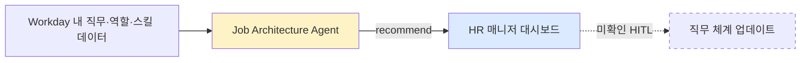

# Workday Illuminate — Job Architecture Agent / Intelligence

## Summary
Workday HCM 플랫폼에 내장된 AI 기능으로, **조직의 직무 체계(job architecture)를 분석·생성·관리**한다. Bersin의 2024-09 분석에서는 "skill gap·직무 통합 기회·역할 부적합 식별"(분석형)로, 2025-09 Workday press release에서는 "직무 사다리(job ladder)의 생성·관리 자동화"(구성형)로 묘사된다. 두 설명은 상호 모순은 아니며, 2024-09 이후 기능이 확장되었거나 측면이 다른 것으로 보이나 **공식 확인은 없다**.

## Problem / Why
대기업 HR에서 직무 체계 관리는 정기 업데이트 주기가 느리고(연 1회 수준), 실제 업무 변화·스킬 변화와 격차가 벌어지기 쉽다. 이 격차가 직무 통합·재배치·보상 설계 오류로 이어진다. 이 use case는 Workday HCM 위에서 해당 bookkeeping을 AI가 보조하려는 시도.

## Solution Architecture

### A. Process (프로세스)

- **Before (As-is)**: _미공개. Bersin·PR 모두 기존 workflow를 기술하지 않음_
- **After (To-be)** (Bersin 기준): 에이전트가 HR 매니저에게 다음을 "보여줌":
  - Skill gap
  - 직무 통합 기회
  - 잘못된 역할에 있을 가능성 있는 직원
- **After (To-be)** (PR 기준): 에이전트가 "job ladder의 생성과 관리를 자동화" (구체 단계 미공개)
- **Human-in-the-loop 지점**: _미공개. Bersin의 "shows HR managers" 표현은 recommend-only를 시사하지만 명시적 확인은 없음_
- **Trigger & Frequency**: _미공개_
- **Scope of autonomy**: _미공개. 두 소스가 다른 뉘앙스("보여주다" vs "자동화")를 쓰지만 구체 autonomy 수준은 어느 쪽도 밝히지 않음_

_범례: 실선 = 소스 확인, 점선 = 미확인_

### B. System & Infrastructure (시스템·인프라)

- **Core HRIS**: **Workday HCM** (내장 기능, 소스 확인)
- **AI 시스템 배치**: Workday Illuminate 플랫폼에 내장 ([[bersin-workday-illuminate-2024-09]])
- **배포 환경**: Workday 공개 클라우드 (플랫폼 특성상). **세부 cloud provider·region 미공개**
- **연동·통합**: _미공개_
- **사용자 접점 (UX layer)**: Workday UI + Illuminate Assistant (소스 미확인) — Bersin이 "Microsoft Copilot처럼 트랜잭션을 가이드"라고 묘사했으나 이 묘사가 Job Architecture Agent에 특정해 적용되는지는 **기사 내에서 명시되지 않음**
- **인증·권한**: _미공개_
- **SLA**: _미공개_

### C. Data (데이터)

- **입력 데이터 소스**: Workday 내부의 직무·직급·스킬·직원 데이터 (Bersin 설명에서 추론 가능하나 구체 필드 목록 **미공개**)
- **데이터 규모**: **⚠️ 벤더 주장**: 플랫폼 전체 기준 "70 million users' HR and finance data" — Bersin 전달 ([[bersin-workday-illuminate-2024-09]]). 이 Job Architecture Agent가 이 전체 corpus를 모두 쓰는지는 미공개
- **전처리·정제**: _미공개_
- **학습 vs RAG vs In-context 구분**: _미공개_
- **데이터 거버넌스**: _미공개_
- **민감정보 처리**: _미공개_

### D. Model (모델)

- **Foundation model**: **⚠️ 벤더 주장**: "Workday 플랫폼이 70 million users의 HR·finance 데이터에 최적화된 LLM을 운영한다" — Bersin 전달
- **파라미터 수**: **🔴 모순 상태** — 같은 Bersin 기사 안에 "800 Billion parameter LLM"과 "70 Billion parameter LLM" 두 표기가 공존. 원본 주장이 어느 쪽인지 미해결. [`contradictions` 섹션 참조]
- **모델 유형**: LLM이라는 것 외에는 미공개 (embedding 병행 여부, classifier 보조 여부 등)
- **제공 방식**: 상용 API 래핑인지 자체 학습 모델인지 **미공개** (Workday 내부 운영 여부도 기사에 명시 없음)
- **커스터마이징 기법**: _미공개 (RAG/fine-tune/in-context 구분 없음)_
- **Orchestration 프레임워크**: _미공개_
- **평가·가드레일**: _미공개. bias 감사, hallucination 테스트, eval set 등 언급 전무_
- **비용·성능 지표**: _미공개_
- **Fallback 전략**: _미공개_

### E. Organization & Team (조직·팀 구조)

- **Workday 측**: _미공개. 개발 팀 구성·규모 등 일절 없음_
- **도입 기업 측**: _미공개 (도입 기업 자체가 공개되지 않음)_
- **거버넌스 체계**: _미공개_
- **변화관리**: _미공개_
- **파트너**: _미공개_

### F. Diagrams (도식)

위 Process 섹션의 flowchart 1개만 작성. System·Data·Model 항목의 공개 정보가 대부분 `_미공개_`이므로 추가 다이어그램을 그리지 않는다 (소스 없이 채운 다이어그램은 [[CLAUDE|CLAUDE.md]] §3 규칙 위반).

---

**Fact 품질 요약**:
- ✅ Fact (소스 확인): Agent의 존재, Workday HCM 내장, Job Architecture 도메인 지향, Bersin의 "recommend" 성격 묘사
- ⚠️ 벤더 주장 (독립 검증 없음): 70M users·LLM 기반·파라미터 수 주장
- ❓ 미공개: Process 세부·HITL·Trigger·System 배치·Data 구조·Model 전반·Org·Customer·Metric

## Impact / Metrics (기대효과)

### 기대효과 요약
정량 지표 0건, 고객 사례 0건 — Bersin의 "highly advanced" 평가는 Workday AI 전략 방향성에 대한 것이지 이 에이전트 단독 성과 아님. ⚠ Contradiction 존재(70B vs 800B parameter 주장 충돌)로 벤더 기술 주장 자체의 신뢰도도 낮음.

- **정량 지표**: **없음**. Bersin·PR 두 소스 모두 이 에이전트에 대한 ROI·시간 절감·정확도 수치를 제공하지 않는다.
- **정성 평가**: Bersin은 Illuminate 전반을 "highly advanced"로 평가 — 단, 이는 Job Architecture Agent 단독에 대한 평가가 아니라 Workday의 AI 전략 방향성에 대한 평가.
- **고객 사례**: _미공개_

## Governance & Risk

- **HITL 명시 여부**: 미공개 (Bersin의 "shows HR managers" 표현만으로는 불충분)
- **편향·공정성 감사**: 언급 없음. Job architecture는 임금·승진·재배치 결정에 연결되므로 **bias 리스크가 특히 큰 도메인**이지만 Workday가 공개한 가드레일 **0건**
- **개인정보**: Workday HCM 자체가 GDPR·개인정보법 등에 대응하나, 이 에이전트 특정 처리 방식은 미공개
- **Risk flag (컨설팅 관점)**: 이 use case로 "bias-free job architecture"를 주장하는 것은 현재 공개 자료로는 불가능. 클라이언트에 제시 시 반드시 이 공백을 고지.

## Contradictions

> [!contradiction] 2026-04-12 — Foundation model 파라미터 수
> - 기존 주장: "70 Billion parameter LLM" (출처: [[bersin-workday-illuminate-2024-09]] 본문 일부)
> - 새 주장: "800 Billion parameter LLM" (출처: [[bersin-workday-illuminate-2024-09]] 다른 섹션)
> - 두 수치가 **같은 기사 안에서** 동시에 나타남. 외부 소스 교차검증 필요.
> - 상태: **unresolved**
> - 해결 방법 제안: (1) Workday 공식 기술 문서/whitepaper 확보, (2) Workday Rising 2025 발표 자료에서 재확인, (3) 다른 Tier 1 분석가(Constellation·Ventana·Forrester)의 분석과 대조

## Consulting Angle

- **사용처**: 대기업 HR 컨설팅 프로젝트에서 "Workday HCM + AI" 카드를 언급할 때 reference로 인용 가능. 단, "검증된 ROI 사례는 없음"을 함께 고지해야 한다.
- **반면교사 활용**: AI 솔루션 도입 의사결정 시, "벤더 플랫폼에 내장된 AI 기능"에 대한 성숙한 평가 기준의 예시로 쓸 수 있다 — 이 페이지의 `_미공개_`가 무엇인지가 곧 클라이언트가 벤더에게 물어야 할 체크리스트.
- **파생 질문**:
  1. Workday HCM을 이미 쓰는 국내 대기업(예: 대형 제조사) 중 Illuminate early access에 참여한 곳이 있는가? (현재 소스 기준: 확인 불가)
  2. Job Architecture Agent의 추천 품질을 평가할 벤치마크 데이터셋은?
  3. 본 에이전트의 추천을 채택할 때 legal/노사 리스크는 어떻게 관리되는가?
- **제안서 사용 경고**: confidence 0.25는 제안서 본문에 단독 인용하기에 **부족**. "시장 동향" 수준의 참고로만.
