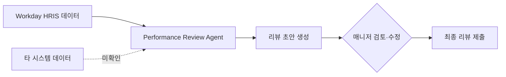

## Summary

Workday가 2025년 9월 Rising에서 **Illuminate Performance Review Agent**를 발표. 다양한 시스템의 데이터를 종합해 매니저에게 **성과 리뷰 초안(first draft)**을 자동 생성. 2026년 GA 예정. 기존 Illuminate 에이전트에서는 계약 실행 시간 **65% 단축**, 스태핑 변경 **최대 90% 감소**, 감사 증거 수집 **연 900시간 절약**, 급여 컴플라이언스 **4배 빠름** 등의 성과를 공유. [[sources/workday-illuminate-pr-2025-09.md]]

## Problem / Why

- 매니저가 성과 리뷰를 작성하는 데 **직원당 수시간** 소요 — 다수 시스템에서 데이터 수집 필요
- 리뷰 품질의 **불일관성** — 매니저별 역량·시간 투입 편차
- Workday Rising 2025에서 발표된 7개 신규 에이전트 중 하나로, **HRMS 내장 AI agent** 트렌드의 핵심 [[sources/workday-illuminate-pr-2025-09.md]]

## Solution Architecture (요약)

### A. Process (프로세스)

- **Before**: 매니저가 직원별로 여러 시스템(HRIS·프로젝트 관리·피드백 도구)에서 데이터 수집 → 수동으로 리뷰 작성
- **After**: Performance Review Agent가 타 시스템 데이터를 자동 수집 → 리뷰 초안 자동 생성 → 매니저가 검토·수정·확정 [[sources/workday-illuminate-pr-2025-09.md]]
- **HITL 지점**: Agent가 초안 생성 → **매니저가 반드시 검토·수정 후 제출**
- **Scope of autonomy**: Assist (초안 생성) → 매니저 approve

### B. System & Infrastructure

- **Core HRIS**: Workday HCM
- **AI 시스템**: Workday Illuminate — Workday 내장 AI 플랫폼 [[sources/workday-illuminate-pr-2025-09.md]]
- **Workday Data Cloud**: 통합 데이터 레이어 (2025 Rising에서 동시 발표) [[sources/workday-illuminate-pr-2025-09.md]]
- 타 시스템 연동 상세: _미공개 (not disclosed)_

### C. Data

- **입력**: Workday HCM 내 성과·피드백 데이터 + "다른 시스템" 데이터 (구체 명시 없음) [[sources/workday-illuminate-pr-2025-09.md]]
- 나머지: _미공개 (not disclosed)_

### D. Model

- _미공개 (not disclosed)_ — Workday Illuminate는 자체 AI 플랫폼이나 구체 모델명 미공개

### E. Organization & Team

- _미공개 (not disclosed)_

## Impact / Metrics

### 기대효과 요약

매니저의 리뷰 작성 시간 절감 + 리뷰 품질 일관성 향상. Performance Review Agent 자체의 고객 outcome은 미공개 (2026 GA 예정). 기존 Illuminate 에이전트 실적을 참고.

| 지표 | 값 | 출처 | 성격 | 비고 |
|---|---|---|---|---|
| 계약 실행 시간 단축 | **65%** | Workday Rising 2025 | ⚠️ 벤더 주장 | 기존 에이전트 |
| 스태핑 변경 감소 | **최대 90%** | Workday Rising 2025 | ⚠️ 벤더 주장 | 기존 에이전트 |
| 감사 증거 수집 절감 | **연 900시간** | Workday Rising 2025 | ⚠️ 벤더 주장 | 기존 에이전트 |
| 급여 컴플라이언스 | **4배 빠름** | Workday Rising 2025 | ⚠️ 벤더 주장 | 기존 에이전트 |

**Performance Review Agent 자체 metric은 _미공개 (not disclosed)_. stage: announced.**

## Governance & Risk

- AI 생성 리뷰 초안의 **환각(hallucination) 리스크** — 잘못된 성과 데이터가 초안에 포함될 경우 평가 공정성 훼손
- 매니저가 초안을 그대로 제출하는 **"rubber stamp" 리스크** — HITL가 형식화될 가능성
- "타 시스템 데이터" 수집 시 **데이터 접근 권한·프라이버시** 이슈

## Consulting Angle

### 활용 포인트
- **Workday vs SAP 성과관리 AI 정면 비교**: Workday Illuminate Performance Review Agent vs SAP Joule Performance & Goals Agent — 둘 다 2025 하반기~2026 GA, 기능 유사하나 아키텍처 접근 차이
- **"AI 리뷰 초안" 개념의 시장 표준화**: Workday 같은 HRMS 거인이 도입하면 시장 전체가 이 기능을 기대치로 삼게 됨 → 클라이언트에게 "조만간 모든 HRMS가 이것을 제공할 것" 전망 제시
- **기존 Illuminate 에이전트 실적 (65% 계약 단축 등)**: "AI agent가 HR 프로세스에 실제로 효과가 있다"는 논거의 앵커

### 한국 적용
- Workday 한국 고객(금융·테크·글로벌 기업)에서 성과관리 AI 도입 시 직접 해당
- 한국어 리뷰 초안 생성 품질이 핵심 변수 — _미공개_
