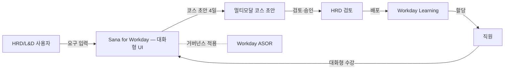

## Summary

Workday가 2025-11에 $1.1B로 인수한 스웨덴 AI-native LMS 회사 Sana를 2026-03-17에 첫 통합 제품 **"Sana for Workday"**로 공개. Sana의 conversational interface가 Workday 신규 UI front door로 채택되고, Sana Learn은 AI-native LMS로 Workday Learning을 대체·보강. ⚠️ 벤더 주장: 코스 생성 시간 4개월 → 4일, engagement 275% lift. ASOR 거버넌스 하에서 학습 에이전트가 사람·기존 에이전트와 통합 관리됨.

## Problem / Why (도입 배경)

- **Before (baseline)**: Workday Learning은 기존 LMS 카테고리에 속해 conventional course management 위주. AI-native 경쟁자(Sana·Bersin Galileo·Docebo Shape) 대비 콘텐츠 생성·개인화·대화형 UX 격차 누적.
- **Pain point**: 기업 학습 콘텐츠 제작 비용·시간이 ROI를 짓누르는 구조 (코스 1개당 수개월·수천만원). 직원 engagement도 낮음 (LMS 평균 완료율 30~50%).
- **Trigger**: Bersin이 발표한 "AI Transforms $400B of Corporate Learning" 보고서 + Sana의 빠른 시장 침투 (Klarna 등). Workday가 자체 개발 대신 acquisition으로 catch-up.

## Solution Architecture

### A. Process (프로세스)

- **Before (As-is)**: 1) HRD가 외주 ID·콘텐츠 벤더에 코스 발주 / 2) 4~6개월 제작 / 3) Workday Learning에 업로드·할당 / 4) 직원이 self-paced로 수강 (avg 완료율 낮음)
- **After (To-be)**:
  1. HRD가 Sana for Workday 대화창에 학습 목적·대상 입력
  2. ⚠️ 벤더 주장: AI가 4일 내 멀티모달 코스 초안 생성 (텍스트·비디오·음성)
  3. HRD가 검토·수정 → 배포
  4. 직원이 conversational interface로 수강 (Sana Learn) — 질문·요약·실습 양방향
  5. ASOR이 학습 에이전트 활동 거버넌스 적용
- **HITL**: 코스 초안 검토·승인 단계에서 HRD 개입 필수
- **Trigger & Frequency**: 신규 코스 요청(adhoc) + 학습 활동(daily)
- **Scope of autonomy**: 코스 초안은 AI 생성·HRD 승인. 직원 수강은 Sana Learn agent와 대화형 autonomous 진행

### B. System & Infrastructure (시스템·인프라)

- **Core HRIS**: Workday HCM + Workday Learning (Sana for Workday가 신규 UI front door)
- **AI 시스템 배치**: Sana 기술 스택 통합 (Workday cloud로 마이그레이션 진행)
- **배포 환경**: Workday cloud (multi-tenant)
- **연동·통합**: Workday HCM 마스터 데이터 + ASOR 거버넌스 + 30+ 언어 지원
- **사용자 접점**: 대화형 UI (web + mobile) — Sana 기존 UX 차용
- **인증·권한**: Workday IAM + ASOR 에이전트 정책

### C. Data (데이터)

- **입력 데이터 소스**: 학습 콘텐츠 코퍼스, 직무·스킬 매핑, 학습 이력, 직원 프로필
- **데이터 규모**: _미공개_
- **전처리·정제**: 멀티모달 처리 (텍스트·비디오·음성)
- **학습 vs RAG vs In-context 구분**: 코스 생성은 LLM + 회사 콘텐츠 RAG 추정. 학습 대화는 in-context (개인화 + 회사 정책)
- **데이터 거버넌스**: Workday tenant 격리
- **민감정보 처리**: 학습 이력은 PII 범주 — Workday RBAC 적용
- **데이터 출처의 오너십**: 회사 보유 콘텐츠 + Sana 기본 템플릿

### D. Model (모델)

- **Foundation model**: Sana 자체 model + 외부 API 혼합 추정 (구체 모델 _미공개_)
- **Model 유형**: LLM (생성) + multi-modal + agentic (학습 대화)
- **제공 방식**: SaaS (Workday Learning 경유)
- **커스터마이징 기법**: RAG (회사 콘텐츠) + prompt engineering (코스 템플릿)
- **Orchestration 프레임워크**: Sana 자체 구축
- **평가·가드레일**: ASOR 거버넌스 적용 + Workday 기본 content filter

### E. Organization & Team (조직·팀 구조)

- **오너십**: HRD/L&D 부서 (콘텐츠 오너십 유지) + Workday/Sana 통합 팀(Workday 인수 후 통합 진행 중)
- **참여 역할**: HRD·콘텐츠 디자이너·번역 담당·legal·보안
- **거버넌스 체계**: ASOR + Workday 기본 거버넌스
- **변화관리**: 외주 콘텐츠 벤더 의존도 축소 → HRD 직무 재설계 ("콘텐츠 발주자"에서 "AI prompt designer + curator"로)

### F. Diagrams (도식)

## Impact / Metrics (기대효과)

### 기대효과 요약
LMS 콘텐츠 제작 시간·비용을 대폭 단축하고 conversational UI로 직원 engagement 제고. AI-native LMS 카테고리에서 Workday가 catch-up.

- **Before → After (벤더 주장)**:
  - ⚠️ 벤더 주장: 코스 생성 4개월 → 4일 (Sana for Workday)
  - ⚠️ 벤더 주장: 직원 engagement 275% lift
  - ⚠️ 벤더 주장: 30+ 언어 자동 지원
- **Forrester TEI / 독립 검증**: 별도 미발표 (인수 직후)
- **Klarna·MTV·Polestar 등 Sana 기존 고객 사례**: 인수 전 사례, 구체 metric은 [[bersin-galileo-learn-ai-native-lms]] 페이지의 비교 분석 참조

## Governance & Risk

- ⚠️ 벤더 주장 수치(4일·275%)는 독립 검증 부재 — 제안서 인용 시 "벤더 주장" 표기 필수
- ⚠️ 한국어 콘텐츠 품질·문화 fit 미검증 (Pretendard·존댓말·한국 비즈니스 사례 등)
- ⚠️ 인수 후 통합 risk — Sana 핵심 인력 유지 여부, Workday 마이그레이션 일정 지연 가능성
- ✅ ASOR 거버넌스 통합 — AI 윤리·감사 측면은 Workday 기존 자산 활용

## Contradictions

(없음)

## Consulting Angle

- **KR 적용 1순위**: 한국 대기업 LMS 교체 사이클(보통 7~10년)에 정확히 맞물림. 삼성 멀티캠퍼스·LG인화원·SK mySUNI와 직접 비교 벤치마크
- **2026 Q3-Q4 LMS RFP 시나리오**: Workday HCM 도입 KR 대기업이 Workday Learning 갱신 시 Sana 통합 자동 검토. SAP 도입사는 SuccessFactors Learning vs Sana(별도 도입 가능 시) vs 자체 LXP 결정
- **반면교사 포인트**: 한국어 콘텐츠 품질 미검증 — POC 4주로 한정해 자국어 코스 생성 품질 검증 후 확정
- **인수 통합 risk 모니터링**: 2026 Q4까지 Sana 핵심 인력 유지·마이그레이션 진척도 추적
- **시장 비교 paper**: [[bersin-galileo-learn-ai-native-lms]] (Bersin Galileo) + [[docebo-ai-learning-lazboy]] (Docebo) + Sana for Workday → 3-way LMS-AI 비교덱
