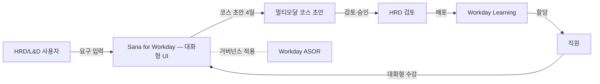

## Summary

Workday가 2025-11에 $1.1B로 인수한 스웨덴 AI-native LMS 회사 Sana를 2026-03-17에 첫 통합 제품 **"Sana for Workday"**로 공개. Sana의 conversational interface가 Workday 신규 UI front door로 채택되고, Sana Learn은 AI-native LMS로 Workday Learning을 대체·보강. ⚠️ 벤더 주장: 코스 생성 시간 4개월 → 4일, engagement 275% lift ([[sources/hr-brew-workday-sana-2026-03]] — 스냅샷 unavailable, 소스 페이지 요약 기준·원문 미확인). ASOR 거버넌스 하에서 학습 에이전트가 사람·기존 에이전트와 통합 관리됨 ([[sources/workday-asor-ga-2026-02]]).

## Problem / Why (도입 배경)

- **Before (baseline)**: ❓ baseline 미공개 — Workday Learning 기존 기능 대비 격차는 인용 소스에 서술 없음
- **Pain point**: ⚠️ 벤더 주장: 코스 생성에 4개월 소요 → 4일로 단축 주장 ([[sources/hr-brew-workday-sana-2026-03]] — 원문 미확인); 업계 완료율·시장 규모 통계는 인용 소스에 없어 삭제 (2026-09-27 grounding 점검)
- **Trigger**: Workday의 Sana 인수 (2025-11, $1.1B) 후 첫 통합 제품 공개 (2026-03-17, Workday DevCon) ([[sources/hr-brew-workday-sana-2026-03]]); Sana 기존 고객(Klarna·MTV·Polestar)에 Workday 마이그레이션 경로 제공 (동일 소스)

## Solution Architecture

### A. Process (프로세스)

- **Before (As-is)**: 1) HRD가 외주 ID·콘텐츠 벤더에 코스 발주 / 2) 4~6개월 제작 / 3) Workday Learning에 업로드·할당 / 4) 직원이 self-paced로 수강 (avg 완료율 낮음)
- **After (To-be)**:
  1. HRD가 Sana for Workday 대화창에 학습 목적·대상 입력
  2. ⚠️ 벤더 주장: AI가 4일 내 멀티모달 코스 초안 생성 (텍스트·비디오·음성)
  3. HRD가 검토·수정 → 배포
  4. 직원이 conversational interface로 수강 (Sana Learn) — 질문·요약·실습 양방향
  5. ASOR이 학습 에이전트 활동 거버넌스 적용
- **HITL**: 코스 초안 검토·승인 단계에서 HRD 개입 필수
- **Trigger & Frequency**: 신규 코스 요청(adhoc) + 학습 활동(daily)
- **Scope of autonomy**: 코스 초안은 AI 생성·HRD 승인. 직원 수강은 Sana Learn agent와 대화형 autonomous 진행

### B. System & Infrastructure (시스템·인프라)

- **Core HRIS**: ✅ Workday — Sana for Workday가 Workday 신규 UI front door, Sana Learn이 Workday Learning에 AI-native LMS 기능 추가 ([[sources/hr-brew-workday-sana-2026-03]])
- **AI 시스템 배치**: ✅ Sana 기술 통합 제품 ([[sources/hr-brew-workday-sana-2026-03]]); 마이그레이션 세부 _미공개_
- **배포 환경**: _미공개 (not disclosed)_
- **연동·통합**: ✅ Workday ASOR과 결합 — 학습 에이전트도 거버넌스 대상 ([[sources/hr-brew-workday-sana-2026-03]], [[sources/workday-asor-ga-2026-02]]); 30+ 언어 지원 (⚠️ 벤더 주장, [[sources/hr-brew-workday-sana-2026-03]])
- **사용자 접점**: ✅ 대화형 인터페이스 (Workday 신규 UI front door) ([[sources/hr-brew-workday-sana-2026-03]]); web/mobile 여부 _미공개_
- **인증·권한**: _미공개 (not disclosed)_

### C. Data (데이터)

- **입력 데이터 소스**: _미공개 (not disclosed)_ — 학습 콘텐츠 생성 입력 세부는 소스에 없음
- **데이터 규모**: _미공개 (not disclosed)_
- **전처리·정제**: ⚠️ 벤더 주장: 멀티모달(텍스트·비디오·음성) 콘텐츠 ([[sources/hr-brew-workday-sana-2026-03]]); 처리 방식 _미공개_
- **학습 vs RAG vs In-context 구분**: _미공개 (not disclosed)_
- **데이터 거버넌스**: ✅ ASOR 거버넌스 적용 (학습 에이전트) ([[sources/workday-asor-ga-2026-02]]); 데이터 보존·격리 세부 _미공개_
- **민감정보 처리**: _미공개 (not disclosed)_
- **데이터 출처의 오너십**: _미공개 (not disclosed)_

### D. Model (모델)

- **Foundation model**: _미공개 (not disclosed)_
- **Model 유형**: ⚠️ 벤더 주장: AI-native LMS — 코스 생성(생성형)·대화형 학습 인터페이스·멀티모달 ([[sources/hr-brew-workday-sana-2026-03]])
- **제공 방식**: _미공개 (not disclosed)_
- **커스터마이징 기법**: _미공개 (not disclosed)_
- **Orchestration 프레임워크**: _미공개 (not disclosed)_
- **평가·가드레일**: ✅ ASOR 거버넌스 적용 ([[sources/workday-asor-ga-2026-02]]); content filter 등 세부 _미공개_

### E. Organization & Team (조직·팀 구조)

- **오너십**: 벤더 제품 — 고객별 상이. Workday의 Sana 인수(2025-11) 후 통합 제품 ([[sources/hr-brew-workday-sana-2026-03]])
- **참여 역할**: _미공개 (not disclosed)_
- **거버넌스 체계**: ✅ ASOR — 학습 에이전트도 거버넌스 대상 ([[sources/workday-asor-ga-2026-02]])
- **변화관리**: _미공개 (not disclosed)_ (HRD 직무 재설계 서술은 컨설팅 해석 — Consulting Angle 참조)
- **파트너**: _미공개 (not disclosed)_

### F. Diagrams (도식)

```mermaid
flowchart LR
    HRD[HRD/L&D 사용자] -->|요구 입력| Sana[Sana for Workday — 대화형 UI]
    Sana -->|코스 초안 4일| Draft[멀티모달 코스 초안]
    Draft -->|검토·승인| HRD2[HRD 검토]
    HRD2 -->|배포| Learning[Workday Learning]
    Learning -->|할당| Emp[직원]
    Emp -->|대화형 수강| Sana
    Sana -.-|거버넌스 적용| ASOR[Workday ASOR]
```

## Impact / Metrics (기대효과)

### 기대효과 요약
LMS 콘텐츠 제작 시간·비용을 대폭 단축하고 conversational UI로 직원 engagement 제고. AI-native LMS 카테고리에서 Workday가 catch-up.

- **Before → After (벤더 주장)**:
  - ⚠️ 벤더 주장: 코스 생성 4개월 → 4일 (Sana for Workday)
  - ⚠️ 벤더 주장: 직원 engagement 275% lift
  - ⚠️ 벤더 주장: 30+ 언어 자동 지원
- **Forrester TEI / 독립 검증**: 별도 미발표 (인수 직후)
- **Klarna·MTV·Polestar 등 Sana 기존 고객 사례**: 인수 전 사례, 구체 metric은 [[bersin-galileo-learn-ai-native-lms]] 페이지의 비교 분석 참조

## Governance & Risk

- ⚠️ 벤더 주장 수치(4일·275%)는 독립 검증 부재 — 제안서 인용 시 "벤더 주장" 표기 필수
- ⚠️ 한국어 콘텐츠 품질·문화 fit 미검증 (Pretendard·존댓말·한국 비즈니스 사례 등)
- ⚠️ 인수 후 통합 risk — Sana 핵심 인력 유지 여부, Workday 마이그레이션 일정 지연 가능성
- ✅ ASOR 거버넌스 통합 — AI 윤리·감사 측면은 Workday 기존 자산 활용

## Contradictions

_없음._

> [!note] 2026-09-27 grounding — [[sources/hr-brew-workday-sana-2026-03]]는 스냅샷 unavailable — 4개월→4일·275%·30+ 언어·$1.1B는 소스 페이지 요약 기준 원문 미확인. B/C/D의 multi-tenant·IAM·RAG/prompt·content filter 등 "추정" 아키텍처 서술과 Problem의 업계 통계(완료율·시장 규모)는 인용 소스에 없어 `_미공개_`/삭제.

## Consulting Angle

- **KR 적용 1순위**: 한국 대기업 LMS 교체 사이클에 맞물림. 삼성 멀티캠퍼스·LG인화원·SK mySUNI와 직접 비교 벤치마크
- **2026 Q3-Q4 LMS RFP 시나리오**: Workday HCM 도입 KR 대기업이 Workday Learning 갱신 시 Sana 통합 자동 검토. SAP 도입사는 SuccessFactors Learning vs Sana(별도 도입 가능 시) vs 자체 LXP 결정
- **반면교사 포인트**: 한국어 콘텐츠 품질 미검증 — POC 4주로 한정해 자국어 코스 생성 품질 검증 후 확정
- **인수 통합 risk 모니터링**: 2026 Q4까지 Sana 핵심 인력 유지·마이그레이션 진척도 추적
- **시장 비교 paper**: [[bersin-galileo-learn-ai-native-lms]] (Bersin Galileo) + [[docebo-ai-learning-lazboy]] (Docebo) + Sana for Workday → 3-way LMS-AI 비교덱
