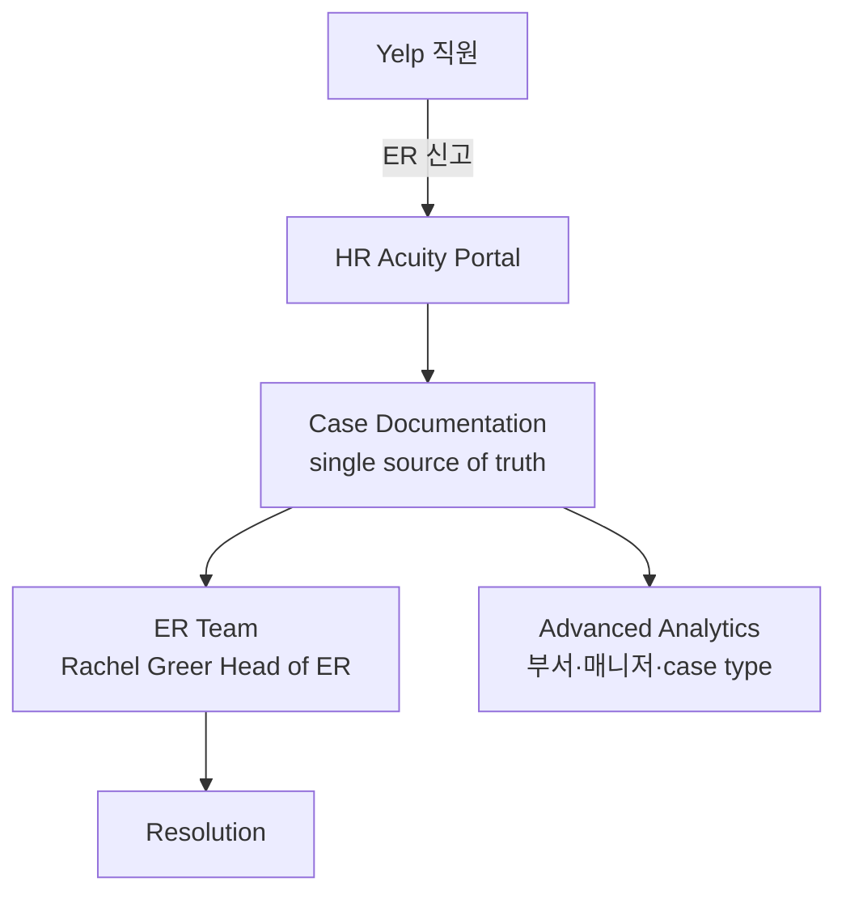

> 📌 **Stub-수준 사례**: HR Acuity Yelp case study는 정성 인용 위주. 정량 metric (% 단축·시간 절감) 미공개. confidence 낮게 유지. Yelp의 도입 동기·고려사항 reference로만 활용 권장.

## Summary

Yelp (소비자 리뷰 플랫폼)가 HR Acuity ER case management 도입. ⚠️ 자사 보고 (HR Acuity case study 단일 출처): 도입 동기는 **single source of truth in documentation** + advanced analytics + case 분류 단순화. Rachel Greer (Head of Employee Relations) 인용. Greer는 HR Acuity의 **empowER™ Community Award 수상** (HR Acuity 커뮤니티 활동가). 정량 metric 미공개, AI 기능 (olivER) 사용 여부 명시 안 됨.

## Problem / Why (도입 배경)

- **Before**: Yelp의 ER documentation 분산 — case 기록·investigation note·resolution이 여러 도구·spreadsheet에 흩어짐
- **Pain point**:
  - **Documentation 분산**: ER team이 case 검색·trend 분석 시 1건씩 수작업
  - **Case 분류 복잡성**: grievance type 분류 기준 일관성 없음 → analytics 부정확
  - **Advanced analytics 부재**: 부서·매니저별 trend dashboard 부재
- **Trigger**: ER team 성장 + case management 전문 도구 필요성. HR Acuity가 ER 전용 leader로 등장

## Solution Architecture

### A. Process (프로세스)

- **Before**: ER case가 spreadsheet·이메일·일반 ticketing에 분산 → documentation 단편화
- **After**:
  1. ER team이 HR Acuity portal로 모든 case 단일 기록
  2. Case 분류·investigation note·resolution 통합 documentation
  3. Advanced analytics — 부서·매니저·case type별 dashboard
  4. Rachel Greer Head of ER team이 운영 + HR Acuity 커뮤니티 활동
- **HITL**: ER team이 모든 결정·인터뷰·resolution 진행
- **Frequency**: daily case 처리 + 분기 trend
- **Scope of autonomy**: assist (documentation·analytics)

### B. System & Infrastructure (시스템·인프라)

- **Core platform**: HR Acuity SaaS (Yelp 도입)
- **AI 시스템 배치**: HR Acuity 전체 (olivER AI 사용 여부는 case study에 명시 없음)
- **연동**: HRIS·SSO (구체 미공개)

### C. Data (데이터)

- **입력 데이터**: ER case (grievance·discipline·investigation), 인사 정보
- **Data governance**: single source of truth → audit trail 통합

### D. Model (모델)

- **Foundation model**: HR Acuity stack (구체 모델 미공개)

### E. Organization & Team (조직·팀 구조)

- **오너십**: Yelp Employee Relations team (Rachel Greer Head of ER)
- **거버넌스**: HR Acuity empowER™ Community Award 수상 (Greer) — HR Acuity ecosystem 활동
- **참여**: ER 전용 team

### F. Diagrams (도식)

범례: 모든 연결 ⚠️ HR Acuity Yelp case study (자사 보고) 기반.

## Impact / Metrics (기대효과)

### 기대효과 요약
정성 사례 — single source of truth in documentation + advanced analytics. ⚠️ 정량 metric 미공개.

| 지표 | 값 | 출처 | 성격 |
|---|---|---|---|
| 도입 동기 | single source of truth in documentation | HR Acuity Yelp case study | ⚠️ 자사 보고 |
| Advanced analytics | 활용 (구체 정량 미공개) | HR Acuity case study | ⚠️ 자사 보고 |
| 핵심 인용 | Rachel Greer Head of Employee Relations | HR Acuity case study | ✅ Fact |
| 인증 | HR Acuity empowER™ Community Award (Greer) | HR Acuity 공식 | ✅ Fact |
| 정량 metric (시간·case 단축) | _미공개_ | — | ❓ 미공개 |
| AI (olivER) 사용 여부 | _미공개_ — case study에 명시 없음 | — | ❓ 미공개 |

## Governance & Risk

- ⚠️ **HR Acuity 단일 출처** + 정량 metric 0건 — stub-수준 reference
- ⚠️ AI (olivER) 사용 여부 미공개 — case management 위주 도입 추정
- ⚠️ Yelp 특수성: 미국 IT 기업, 소비자 리뷰 플랫폼 — 한국 제조·금융과 노동 환경 차이

## Consulting Angle

- **정성 사례 reference**: 한국 대기업의 ER documentation 통합 검토 시 Yelp의 "single source of truth" 도입 동기 인용 가능
- **vs Waymo** [[waymo-hr-acuity-er-case-management]]:
  - Waymo: 정량 (92% reporting time 단축)
  - Yelp: 정성 (documentation 통합·analytics)
  - 양자 보완 — Waymo는 ROI 정량, Yelp는 도입 동기·고려사항
- **HR Acuity ecosystem 활동**: Rachel Greer의 empowER 커뮤니티 award는 vendor ecosystem 활용 사례 — 한국 대기업 도입 시 vendor community 활용 reference
- **한계**:
  - 정량 metric 0건 — 클라이언트 인용 시 Yelp 사례는 정성 위주만
  - olivER 사용 여부 미공개 — AI-enabled vs not 구분 어려움
- **Watch list**: Yelp의 olivER 사용·정량 metric 공개·HR Acuity case study 갱신 시 confidence 재조정
