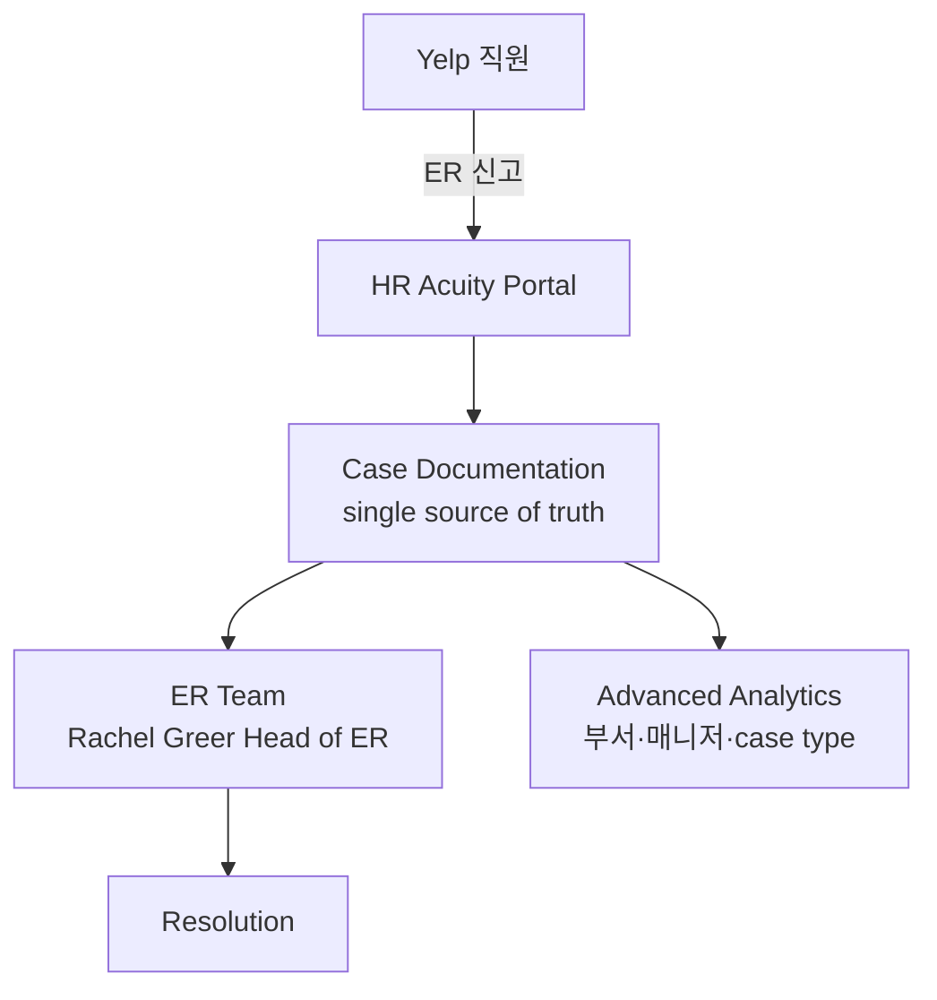

> 📌 **Stub-수준 사례**: HR Acuity Yelp case study는 정성 인용 위주. 정량 metric (% 단축·시간 절감) 미공개. confidence 낮게 유지. Yelp의 도입 동기·고려사항 reference로만 활용 권장.

## Summary

Yelp (소비자 리뷰 플랫폼)가 HR Acuity ER case management 도입. ⚠️ 자사 보고 (HR Acuity case study 단일 출처): 도입 동기는 **single source of truth in documentation** + advanced analytics + case 분류 단순화 ([[sources/hr-acuity-yelp-case-study]]). Rachel Greer (Head of Employee Relations) 인용. Greer는 HR Acuity empowER 커뮤니티 참여를 언급 ([[sources/hr-acuity-yelp-case-study]]); 'Community Award 수상'은 인용 소스에 없음 — _미공개_ (2026-09-27 grounding 점검). 정량 metric은 'ER 기능 120% 확장' 헤드라인(정의·산식 불명)뿐, AI 기능 (olivER) 사용 여부 명시 안 됨.

## Problem / Why (도입 배경)

- **Before**: Yelp의 ER documentation 분산 — case 기록·investigation note·resolution이 여러 도구·spreadsheet에 흩어짐
- **Pain point**:
  - **Documentation 분산**: ER team이 case 검색·trend 분석 시 1건씩 수작업
  - **Case 분류 복잡성**: grievance type 분류 기준 일관성 없음 → analytics 부정확
  - **Advanced analytics 부재**: 부서·매니저별 trend dashboard 부재
- **Trigger**: ER team 성장 + case management 전문 도구 필요성. HR Acuity가 ER 전용 leader로 등장

## Solution Architecture

### A. Process (프로세스)

- **Before**: ER case가 spreadsheet·이메일·일반 ticketing에 분산 → documentation 단편화
- **After**:
  1. ER team이 HR Acuity portal로 모든 case 단일 기록
  2. Case 분류·investigation note·resolution 통합 documentation
  3. Advanced analytics — 부서·매니저·case type별 dashboard
  4. Rachel Greer Head of ER team이 운영 + HR Acuity 커뮤니티 활동
- **HITL**: ER team이 모든 결정·인터뷰·resolution 진행
- **Frequency**: daily case 처리 + 분기 trend
- **Scope of autonomy**: assist (documentation·analytics)

### B. System & Infrastructure (시스템·인프라)

- **Core platform**: ✅ HR Acuity (Yelp 도입) ([[sources/hr-acuity-yelp-case-study]]); Core HRIS _미공개_
- **AI 시스템 배치**: _미공개 (not disclosed)_ — olivER AI 사용 여부는 case study에 명시 없음 ([[sources/hr-acuity-yelp-case-study]])
- **연동**: HRIS·SSO (구체 미공개)

### C. Data (데이터)

- **입력 데이터**: ✅ ER 케이스 문서·이슈 분류 ([[sources/hr-acuity-yelp-case-study]]); 세부 항목 _미공개_
- **Data governance**: ✅ 문서화의 single source of truth ([[sources/hr-acuity-yelp-case-study]]); 보존·접근 정책 _미공개_

### D. Model (모델)

- **Foundation model**: HR Acuity stack (구체 모델 미공개)

### E. Organization & Team (조직·팀 구조)

- **오너십**: Yelp Employee Relations team (Rachel Greer Head of ER)
- **거버넌스**: _미공개 (not disclosed)_; Greer의 empowER 커뮤니티 참여 ([[sources/hr-acuity-yelp-case-study]]) — Award 수상은 인용 소스에 없음
- **참여**: ER 전용 team

### F. Diagrams (도식)

```mermaid
flowchart TB
    Emp[Yelp 직원] -->|ER 신고| HRA[HR Acuity Portal]
    HRA --> Case[Case Documentation<br/>single source of truth]
    Case --> ER[ER Team<br/>Rachel Greer Head of ER]
    ER --> Resolution[Resolution]
    Case --> Analytics[Advanced Analytics<br/>부서·매니저·case type]
```

범례: 모든 연결 ⚠️ HR Acuity Yelp case study (자사 보고) 기반.

## Impact / Metrics (기대효과)

### 기대효과 요약
정성 사례 — single source of truth in documentation + advanced analytics. ⚠️ 정량 metric 미공개.

| 지표 | 값 | 출처 | 성격 |
|---|---|---|---|
| 도입 동기 | single source of truth in documentation | HR Acuity Yelp case study | ⚠️ 자사 보고 |
| Advanced analytics | 활용 (구체 정량 미공개) | HR Acuity case study | ⚠️ 자사 보고 |
| 핵심 인용 | Rachel Greer Head of Employee Relations | HR Acuity case study | ✅ Fact |
| 'ER 기능 120% 확장' 헤드라인 | 120% (정의·산식 불명) | [[sources/hr-acuity-yelp-case-study]] | ⚠️ 벤더 주장 |
| empowER Community Award | _미공개_ | 인용 소스에 없음 (2026-09-27 grounding 점검) | ❓ |
| 정량 metric (시간·case 단축) | _미공개_ | — | ❓ 미공개 |
| AI (olivER) 사용 여부 | _미공개_ — case study에 명시 없음 | — | ❓ 미공개 |

## Governance & Risk

- ⚠️ **HR Acuity 단일 출처** + 정량 metric 0건 — stub-수준 reference
- ⚠️ AI (olivER) 사용 여부 _미공개_
- ⚠️ Yelp 특수성: 미국 IT 기업, 소비자 리뷰 플랫폼 — 한국 제조·금융과 노동 환경 차이

## Contradictions

_없음._

> [!note] 2026-09-27 grounding — 'empowER Community Award 수상'은 인용 소스에 없음(커뮤니티 참여 발언만 확인) → `_미공개_`. 소스의 'ER 기능 120% 확장' 헤드라인은 정의 불명으로 ⚠️ 벤더 주장 표기로 추가. Consulting Angle의 Waymo 수치는 해당 페이지 참조로 교체.

## Consulting Angle

- **정성 사례 reference**: 한국 대기업의 ER documentation 통합 검토 시 Yelp의 "single source of truth" 도입 동기 인용 가능
- **vs Waymo** [[waymo-hr-acuity-er-case-management]]:
  - Waymo: 정량 사례 (reporting time 단축 — [[waymo-hr-acuity-er-case-management]] 참조)
  - Yelp: 정성 (documentation 통합·analytics)
  - 양자 보완 — Waymo는 ROI 정량, Yelp는 도입 동기·고려사항
- **HR Acuity ecosystem 활동**: Rachel Greer의 empowER 커뮤니티 참여는 vendor ecosystem 활용 사례 — 한국 대기업 도입 시 vendor community 활용 reference
- **한계**:
  - 정량 metric 0건 — 클라이언트 인용 시 Yelp 사례는 정성 위주만
  - olivER 사용 여부 미공개 — AI-enabled vs not 구분 어려움
- **Watch list**: Yelp의 olivER 사용·정량 metric 공개·HR Acuity case study 갱신 시 confidence 재조정
