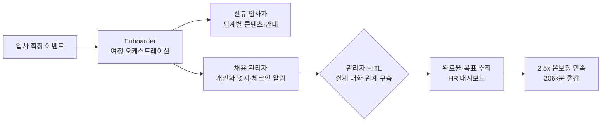

## Summary

Zapier (워크플로 자동화 SaaS, 100% 원격, 30개국 ~800명)은 Enboarder 플랫폼으로 온보딩 자동화를 구현해 수작업 온보딩 태스크 206,000분(86 근무 주) 절감, 채용 관리자 참여율 +10%, 신규 입사자의 온보딩 최우수 평가 가능성 2.5배 향상을 달성했다. 2022년 케이스 스터디; Enboarder는 이후 2025년 SmartRecruiters와 통합 파트너십을 맺고 AI 네이티브 온보딩 플랫폼으로 확장. Deloitte, KPMG, ING, T-Mobile, Cisco도 Enboarder 고객으로 확인.

## Problem / Why

- 100% 원격·30개국 분산 구조 → 일관된 온보딩 경험 전달 불가
- 채용 관리자 참여 없이 HR만으로 온보딩 → 신규 입사자 경험 단절
- 성장에 따른 신규입사자 증가 → HR 팀 규모 확대 없이 확장 필요

## Solution Architecture

### A. Process (프로세스)

- **Before (As-is)**: HR 담당자가 각 신규입사자에게 개별 수작업 이메일·체크리스트 전달; 채용 관리자 참여율 낮음
- **After (To-be)**:
  1. 입사 확정 시점에 Enboarder가 자동화된 온보딩 여정 개시
  2. 채용 관리자에게 개인화된 액션·넛지 자동 전송
  3. 신규 입사자에게 단계별 콘텐츠(기대치 설정·리소스 안내·관계 구축·커뮤니케이션) 자동 전달
  4. 완료율·목표 달성률·Time-to-productivity 자동 추적
- **Human-in-the-loop**: 채용 관리자가 알림을 받고 실제 대화·관계 구축 수행; HR이 이상 신호 모니터링
- **Trigger & Frequency**: 입사 확정 이벤트 기반(event-driven); 이후 단계별 스케줄(daily/weekly)
- **Scope of autonomy**: autonomous (콘텐츠 전달·추적); recommend (관리자 액션 넛지)

범례: 실선 = From Day One 케이스 스터디 / Enboarder 플랫폼 페이지에서 확인

### B. System & Infrastructure (시스템·인프라)

- **Core HRIS**: _미공개 (not disclosed)_
- **AI 시스템 배치**: Enboarder SaaS (클라우드)
- **배포 환경**: 클라우드; 30개국 원격 직원 대상
- **연동·통합**: SmartRecruiters (2025-09 파트너십 — 지원자 수락 시 Enboarder 자동 개시); 기타 시스템 미공개
- **사용자 접점**: 이메일, 슬랙·메신저 (구체 채널 미공개), 웹 포털
- **2025 업데이트**: AI-native 온보딩 플랫폼으로 진화 — AI Journey Builder, New Hire AI Assistant 추가

### C. Data (데이터)

- **입력**: 신규 입사자 프로필, 역할·팀 정보, 온보딩 체크리스트 완료 여부, 관리자 액션 이력
- **데이터 규모**: Zapier ~800명 규모; 완료 현황 자동 집계
- **거버넌스**: _미공개 (not disclosed)_

### D. Model (모델)

- **Foundation model**: _미공개 (not disclosed)_ — Enboarder AI 모델 아키텍처 미공개
- **2025 AI 기능**: AI Journey Builder (여정 자동 생성), New Hire AI Assistant (질의응답)

### E. Organization & Team (조직·팀 구조)

- **오너십**: HR (소규모 팀으로 운영)
- **참여 역할**: HR 1명(또는 소수), 채용 관리자 전원
- **변화관리**: 채용 관리자의 온보딩 참여가 핵심 KPI로 설정

## Impact / Metrics (기대효과)

### 기대효과 요약
수작업 온보딩 시간 206,000분(86 근무 주) 절감, 채용 관리자 참여율 10% 증가 (자사 보고 기반).

| 지표 | 결과 | 신뢰도 |
|---|---|---|
| 수작업 온보딩 시간 절감 | **206,000분 (86 근무 주)** | ⚠️ 자사 보고 (Enboarder 케이스 스터디) |
| 채용 관리자 참여율 | **+10%** | ⚠️ 자사 보고 |
| 온보딩 최우수 평가 (관리자 참여 시) | **2.5배** | ⚠️ 자사 보고 |

Enboarder 추가 집계 데이터 (미명 고객):

| 사례 | 결과 | 신뢰도 |
|---|---|---|
| 글로벌 화학기업 | $3.7M 연간 절감 / 45,000시간 (10,000개 온보딩 자동화) | ⚠️ 벤더 주장 |
| 대형 헬스케어 IT 기업 | $1.68M 절감 / 90일 이내 이직율 -36% | ⚠️ 벤더 주장 |

## Governance & Risk

- 원격·글로벌 배포 시 데이터 크로스보더 이전 (30개국 개인정보보호법 다양) → 미공개
- 자동화된 온보딩이 신규 입사자의 "사람과의 연결" 필요를 대체할 수 없음 — 관리자 참여 유지가 핵심

## Contradictions

없음. (케이스 스터디 2022년 기준; 2025년 AI 기능 추가 후 업데이트 데이터 미공개)

## Consulting Angle

- **원격·글로벌 기업 온보딩**: 100% 원격 기업의 확장 가능한 온보딩 아키텍처 레퍼런스 — 스타트업·하이그로스 기업 제안에 유효
- **관리자 참여 설계**: "AI가 관리자를 대체하지 않고 관리자 참여를 유도"하는 아키텍처 패턴 — 온보딩 프로그램 재설계 워크숍에서 활용
- **한국 적용**: 재택/하이브리드 근무 확산 기업의 온보딩 표준화 과제에 참고; 카카오·라인 등 IT 기업 온보딩 자동화 POC 아이디어
- **ROI 계산**: 206,000분 = 86 근무 주 ÷ 직원 수 → 1인당 절감 시간으로 환산해 비용 편익 분석
